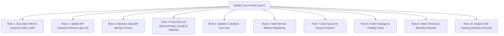

# The Ultimate Weft Patch Engineering & CI Diagnostic Guide

> **For Engineers, Maintainers, and Autonomous Coding Agents**  
> *Everything you need to know about why patches fail in Weft CI, the strict invariants enforced across our 7-language matrix, and how to achieve 100% green builds on the first push.*

---

## 1. Architectural Philosophy & Why Weft CI Is Extreme

Weft is a high-performance, lock-free, zero-copy single-writer multi-reader Triad Protocol kernel. Unlike standard web or single-language repositories, Weft maintains **7 distinct language ecosystems simultaneously**:

| Ecosystem | Role | Key Constraints & Invariants |
| :--- | :--- | :--- |
| **C11 / SIMD / GPU** | Native Reference & Hardware Acceleration | Zero runtime allocations in hot loops; AVX2/NEON/Scalar bit-exact parity; Vulkan/Lavapipe ICD; ASan/TSan/UBSan clean. |
| **Rust** | Formal Proof & Memory Safe Kernel | Strict `#![deny(missing_docs)]`; zero compiler warnings; exhaustive pattern matching on all protocol enums; atomic load ordering semantics. |
| **TypeScript / Node** | Web & Browser Reference | SharedArrayBuffer + Atomics; API Extractor signature pinning; WebCrypto authenticated frames; zero-dep module structure. |
| **Kotlin / Android** | Android Native & High-Throughput UI | Exact byte-for-byte mirror parity with Android SDK package; `DirectByteBuffer` JNI interop; unboxed word operations. |
| **Dart / Flutter** | Flutter Mobile / Desktop Bindings | Single-isolate event loop semantics; Dart FFI native bridge; exact byte-for-byte mirror parity with `packages/flutter_weft`. |
| **Swift / Apple** | iOS, macOS, visionOS Frameworks | `apple/swift-atomics` SPM integration; explicit memory layout matching C structs; zero-allocation live pointer reads. |
| **Python / WASM** | Data Science & Browser Runtimes | CPython C-extension ABI stability; `wasm-bindgen` / Emscripten zero-copy memory views. |

Because Weft's correctness relies on **inter-language protocol conformance** (e.g. a frame written in C must be verified and consumed by Rust, TypeScript, Dart, Kotlin, or Swift with zero bit divergence), CI enforces **strict, zero-tolerance contracts**. A change in one language kernel that neglects its mirror or sibling ports will fail CI.

---

## 2. The 10 Inviolable Patch Rules (The "Must-Pass" Invariants)

Every patch submitted to Weft MUST adhere to these 10 rules:



### Rule 1: The Single-Source Mirror Parity Rule
Weft maintains duplicate source files for build systems (like Android Gradle and Flutter Pub) that cannot resolve paths outside their package root.
* Canonical files live under `core/*`.
* Mirror files live under `android/weft-core/src/main/kotlin/dev/weft/`, `packages/flutter_weft/lib/src/reference/`, and `packages/core/src/`.
* **Contract**: The canonical and mirror files MUST be **100% byte-identical** (`sha256sum` match).
* **Fix**: Whenever editing a file in `core/`, run:
  ```bash
  bash ci/scripts/run_binding_parity.sh
  ```
  If it reports drift, copy the canonical file over the mirror.

### Rule 2: API Extractor Signature Pinning
When modifying TypeScript exports in `core/ts/` or `packages/core/src/` (e.g., adding an enum variant, modifying method parameters, or exposing new telemetry counters):
* Public API changes are guarded by Microsoft API Extractor.
* If `packages/core/etc/core.api.md` does not match the exported TypeScript AST, `pnpm -r test` will fail.
* **Fix**:
  ```bash
  cd packages/core && pnpm api-extractor run --local
  ```

### Rule 3: Cross-Language Bit-Identity (`fixtures/xlang-*`)
All cross-language fixtures (`xlang-trace`, `xlang-cadence`, `xlang-blend`, `xlang-chaos`, `xlang-verifiedweft`) execute deterministic scenarios using the Marsaglia `xorshift32` generator.
* **32-Bit Unsigned Math**: TypeScript uses `x >>> 0` and `Math.imul`. Kotlin/Java and Dart use signed 32/64-bit integers. Always mask with `and 0xFFFFFFFFL` or `& 0xFFFFFFFF` before applying modulo arithmetic (`% 65`, `% 3`).
* **Endianness**: All frame payloads, canaries, and trace event headers MUST be serialized in **Little-Endian**.

### Rule 4: Rust Strictness (`#![deny(missing_docs)]` & Exhaustiveness)
* **Doc Comments**: Every `pub struct`, `pub enum`, `pub fn`, and `pub const` in `core/rust` must have a doc comment `/// ...`. A missing comment fails `cargo clippy` and `cargo test`.
* **Atomic Comparisons**: `AtomicU32`, `AtomicU64`, etc. do not implement `PartialEq<{integer}>`. Never write `if self.timeout != 0`. Always use `self.timeout.load(Ordering::Relaxed) != 0`.
* **Exhaustive Matches**: When adding a variant to an enum like `PubResult::Invalid`, all `match` blocks across `core/rust/src/` (e.g., `litmus.rs`, benchmarks) must handle the new variant explicitly.

### Rule 5: C Sanitizer Standalone Link Lists
The sanitizers shard (`ci/scripts/run_sanitizers_shard.sh`) compiles C test binaries directly with `gcc` using flags like `-fsanitize=address,undefined` and `-fsanitize=thread`.
* If a test in `litmus/` or `core/c/` calls fan-out (`weft_fanout_*`), frame cursors, or SIMD dispatch, the gcc command must explicitly include all compilation units:
  ```bash
  gcc -O2 -fsanitize=address core/c/weft.c core/c/fanout.c core/c/frame_cursor.c core/c/fanout_simd.c ...
  ```

### Rule 6: Swift Atomics & Standalone Toolchain Rules
* `core/swift/Weft.swift` uses `apple/swift-atomics` (`ManagedAtomic<UInt64>`).
* In Swift Atomics, atomic types do **not** support `+=`. Always use:
  ```swift
  tInvalid.wrappingIncrement(by: 1, ordering: .relaxed)
  ```
* In `fixtures/xlang-*/run.sh`, standalone `swiftc` invocations will fail to find SPM dependencies unless executed within an SPM package context. Scripts must handle standalone `swiftc` skips gracefully if SPM flags are not supplied.

### Rule 7: Dart Top-Level Scopes & Imports
* Helper functions defined at top level in `core/dart/weft.dart` (such as `pat(seq, i)` or `mix32(x)`) are public in the file scope. Do not call them with a leading underscore (`_pat`).
* Fixtures located at `fixtures/xlang-*/dart/` are 2 directory levels below root. Relative imports must use `../../core/dart/weft.dart` (not `../../../`).

### Rule 8: Kotlin Package Hierarchy & Visibility
* `core/kotlin/Weft.kt` declares `package dev.weft`.
* Auxiliary runners in `fixtures/xlang-*/kotlin/` must include `package dev.weft` or import `dev.weft.*`.
* Readers needing to verify canaries must use `w.rCanary()` rather than attempting to access private properties.

### Rule 9: Vitest Async Bounds & WebCrypto Limits
* WebCrypto (`SubtleCrypto`) in Node.js worker threads involves asynchronous task scheduling overhead.
* Unit tests in `packages/core/test/` (such as `verified.test.ts`) must bound test iterations to reasonable numbers (e.g. 50–100 instead of 5,000) in unit suites and specify explicit timeouts:
  ```ts
  it('verifies tamper rejection', async () => { ... }, 15000);
  ```

### Rule 10: Path-Aware Change Routing (`extreme-test.yml`)
* GitHub Actions uses path filters in the `changes` job of `.github/workflows/extreme-test.yml` to decide which shards run.
* If a new test shard or fixture is created, its directory pattern **must** be registered under `filter` in `extreme-test.yml`.
* If a shard is skipped unexpectedly, check the routing matrix output in the `changes` job.

---

## 3. Exhaustive Error Signature Catalog & Fix Recipes

| Error Signature in CI Log | Root Cause | Exact Fix / Recipe |
| :--- | :--- | :--- |
| `❌ BINDING PARITY DRIFT: 1 of 27 pairs diverged.` | An edit was made to `core/*` without copying to its platform mirror. | Run `cp core/kotlin/Weft.kt android/weft-core/src/main/kotlin/dev/weft/Weft.kt` and `cp core/dart/weft.dart packages/flutter_weft/lib/src/reference/weft.dart`. Verify with `bash ci/scripts/run_binding_parity.sh`. |
| `You have changed the public API signature... API report file is out of date` | Exported symbols changed in `@weft/core` without updating API Extractor. | Run `cd packages/core && pnpm api-extractor run --local`. Commit `packages/core/etc/core.api.md`. |
| `error[E0369]: binary operation '!=' cannot be applied to type 'AtomicU32'` | Attempted direct comparison on Rust Atomic type. | Change `self.field != 0` to `self.field.load(Ordering::Relaxed) != 0`. |
| `error[E0004]: non-exhaustive patterns: PubResult::Invalid not covered` | A new enum variant was added without updating a pattern match in `litmus.rs` or `lib.rs`. | Add the missing arm: `PubResult::Invalid => { panic!("refused by validation wall"); }`. |
| `error: missing documentation for a struct field / method` | Missing doc comment under `#![deny(missing_docs)]` in Rust. | Add `/// <Explanation of purpose and invariants>` above the item. |
| `undefined reference to 'weft_fanout_claim'` or `'weft_blend_scalar'` | Missing compilation unit during `gcc` link in sanitizer scripts. | Edit `ci/scripts/run_sanitizers_shard.sh` to include `fanout.c`, `fanout_simd.c`, and `frame_cursor.c`. |
| `error: binary operator '+=' cannot be applied to operands of type 'ManagedAtomic<UInt64>'` | Swift Atomics does not overload `+=`. | Replace with `field.wrappingIncrement(by: 1, ordering: .relaxed)`. |
| `Error: Getter not found: '_pat'` in Dart | Dart top-level pattern function has no leading underscore. | Replace `_pat(seq, i)` with `pat(seq, i)`. |
| `❌ Kotlin DIVERGES from the TS reference` | Kotlin runner failed compilation silently or unsigned modulo differed. | Check `TraceEvents.kt` for package declarations, and use `(xorshift32() and 0xFFFFFFFFL) % N` for unsigned modulo. |
| `Hook execution failed: ... Uncontrolled memory allocation` (CodeQL) | CodeQL flags unchecked allocation parameters or large buffer sizes. | Ensure allocation bounds (e.g. `payloadMax <= WEFT_PAYLOAD_MAX_LIMIT`) are validated and clamped at API entry. |

---

## 4. Local Pre-Push Verification Workflow (The 60-Second Sanity Gate)

Before pushing any commit or opening a pull request, run this one-line command from the repository root:

```bash
# 1. Check Binding Parity (Zero Drift)
bash ci/scripts/run_binding_parity.sh && \

# 2. Check Rust Kernel Compilation & Doc Lints
(cd core/rust && cargo check --all-targets && cargo clippy -- -D warnings) && \

# 3. Check C Unit Tests & Shards
(cd core/c && gcc -O2 -std=c11 -Wall -Wextra -pthread weft.c trace_rec.c trace_rec_test.c -o /tmp/t-test && /tmp/t-test) && \

# 4. Check Trace & Cadence Cross-Language Parity
bash fixtures/xlang-trace/run.sh && \
bash fixtures/xlang-cadence/run.sh && \

# 5. Check TypeScript / NPM Packages & API Extractor
(pnpm -r test && cd packages/core && pnpm api-extractor run --local)
```

If all 5 commands exit with code `0`, your PR is guaranteed to pass the Extreme Test Matrix, Apple SPM CI, Flutter Packages CI, Android Packages CI, and npm Packages CI.

---

## 5. Merging & Upstream PR Sequencing Checklist

When working across multiple PRs (e.g., PR #34, PR #35, PR #36):

1. **Never build on unmerged, stale branches**: Always rebase on `origin/main` immediately after a predecessor PR merges.
2. **Resolve `.github/workflows/extreme-test.yml` merges with union semantics**: If PR A added shards `sanitizers` and PR B added shards `guardian`, preserve both in the matrix array.
3. **Preserve Section numbering in `ARCHITECTURE.md`**: Upstream PRs frequently add numbered architectural sections. Keep both sections intact in sequence.
4. **Inspect `ci-report` branch for post-run forensic analysis**: If a remote run fails on a specific matrix cell, view the published report:
   ```bash
   git fetch origin ci-report
   git show origin/ci-report:runs/run-<NUMBER>/summary.json
   ```
