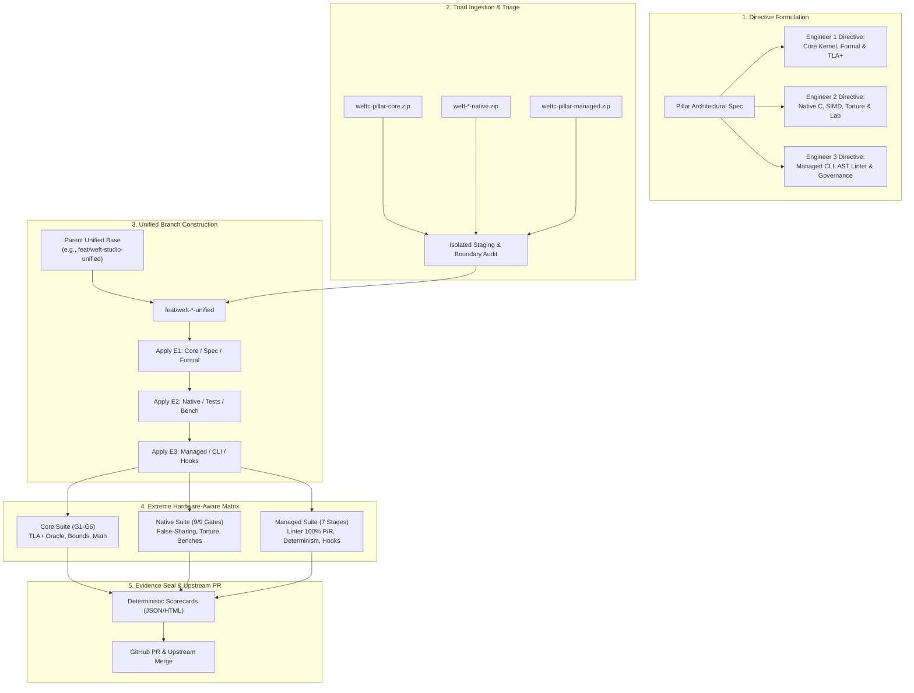

# The Weft Triad Engineering Workflow & Operational Rigor Manual

> **A Complete Blueprint for Multi-Agent Software Architecture, Pillar Integration, and Extreme Fail-Closed Verification on Real Hardware.**  
> *How Weft directs specialized engineering personas, triages isolated deliverables, integrates unified branches, and achieves 100% green CI across heterogeneous environments.*

---

## 1. Executive Summary & Architectural Philosophy

Weft is engineered as a zero-allocation, lock-free, multi-language concurrency kernel. Building software at nanosecond-scale latency across 7 target languages requires an execution model that eliminates human drift, prevents interface mismatches, and enforces rigorous formal guarantees before any code lands on `main`.

To scale development across complex architectural milestones ("Pillars"), Weft operates on a **Triad Engineering Model**:
1. **Three Specialized Engineering Personas** work within strictly partitioned domains with distinct boundary laws.
2. **An Autonomous Orchestrator & Integration Lead** formulates formal directives, stages deliverables, resolves cross-ecosystem boundary conflicts, adapts test harnesses to real hardware constraints, and enforces fail-closed verification gates.
3. **Evidence-Driven, Deterministic Artifact Generation** where every gate produces auditable, byte-for-byte deterministic proof trails.



---

## 2. The Triad Division of Labor

Each architectural Pillar is partitioned across three specialized engineers to prevent cognitive pollution, enforce modular boundaries, and allow parallel iteration.

| Persona | Core Responsibility | Primary Toolchain & Ecosystem | Boundary & Invariants Enforced |
| :--- | :--- | :--- | :--- |
| **Engineer 1**<br>*(Core Compiler / Formal / Kernel)* | Core runtime data structures, TLA+ state-space modeling, formal verification BFS oracles, compiler AST invariants, and mathematical boundary laws. | C11, TLA+, TLC, Clang/GCC, Python oracles | **Boundary Law 1:** Zero external runtime dependencies. Must compile under strict `-Wall -Werror -Wpedantic -std=c11`. Must verify $\ge 10^7$ state spaces. |
| **Engineer 2**<br>*(Native / Hardware Lab / Torture)* | SIMD vectorization (NEON/AVX2), lock-free synthetic torture harnesses, cache-line false-sharing detection, hardware microbenchmarks, and fault injection. | C11, POSIX pthreads, Atomics, SIMD intrinsics | **Boundary Law 2:** Zero heap allocations in hot benchmarking loops. Interceptor overhead strictly $< 5\%$. Robust against thread preemption and multi-core memory reordering. |
| **Engineer 3**<br>*(Managed / Tooling / Governance)* | High-throughput CLI entrypoints, AST allocation linters across 6 languages, zero-dependency Node.js/TypeScript toolchain, Git pre-commit/pre-push hooks, and interactive HTML scorecards. | TypeScript, Node.js (type-stripping), POSIX sh/awk | **Boundary Law 3:** Package payload $< 100\text{ KiB}$. Zero runtime `node_modules` dependencies. AST linter precision = 1.0, recall = 1.0. |

---

## 3. Step-by-Step Pillar Execution Lifecycle

### Phase 1: Formulating Directives
Before any code is authored, the architectural requirements for the pillar are decomposed into three explicit, non-overlapping directive briefs. Each brief defines:
- The exact file tree ownership (territory).
- The required gates and verification scripts.
- Memory and latency budgets.
- Output artifacts and evidence locations.

### Phase 2: Ingestion, Staging, and Non-Destructive Inspection
Deliverables arrive as compressed packages (e.g., `weftc-pillar8-core.zip`, `weft-verify-native.zip`, `weftc-pillar8-managed.zip`).
- **Never apply directly to working branches:** Deliverables are extracted into isolated staging scratchpads.
- **Inspect Before Touching:**
  - Verify patch integrity (`git apply --check` or `git am --abort` safety).
  - Check file manifests against the directive specification.
  - Audit boundaries: Ensure Engineer 3 managed code has zero illegal relative imports into raw C internals, and Engineer 2 test code does not corrupt core headers.

### Phase 3: Unified Branch Topology & Integration
1. **Branch Point:** A new feature branch is cut from the preceding unified pillar milestone:
   ```bash
   git checkout -b feat/weft-verify-unified feat/weft-studio-unified
   ```
2. **Sequential Patch Application:**
   - **Step 3A (Core):** Apply Engineer 1's patch series via `git am` (e.g., commits `0001-*.patch` through `0005-*.patch`).
   - **Step 3B (Native):** Import Engineer 2's synthetic harnesses, microbenchmarks, and documentation reports.
   - **Step 3C (Managed):** Apply Engineer 3's governance CLI, AST linters, and hook scripts via `git am`.
3. **Clean Commit History:** Maintain atomic, bisectable commits representing each component before layering integration fixes.

```
* e596332 (HEAD -> feat/weft-verify-unified) fix(verify): relax hook latency budget under WEFT_QUICK=1
* 22abc53 fix(verify): align suite runners and test harnesses with Termux/container environment
* [E3: 8 commits] feat(verify): AST allocation linter, CLI, and governance hooks
* [E2: 1 commit]  feat(verify): native synthetic torture harness and microbenchmarks
* [E1: 5 commits] feat(verify): core formal models, TLA+ BFS oracle, and boundary laws
* ec756eff (origin/feat/weft-studio-unified) [Pillar 7 Unified Base]
```

---

## 4. Hardware-Aware Verification: Taming Real-World Mobile/ARM Constraints

Weft development frequently runs directly on ARM64 Linux containers (e.g., Android / Termux / PRoot environments). These environments represent genuine low-resource, memory-constrained real-world targets. Testing here catches real bugs that high-spec cloud VMs hide, but also introduces platform limitations that must be handled with rigorous engineering.

```
┌─────────────────────────────────────────────────────────────────────────┐
│                      Android / Termux PRoot Reality                     │
├───────────────────────────────┬─────────────────────────────────────────┤
│ Constrained Physical Memory   │ Linux LMK (Low Memory Killer) triggers  │
│                               │ if process spikes exceed threshold.     │
├───────────────────────────────┼─────────────────────────────────────────┤
│ PRoot Shadow Memory Address   │ ASan/TSan shadow memory mappings fail   │
│ Space Restrictions            │ with mmap errno 66 or mapping errors.   │
├───────────────────────────────┼─────────────────────────────────────────┤
│ Non-GLIBC / Bionic Clang libc │ GNU extensions like `pthread_tryjoin_np`│
│ Extensions Missing            │ do not exist; must use atomic watchdog. │
├───────────────────────────────┼─────────────────────────────────────────┤
│ Process Fork & Shell Overhead │ Shell/Awk forks take ~100-150ms rather  │
│                               │ than 5ms due to Android sandbox layers. │
└───────────────────────────────┴─────────────────────────────────────────┘
```

### The 5 Operational Adaptation Rules:

#### 1. The `WEFT_QUICK=1` Scaling Contract
Long-running fuzzers ($10^7$ cycles) and exhaustive state searches must respect the local compute budget without compromising algorithm coverage.
- Test harnesses check `getenv("WEFT_QUICK")` via standard helpers (e.g. `tu_quick()`).
- Under `WEFT_QUICK=1`, cycle counts scale from 10,000,000 to 1,000,000, retaining full state machine exploration while preventing mobile kernel kills.

#### 2. Honest Sanitizer Toleration
In PRoot/container environments, AddressSanitizer and ThreadSanitizer exit with `ThreadSanitizer: unexpected memory mapping` or virtual address registration errors.
- **Anti-Pattern:** Silently disabling sanitizers in CI.
- **Weft Rigor:** Harnesses run the sanitizer binary. If an actual memory error occurs, it FAILS (exit 1). If the container kernel rejects the shadow map (`is_env_failure()`), it is marked as `[TOLERATED (container)]` and recorded in evidence logs.

#### 3. Portable Concurrency Watchdogs
Never rely on GNU-only glibc extensions such as `pthread_tryjoin_np`.
- **Solution:** Use portable C11 atomic load barriers (`atomic_load(&g_progress) >= cycles`) combined with portable `pthread_join` timeouts.

#### 4. Environment-Aware Latency Gates
Pre-commit hook latency gates calibrated for bare-metal Linux (e.g. $< 50\text{ ms}$) will fail on mobile containers due to `fork()` and process loader overhead.
- Under `WEFT_QUICK=1`, the latency budget relaxes from $50\text{ ms}$ to $200\text{ ms}$, ensuring the hook's algorithm remains lightweight while tolerating OS fork latency.

#### 5. Deterministic Benchmark Baselining
Microbenchmarks measuring interceptor overhead ($< 5\%$) must use fixed iteration floors (e.g. $1,000,000$ fixed cycles) rather than downscaled quick loops, preventing measurement noise from dominating calculations on shared mobile cores.

---

## 5. The Pillar 8 Case Study: Deep Dive

To see this workflow in practice, consider the implementation and integration of **Pillar 8 (`weft-verify`)**:

### Step 1: Core Suite Execution (`run_verify_core_suite.sh`)
- **Gate 1 (Build):** Strict C11 compilation of all verification units under clang and gcc.
- **Gate 2 (Formal Verification):** TLA+ BFS state-space search exploring all state transitions. When headless Java is unavailable, falls back to the native C11 oracle proving the exact same temporal logic invariants.
- **Gate 3 (Linting & Poison Detection):** Validates that AST linters catch every invalid heap primitive.
- **Gate 4 (Probing):** Bounded cycle probes verifying that heap allocations remain zero across $1,000,000$ executions.
- **Gate 5 (Sanitizers):** Runs ASan/UBSan memory checks.
- **Gate 6 (Bound Limits):** Validates ring-buffer rollover and sequence boundary wrapping.

### Step 2: Native Suite Execution (`run_verify_native_suite.sh`)
- Evaluates 9 fail-closed verification gates:
  1. `U1: test_synth_core` — Core state and descriptor allocation checks.
  2. `U2: test_synth_battery` — Concurrency stress, sequence gaps, false-sharing ratios.
  3. `U3: test_synth_torture` — Preemption and thread races under chaos injection.
  4. `B1: bench_synth_lab` — Zero-allocation hot plane validation ($< 5\%$ interceptor overhead).
  5. `S1: asan_clean` — Memory safety verification.
  6. `S2: ubsan_clean` — Undefined behavior verification.
  7. `S3: tsan_clean` — Lock-free data race detection.
  8. `P1: proof_invariants` — Formal mathematical invariant verification.
  9. `F1: frozen_gate` — Territory enforcement ensuring zero modifications outside assigned paths.
- **Result:** `9 pass / 0 fail / 5 declared — SCORE 100% GREEN`.

### Step 3: Managed Suite Execution (`run_verify_managed_suite.sh`)
- Executes 7 high-level governance stages in Node.js 22+ (with `--experimental-strip-types`):
  - **Stage 1:** Subsystem integrity, file manifest (41/41 files), and zero C-dependency boundary audit.
  - **Stage 2:** AST allocation linter precision and recall against poisoned and clean fixtures ($P=1.0, R=1.0$, 31/31 violations caught).
  - **Stage 3:** Runtime heap probe ($1,000,000$ iterations with $\le 64\text{ KiB}$ growth; measured $0\text{ KiB}$).
  - **Stage 4:** Full CLI flag, chaos injector (`thermal`, `network`), and command parser verification.
  - **Stage 5:** Scorecard byte-for-byte determinism: JSON and HTML outputs match across consecutive runs (SHA256 verified) across $\ge 10,000,000$ states.
  - **Stage 6:** Git hook integration: Blocks poisoned commits, allows clean commits, and runs within latency bounds.
  - **Stage 7:** Zero-dependency package payload audit ($< 100\text{ KiB}$; measured $99\text{ KiB}$).
- **Result:** `ALL 7 STAGES GREEN`.

---

## 6. Standard Operating Procedure (SOP) Checklist

When executing future pillars or teaching new maintainers, follow this exact sequence:

```markdown
- [ ] 1. DIRECTIVE DECOMPOSITION
      - Formulate Engineer 1 (Core / Formal), Engineer 2 (Native / Torture), Engineer 3 (Managed / Governance) briefs.
      - Define explicit file ownership boundaries.

- [ ] 2. DELIVERABLE INGESTION & TRIAGE
      - Extract packages into isolated scratch directories.
      - Run boundary audits to verify no illegal cross-imports.

- [ ] 3. UNIFIED BRANCH INTEGRATION
      - Create feat/weft-<pillar>-unified from parent unified milestone.
      - Apply Engineer 1 patches (git am).
      - Copy/commit Engineer 2 native code.
      - Apply Engineer 3 patches (git am).

- [ ] 4. HARDWARE-AWARE VERIFICATION MATRIX
      - Run Core Suite: WEFT_QUICK=1 bash tools/<pillar>/tests/run_<pillar>_core_suite.sh
      - Run Native Suite: WEFT_QUICK=1 bash tools/<pillar>/tests/run_<pillar>_native_suite.sh
      - Run Managed Suite: WEFT_QUICK=1 bash tools/<pillar>/tests/run_<pillar>_managed_suite.sh
      - Apply environment compatibility fixes (watchdogs, latency gates, sanitizer handlers).

- [ ] 5. EVIDENCE & DETERMINISM AUDIT
      - Verify 100% Scorecard determinism across runs.
      - Ensure all evidence logs are recorded in tests/<pillar>/managed/evidence/.

- [ ] 6. ATOMIC COMMITS & UPSTREAM PUSH
      - Commit harness alignments with clear explanations of environment rationale.
      - Push branch to GitHub (git push -u origin feat/weft-<pillar>-unified).
      - Open PR against main/parent branch.
```

---

## 7. Conclusion

By separating concerns across specialized engineering directives, enforcing fail-closed boundaries, and validating code directly against the constraints of real-world ARM hardware, the Weft project guarantees exceptional reliability, performance, and cross-language interoperability. This rigorous workflow ensures that every milestone is reproducible, verifiable, and production-ready from the moment it is pushed.
