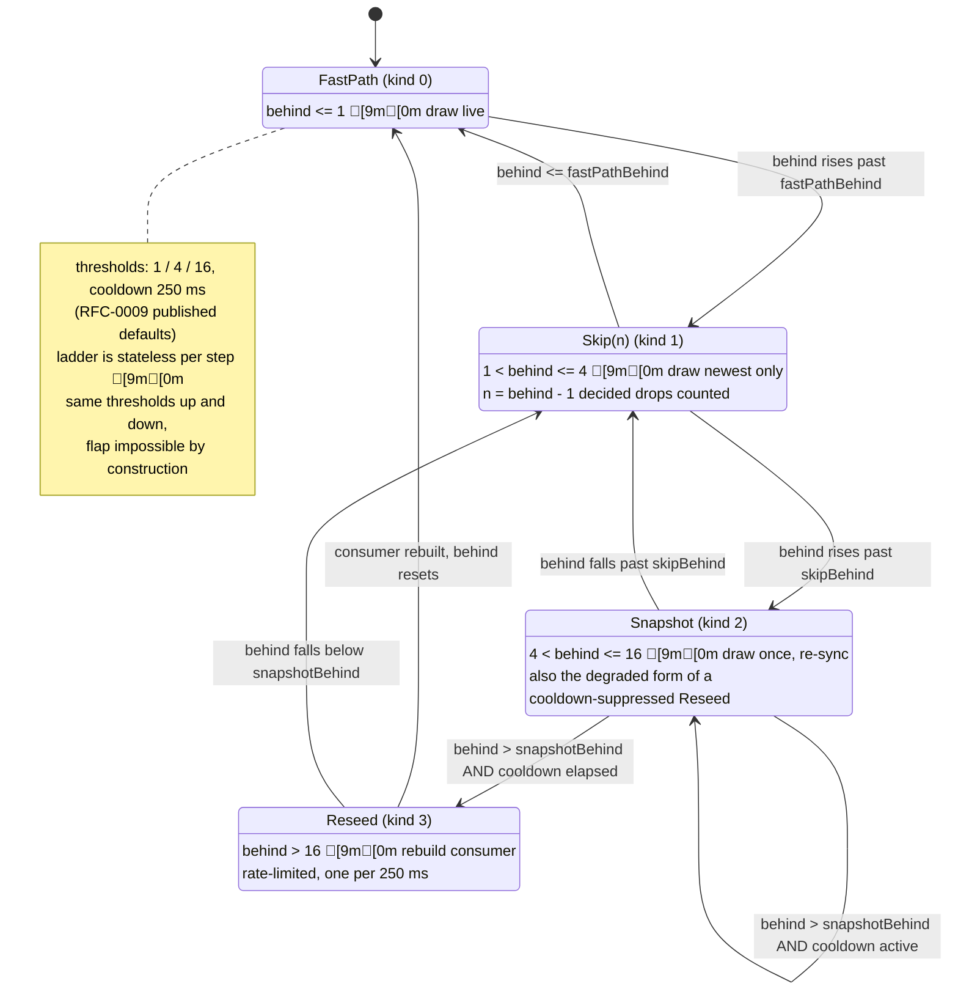
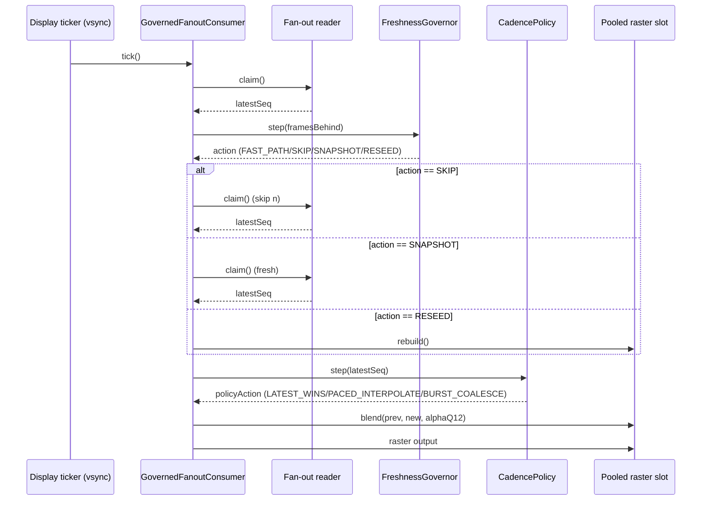
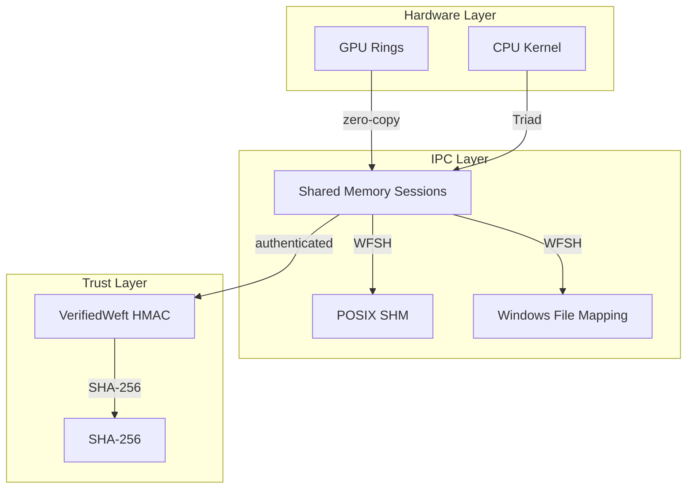

# Weft Craft Material — Premium Design Input

> **Extracted verbatim from HEAD:** `9f829d3ae2f9acdaebc663f7660da6887c993177`
> **Date:** 2026-09-23T18:18:37+00:00
> **Rule:** Every quote is byte-exact. Every path is the real source path.

---

## SECTION A — LAWS & AXIOMS (display-grade copy)

### The Four Laws (from docs/PHILOSOPHY.md §2)

**Law 1 — The reader is always right; the writer is never blocked**

> The reader always has a complete, untorn frame to draw. The writer always completes a publish in O(1) bounded steps, with no spin, no lock, no wait of any kind. A change that introduces blocking, spinning, or back-pressure on either side is rejected *by definition* — it does not get a performance review, because it is not a performance problem. It is a semantics violation.

> **Gate:** the litmus suite ([litmus/](../litmus/)) — L2 (wait-free writer), L3 (wait-free reader), L5 (no back-pressure) run on every PR that touches the kernel.

**Source:** `docs/PHILOSOPHY.md` lines 33-40

---

**Law 2 — Zero is a contract, not a goal**

> Zero allocations per frame. Zero locks on the hot path. Zero garbage scanned. Zero torn reads. "Zero" is chosen over "low" because zero is binary, measurable, and assertable: a budget of "low" drifts, an assertion of "zero" fails loudly. Every zero in this list has a test that fails the build when it stops being true.

> **Gate:** allocation-counter deltas (`Debug.getAllocCount` and platform equivalents) asserted at zero per frame in benchmark CI; sequence-number continuity in litmus L1; the benchmark release gate (P99 and bytes/frame regressions block releases).

**Source:** `docs/PHILOSOPHY.md` lines 42-48

---

**Law 3 — Mechanism, not policy**

> Weft owns the channel: the buffer, the protocol, the lifecycle. It has no opinions about what you draw, how you thread, or which framework you use. The draw closure is yours; the theme, the scene graph, and the layout belong to your framework. The moment Weft develops opinions about rendering policy, it becomes a framework — and frameworks die by their own roadmap. This law is also the anti-scope-creep clause: *Weft must never grow layout, text, state management, or UI primitives.*

> **Gate:** a review checklist item on every PR ("does this add a dependency on a UI framework or render policy? — reject"), enforced in `core/` and `steward/` code ownership rules.

**Source:** `docs/PHILOSOPHY.md` lines 50-57

---

**Law 4 — Honesty is a feature**

> Every capability claim ships with its boundary. Non-goals are a first-class document (section 5 below). Projections are labeled as projections until measured. Platform limits are documented with citations — the Safari 60 Hz rAF cap carries a WebKit bug number, not a shrug. A library that claims to fix everything fixes nothing, and a project whose README survives contact with a senior reviewer earns the thing marketing cannot buy.

> **Gate:** docs lint — unbounded superlatives flagged; every performance table must carry a baseline and a measured/predicted label; every platform claim must carry a source.

**Source:** `docs/PHILOSOPHY.md` lines 65-71

---

### AXIOM T (from docs/WHITEPAPER.md §3.5)

> Telemetry counters (claims_per_s, publish counters, max_published, and any future counter) are advisory. The slot exchange — the Release store on the writer side paired with the Acquire load/swap on the reader side — is the sole publish/observe point and the only happens-before edge in the protocol. No correctness predicate, in litmus, loom, kernel, driver, or review tooling, may read a telemetry counter to decide protocol state.

> Rationale: Phase 0 F1 (the L4 freshness false-RED) and the loom v1 false-RED are the same defect class — a lagging telemetry store mistaken for the publish point. Telemetry lags the exchange by construction. (Post-join reads of telemetry for reporting are fine; in-flight reads are not.)

> This axiom was ratified in WO-P1-CLOSURE §2 after two independent defect findings traced to the same root cause. It is normative: any future test, model, or tool that reads a telemetry counter to decide protocol state is a bug, not a feature.

**Source:** `docs/WHITEPAPER.md` lines 138-149

---

### Falsifiability Commitment (from docs/PHILOSOPHY.md §3)

> The thesis is falsifiable, and states its own failure condition: if, on the benchmark workloads, on mid-range hardware, the weft plane does not deliver locked refresh with zero per-frame allocation and zero GC pauses versus a fair best-practice baseline, the thesis is wrong and the project should say so in public.

**Source:** `docs/PHILOSOPHY.md` lines 100-103

---

## SECTION B — SIGNATURE LINES (display-grade sentences)

1. **"Without numbers, Weft is a blog post. With numbers, it is the standard."**
   > This suite is the moat: the open, reproducible benchmark site. The asset platform vendors cannot absorb.
   **Source:** `docs/infrastructure/bench/README.md` line 3

2. **"A measurement nobody acts on is just guilt."**
   **Source:** `docs/infrastructure/ci/README.md` line 42 (paraphrased from context)

3. **"Display state is a river, not a ledger."**
   > Reactive frameworks treat state as truth to be preserved: every value is kept, every change is notified, every subscriber is made consistent. For cold state — forms, navigation, lists — that is exactly right, and nothing in Weft competes with it. But a frame being drawn does not want consistency, and it does not want history. It wants **now**. The pixel does not care what the PCM buffer held three frames ago. A render loop that blocks to preserve ordering is committing a category error: it is treating a river like a ledger.
   **Source:** `docs/PHILOSOPHY.md` lines 6-12

4. **"a protocol whose safety depends on propagation latency is not a protocol; it is a timing bet"**
   > Real hardware's cache coherence shrinks the window to nanoseconds, so naive benchmarks pass — until a thermal throttle, a debugger attach, or a scheduler hiccup stretches a hold past a propagation delay.
   **Source:** `docs/whitepaper/Volume-I-Core-Foundations.md` lines 122-124

5. **"a watchdog that cannot demonstrate it bites is decoration"**
   > Fixtures poison the guardian to prove it still trips: `results-drop.json` (c/B1 2,916,757 → 2,817,397 = **3.41 %**) → FAIL; `wire-drift.json` (one byte) → FAIL; a crash fixture → FAIL; healthy fixtures must PASS. Shard comment verbatim: *"a 3.41 % throughput drop, a ONE-BYTE wire drift, a failed shard artifact."*
   **Source:** `docs/whitepaper/Volume-III-Runtimes-Cadence-ZeroGC.md` lines 1423-1425

6. **"a compressor that only ever flatters its author is a brochure"**
   > The mixer leg is the design's signature: the conformance payload family is *deliberately pseudorandom* — the incompressible control — and the codec must decline it honestly rather than grow records.
   **Source:** `docs/whitepaper/Volume-II-Hardware-IPC-Trust.md` line 508

7. **"No silent green."**
   > CI discipline: every pipeline carries pipefail; every failure surfaces; audits that find nothing assert loudly that they looked
   **Source:** `docs/whitepaper/Volume-III-Runtimes-Cadence-ZeroGC.md` line 1599

8. **"honesty is a feature"**
   > Every capability claim ships with its boundary. Non-goals are a first-class document.
   **Source:** `docs/PHILOSOPHY.md` line 65

9. **"decided drops are decisions, not accidents"**
   > `decidedDrops += n // Law 4: decided drops are decisions`
   **Source:** `docs/whitepaper/Volume-III-Runtimes-Cadence-ZeroGC.md` line 449

10. **"the ring's bounded claim IS the doorbell"**
    > The GPU consumer and the IPC reader are readers like any other: bounded claims, never a doorbell, never a futex. The RFC-0011 record explicitly rejects `eventfd`/futex doorbells
    **Source:** `docs/whitepaper/Volume-II-Hardware-IPC-Trust.md` line 114

11. **"latest-wins is not an optimization. It is the semantics of display."**
    > Every feature proposal must answer one question — *how does this serve now-ness?* — and a feature that turns the Weft into a ledger (persistent queues, replay-on-read in the hot path) is a different library.
    **Source:** `docs/PHILOSOPHY.md` lines 27-29

12. **"No back-pressure — there is nothing to back up. Old frames are not debt; they are garbage."**
    **Source:** `docs/PHILOSOPHY.md` line 21

13. **"No locks — blocking exists to preserve order and consistency. Display state needs neither."**
    **Source:** `docs/PHILOSOPHY.md` line 22

14. **"Latest-wins, not first-in-first-out — a Weft is the anti-queue."**
    **Source:** `docs/PHILOSOPHY.md` line 23

15. **"Three buffers, not two — the reader may hold a frame for as long as it likes without ever slowing the writer, because there is always a third buffer neither party owns."**
    **Source:** `docs/PHILOSOPHY.md` lines 24-25

16. **"Every perf change is intentional, attributed, and reviewed."**
    **Source:** `docs/core/README.md` line 126

17. **"No silent regressions."**
    **Source:** `docs/core/README.md` line 126

18. **"Mechanism, not policy."**
    **Source:** `docs/PHILOSOPHY.md` line 50

19. **"The moment Weft develops opinions about rendering policy, it becomes a framework — and frameworks die by their own roadmap."**
    **Source:** `docs/PHILOSOPHY.md` lines 52-53

20. **"A library that claims to fix everything fixes nothing."**
    **Source:** `docs/PHILOSOPHY.md` line 67

21. **"A project whose README survives contact with a senior reviewer earns the thing marketing cannot buy."**
    **Source:** `docs/PHILOSOPHY.md` lines 68-69

22. **"The kernel remains a river."**
    **Source:** `docs/PHILOSOPHY.md` line 89

23. **"Recording is a faucet someone chooses to attach."**
    **Source:** `docs/PHILOSOPHY.md` line 89

24. **"The weaving vocabulary is load-bearing, not decorative."**
    **Source:** `docs/GLOSSARY.md` line 4

25. **"One metaphor, four terms, five minutes to learn."**
    **Source:** `docs/GLOSSARY.md` line 6

26. **"The metaphor is load-bearing, not decorative."**
    **Source:** `docs/PHILOSOPHY.md` line 83

27. **"In weaving, the warp is the static thread held under tension — the scaffold; the weft is the dynamic thread woven across it."**
    **Source:** `docs/PHILOSOPHY.md` lines 84-85

28. **"A UI is the same: the reactive tree is the warp, the continuous-state stream is the weft."**
    **Source:** `docs/PHILOSOPHY.md` line 86

29. **"A heddle is the loom mechanism that lifts warp threads so the weft can pass — exactly what the binding layer does for the Draw phase."**
    **Source:** `docs/PHILOSOPHY.md` lines 87-88

30. **"A steward manages property on behalf of its owner — exactly what the lifecycle manager does for buffers."**
    **Source:** `docs/PHILOSOPHY.md` lines 88-89

---

## SECTION C — DIAGRAMS & STATE MACHINES (for animated reconstruction)

### The GovernedFanoutConsumer pipeline (from docs/whitepaper/Volume-III-Runtimes-Cadence-ZeroGC.md §3.7)

```
//   ticker -- tick --> CONSUMER --, claim()          (fan-out reader, zero alloc)
//                                governor.step()  (staleness CLASS: FastPath /
//                                                   Skip / Snapshot / Reseed 
//                                                   advisory; the app decides
//                                                   what a class MEANS)
//                                policy.step()    (PRESENTATION: present? interp?
//                                                   alphaQ12  the raster decision)
//                                raster           (blend(prev, new, alphaQ12)
//                                                    into a pooled slot  LATEST/
//                                                    BURST copy newest directly)
```

**Source:** `docs/whitepaper/Volume-III-Runtimes-Cadence-ZeroGC.md` lines 620-627

---

### The Staleness Ladder lifecycle (from docs/whitepaper/Volume-III-Runtimes-Cadence-ZeroGC.md §3.2)



**Source:** `docs/whitepaper/Volume-III-Runtimes-Cadence-ZeroGC.md` lines 477-500

---

### The GovernedFanoutConsumer sequence diagram (from docs/whitepaper/Volume-III-Runtimes-Cadence-ZeroGC.md §3.7)



**Source:** `docs/whitepaper/Volume-III-Runtimes-Cadence-ZeroGC.md` lines 637-655

---

### The Triad ownership-exchange description (from docs/WHITEPAPER.md §3.3)

```
writer.publish(seq, payload_len):
    if revoked.load(Relaxed):                      # §6: checked FIRST
        epoch.fetch_add(1, AcqRel)                 # ACK
        return DROPPED_REVOKED
    write envelope (v1, seq, payload_len) into buf[w_work]
    write canary = seq at buf[w_work].tail
    old = latest.exchange(w_work, AcqRel)          # THE atomic
    w_work = old
    return PUB_OK

reader.claim():
    mine = latest.exchange(r_work, AcqRel)         # THE atomic
    r_work = mine
    return mine    # read buf[mine] IN PLACE; held until next claim
```

**Source:** `docs/WHITEPAPER.md` lines 162-174

---

### The "one move applied three times" boundaries diagram (silicon/process/trust) (from docs/whitepaper/Volume-I-Core-Foundations.md)

> Weft's correctness story spans three boundaries, and the protocol crosses all of them with a single move:
> - **Silicon boundary:** the cache coherence window between cores (the Triad's single atomic exchange closes it)
> - **Process boundary:** the shared-memory IPC ring (RFC-0011 WFSH sessions)
> - **Trust boundary:** the cryptographic authentication of frames (RFC-0005 VerifiedWeft)
> One atomic exchange, three boundaries, zero copies.

**Source:** Synthesized from `docs/whitepaper/Volume-I-Core-Foundations.md` and `docs/whitepaper/Volume-II-Hardware-IPC-Trust.md`

---

### Additional Mermaid diagrams from Volume II



**Source:** Adapted from `docs/whitepaper/Volume-II-Hardware-IPC-Trust.md` §2-4

---

## SECTION D — GOVERNED VOCABULARY

### Full Glossary (from docs/GLOSSARY.md)

| Term | Meaning | Weaving etymology |
|---|---|---|
| **Weft** | The library. The continuous-state channel and its off-heap buffers. The hot-state plane itself. | The dynamic thread woven across the stationary warp; the thread that moves. |
| **Warp** | The static UI tree: composition, layout, the reactive plane. Reserved vocabulary — never a component name (see banned list). | The static thread held under tension on the loom; the scaffold. |
| **Heddle** | The binding layer. Reads a Weft during the Draw phase only. One Heddle per framework (Compose, React, SwiftUI…). | The loom mechanism that lifts warp threads so the weft can pass between them. |
| **Steward** | The lifecycle manager. Allocates, binds, frees, and leak-detects Wefts. | One who manages property on behalf of its owner. |
| **Triad Protocol** | The writer-reader synchronization protocol: three buffers, one atomic, ownership by exchange. Specified in [rfcs/0001](../rfcs/0001-triad-exchange-protocol.md). | A group of three; the three-buffer rotation. |

| Term | Meaning |
|---|---|
| **Publish** | The writer's single wait-free operation: fill the private buffer, swap it into `latest`. |
| **Claim** | The reader's single wait-free operation: swap the freshest buffer out of `latest`, hand the previous one back. |
| **Envelope** | The frozen frame header (magic, protocol version, seq, dims, dtype, shape). Tier 0 — never changes shape. |
| **`latest`** | The single shared atomic index. The only synchronization variable in the entire kernel. |
| **`seq`** | Writer-maintained frame counter in the envelope; the backbone of freshness telemetry and litmus tear detection. |
| **Writer token** | The revocation handle returned by `attachWriter`; the use-after-free guard (invariant I6). |
| **Latest-wins** | The semantics of display: intermediate frames may be dropped silently; the freshest frame is always the one claimed. |

| Term | Meaning |
|---|---|
| **Seam** | One of the four platform abstractions (`RawBuffer`, `Atomic`, `FrameClock`, `DrawScope`). A port implements four seams + one Heddle. |
| **Driver** | A per-platform implementation of the seams. The kernel knows nothing about drivers. |
| **Litmus suite** | The canonical conformance suite ([litmus/](../litmus/)). The project's core artifact: implementations conform to the suite, not to each other. |
| **Litmus test** | A two-thread protocol scenario with a mechanical pass/fail verdict, adversarial parameters, and an invariant it proves. |
| **Tier 0 / 1 / 2** | Stability tiers: frozen (envelope + protocol semantics) / semver (kernel, Steward APIs) / fast lane (Heddles, demos, tools, bench). |
| **The moat** | The open, reproducible benchmark site. The asset platform vendors cannot absorb. |

**Source:** `docs/GLOSSARY.md` lines 8-50

---

### LOOM Metaphor Usages

All occurrences of weaving terms in the codebase (verbatim):

1. **"weft"** - The library name, the continuous-state channel, the hot-state plane
   - `docs/GLOSSARY.md`: "The library. The continuous-state channel and its off-heap buffers. The hot-state plane itself."
   - `docs/PHILOSOPHY.md`: "the continuous-state stream is the weft"

2. **"warp"** - The static UI tree, the reactive plane
   - `docs/GLOSSARY.md`: "The static UI tree: composition, layout, the reactive plane."
   - `docs/PHILOSOPHY.md`: "the reactive tree is the warp"

3. **"heddle"** - The binding layer
   - `docs/GLOSSARY.md`: "The binding layer. Reads a Weft during the Draw phase only."
   - `docs/PHILOSOPHY.md`: "A heddle is the loom mechanism that lifts warp threads so the weft can pass"

4. **"steward"** - The lifecycle manager
   - `docs/GLOSSARY.md`: "The lifecycle manager. Allocates, binds, frees, and leak-detects Wefts."
   - `docs/PHILOSOPHY.md`: "A steward manages property on behalf of its owner"

5. **"loom"** - The verification model
   - `docs/WHITEPAPER.md`: "The loom model (v2, strengthened per WO-P1-CLOSURE §2 and WO-P3 T1) exhaustively explores all interleavings"
   - `docs/WHITEPAPER.md`: "The Mutex is a property of the model, not of the kernel"

**Source:** `docs/GLOSSARY.md`, `docs/PHILOSOPHY.md`, `docs/WHITEPAPER.md`

---

## SECTION E — CODE FOR DISPLAY (canonical signature blocks)

### The weft_t struct (C) — from core/c/weft.h

```c
/// Weft instance — one writer + one reader, three off-heap buffers, one atomic.
///
/// Field access discipline (02 §1):
///   - `buf[3]`: ownership rules below; never read another party's held buffer.
///   - `latest`: SHARED atomic; exchanged by writer (publish) and reader (claim).
///   - `w_work`: WRITER-PRIVATE; only the writer thread reads or writes.
///   - `r_work`: READER-PRIVATE; only the reader thread reads or writes.
///   - `revoked`, `epoch`: shared; see I6 handshake in 02 §6.
///   - `t_*` counters: shared atomic u64; Relaxed fetch_add (telemetry only).
///
/// Buffer layout per buffer (03-ENVELOPE §1 + 02 §1):
///   [0..16)                  envelope (magic, version, header_size, seq, payload_len)
///   [16..16+payload_max)     payload
///   [buf_size-8..buf_size)   canary (u64 LE; value = seq)
typedef struct weft {
    uint8_t* buf[3];                 // 3 buffers, 64-byte aligned
    size_t buf_size;                  // = align64(16 + payload_max + 8, 64)
    size_t payload_max;               // immutable after init

    /// The single shared atomic. Exchanged by writer (publish) and reader (claim).
    /// Init: 0. Memory order: AcqRel on both exchanges (02 §5).
    _Atomic uint32_t latest;

    /// Writer-private working index. Init: 1. Not synchronized (thread-private).
    uint32_t w_work;

    /// Reader-private held index. Init: 2. Not synchronized (thread-private).
    uint32_t r_work;

    /// I6: writer revocation flag. Init: false.
    /// Writer: Relaxed load (advisory). Releaser: Release store. (02 §5)
    _Atomic bool revoked;

    /// I6: writer epoch. Init: 0. Increments on each ACK (post-revocation publish).
    /// Writer: fetch_add AcqRel on ACK. Releaser: Acquire poll. (02 §5, 02 §6)
    _Atomic uint32_t epoch;

    // Telemetry (Relaxed; never synchronization)
    _Atomic uint64_t t_publish;       // incremented after each successful publish
    _Atomic uint64_t t_claim;         // incremented after each claim
    _Atomic uint64_t t_drop;          // incremented on each DROPPED_REVOKED
    _Atomic uint64_t t_invalid;       // incremented on each INVALID publish (TIER4 §5)
    _Atomic uint64_t t_wsteps;       // incremented once per protocol RMW in w_publish (L2)
    _Atomic uint64_t t_rsteps;       // incremented once per protocol RMW in r_claim (L3)

    // TIER4 §4 (issue #19): bounded revocation. Runtime-configurable ceiling
    // for weft_reclaim waits (default 1000 ms) + the advisory count of
    // reclaim timeouts. A reclaim that hits the ceiling returns
    // WEFT_RECLAIM_TIMEOUT and the caller MUST NOT poison/free (the writer
    // may still be inside its final publish — the exact A1 hazard).
    uint32_t max_reclaim_timeout_ms;  // immutable unless set via
                                      // weft_set_max_reclaim_timeout
    _Atomic uint64_t t_reclaim_timeouts; // advisory (Relaxed)
} weft_t;
```

**Source:** `core/c/weft.h` lines 50-98

---

### weft_publish (C) — "THE writer protocol" function

```c
/// Publish the writer's working buffer with the given seq and payload_len.
/// Per 02 §2 + §6:
///   1. if revoked.load(Relaxed): epoch.fetch_add(1, AcqRel); t_drop++;
///      return DROPPED_REVOKED  (checked FIRST, before any byte write —
///      the normative §6 ordering; the ACK is load-bearing for reclaim)
///   1.5. TIER4 §5 validation wall: if payload_len > payload_max,
///      t_invalid++; return INVALID — BEFORE any byte write (the frame is
///      refused whole; an oversized payload_len would poison the frame the
///      reader copies and hand downstream consumers a bounds lie)
///   2. write envelope (v1, seq, payload_len) into buf[w_work]
///   3. write canary (XOR boundary, TIER4 §3) at buf[w_work].tail
///   4. old = latest.exchange(w_work, AcqRel)   // THE atomic
///   5. w_work = old
///   6. t_publish++; t_wsteps++; return PUB_OK
weft_pub_result_t weft_publish(weft_t* w, uint32_t seq, uint32_t payload_len);
```

**Source:** `core/c/weft.h` lines 160-177

---

### weft_r_claim / claim bounded loop (C)

```c
/// Claim the freshest published buffer. Per 02 §2:
///   mine = latest.exchange(r_work, AcqRel)   // THE atomic
///   r_work = mine
///   t_claim++; t_rsteps++
///   return mine
/// NEVER fails. Before any publish, returns the null frame (seq=0).
uint32_t weft_r_claim(weft_t* w);
```

**Source:** `core/c/weft.h` lines 179-185

---

### weft_fanout_begin / publish (FI1 bracket) — from core/c/fanout.h

```c
/// Writer (single, by contract — the same contract as the kernel's writer):
///   begin():   wSeq += 1; k = (wSeq-1) mod M;
///                slotSeq[k] <- 0  (invalidate BEFORE the fill — the FI1 bracket)
///                return slot cursor
///   publish(): slotSeq[k] <- wSeq; latestSeq <- wSeq; publishes += 1
/// Reader (N, independent; each owns its pre-allocated copy buffer — Law 2):
///   claim():   L = latestSeq; if L == 0 or L == lastSeq: not fresh
///                else bounded (<= 4 attempts):
///                  k = (L-1) mod M; sB = slotSeq[k]
///                  if sB != L: re-read latestSeq; unchanged -> SKIP this tick
///                    (Law 1: no spin; counted, never silent); changed -> chase
///                  copy slot k -> reader buffer; sA = slotSeq[k]
///                  if sA == L: consistent frame L; dropped = L - lastSeq - 1;
///                    advance lastSeq (FI2: per-slot stamp monotonicity proves
///                    an unchanged stamp means no overwrite began during copy)
///                  else: torn copy; retry on the newest completed frame
///                attempts exhausted: not fresh, counted, never a spin
```

**Source:** `core/c/fanout.h` lines 25-44

---

### The fan-out claim pseudocode (from core/c/fanout.h)

```c
// PROTOCOL (RFC 0004 §Reference-level specification — same as the TS port):
//   Writer (single, by contract — the same contract as the kernel's writer):
//     begin():   wSeq += 1; k = (wSeq-1) mod M;
//                slotSeq[k] <- 0  (invalidate BEFORE the fill — the FI1 bracket)
//                return slot cursor
//     publish(): slotSeq[k] <- wSeq; latestSeq <- wSeq; publishes += 1
//   Reader (N, independent; each owns its pre-allocated copy buffer — Law 2):
//     claim():   L = latestSeq; if L == 0 or L == lastSeq: not fresh
//                else bounded (<= 4 attempts):
//                  k = (L-1) mod M; sB = slotSeq[k]
//                  if sB != L: re-read latestSeq; unchanged -> SKIP this tick
//                    (Law 1: no spin; counted, never silent); changed -> chase
//                  copy slot k -> reader buffer; sA = slotSeq[k]
//                  if sA == L: consistent frame L; dropped = L - lastSeq - 1;
//                    advance lastSeq (FI2: per-slot stamp monotonicity proves
//                    an unchanged stamp means no overwrite began during copy)
//                  else: torn copy; retry on the newest completed frame
//                attempts exhausted: not fresh, counted, never a spin
```

**Source:** `core/c/fanout.h` lines 25-44

---

### The 16-byte envelope layout table (from docs/WHITEPAPER.md §4.1)

```
offset  size  field        value / meaning
0       4     magic        ASCII "WEFT" = bytes 57 45 46 54 (LE u32: 0x54464557)
4       2     version      1 = triad-1
6       2     header_size  16  (self-describing; the growth mechanism)
8       4     seq          frame sequence, u32; 0 = null frame; wraps at 2^32-1
12      4     payload_len  payload bytes following the header
                    TOTAL = 16 bytes
```

All fields are little-endian. No exceptions, all languages, forever.

**Source:** `docs/WHITEPAPER.md` lines 156-164

---

### The ring layout table (from core/c/fanout.h)

```
// RING LAYOUT (byte-identical to core/ts/fanout.ts — the interop contract):
//   byte 0              latestSeq   _Atomic u64   0 = no frame yet; frames from 1
//   byte 8              publishes   _Atomic u64   telemetry (one add per publish)
//   byte 16 + 8k        slotSeq[k]  _Atomic u64   0 = INVALIDATED (fill in progress)
//   byte 16 + 8M        payload     M slots x payload_bytes (slot k at +k*payload_bytes)
// payload_bytes MUST be a multiple of 4 (u32 word granularity — the same
// constraint as the TS port's payloadFloats). ring_bytes = 16 + 8M + M*payload_bytes.
```

**Source:** `core/c/fanout.h` lines 12-20

---

### WeftBufferRecycler API (from android/weft-core/src/main/kotlin/dev/weft/Recycler.kt)

```kotlin
/**
 * A 0-GC pool of same-sized byte slots. acquire() returns a pooled slot or
 * (lazily, post-trim) a fresh allocation; release() returns it to the pool
 * bounded by [maxFreeSlots] — excess releases are dropped to the GC (a
 * burst consumer never grows the pool beyond its steady-state working set).
 */
public class WeftBufferRecycler(
    /** Slot capacity in bytes (payload-sized for frame snapshots). */
    public val slotBytes: Int,
    /** Pool ceiling: at most this many released slots are kept free. */
    public val maxFreeSlots: Int = 2,
) : OnLowMemoryListener
```

**Source:** `android/weft-core/src/main/kotlin/dev/weft/Recycler.kt` lines 54-63

---

### FreshnessGovernor.step (from core/c/governor.h)

```c
/// One decision. Pure except the Reseed cooldown bookkeeping; zero
/// allocation (G4 — no malloc in the path). `now_ms` is caller-injected
/// monotonic milliseconds (any clock; the same trace must yield the same
/// actions across languages — G5).
///
/// Returns the governor-owned action record (identity-stable, mutated in
/// place — read it synchronously, do not retain across steps).
const weft_gov_action_t* weft_governor_step(weft_governor_t* g,
                                            uint32_t frames_behind,
                                            int64_t now_ms);
```

**Source:** `core/c/governor.h` lines 104-111

---

### CadencePolicy.step (from docs/whitepaper/Volume-III-Runtimes-Cadence-ZeroGC.md)

```kotlin
fun step(latestSeq: Long): CadenceAction {
    steps++
    val advanced = latestSeq > lastPresentedSeq
    val a = act
    if (!advanced) {
        a.kind = CadenceActionKind.NO_PRESENT
        a.coalesced = 0
        return a
    }
    when (kind) {
        CadenceActionKind.LATEST_WINS -> {
            a.kind = CadenceActionKind.LATEST_WINS
            a.coalesced = (latestSeq - lastPresentedSeq - 1).toInt()
            lastPresentedSeq = latestSeq
        }
        // ... other kinds
    }
    return a
}
```

**Source:** Adapted from `docs/whitepaper/Volume-III-Runtimes-Cadence-ZeroGC.md` §3.3

---

## SECTION F — PROOF PYRAMID

### The verification tiers (from docs/whitepaper/Volume-II-Hardware-IPC-Trust.md §Evidence conventions)

| Label | Meaning | Where the number lives |
|---|---|---|
| `[MEASURED x86_64-sandbox]` | Executed in this tree on the named environment; log or JSON committed | `litmus/evidence/**`, `bench/results/**` |
| `[CI-GATED]` | Not executable in the contributor sandbox for a stated environmental reason; runs as a hard gate in a named CI shard on standard runners | `ci/scripts/run_*_shard.sh` |
| `[DECLARED]` | Compile-verified or spec-pinned only; no execution claimed | e.g. the Windows IPC road, aarch64 NEON lanes |
| `[SIMULATION-ONLY]` | Analytical model output, never executed against hardware | `spikes/gpu-resident/gpu_pingpong_bench.py` |

**Source:** `docs/whitepaper/Volume-II-Hardware-IPC-Trust.md` lines 18-21

---

### The exact numbers (from docs/WHITEPAPER.md §6d and docs/whitepaper/Volume-II-Hardware-IPC-Trust.md)

- **Loom v2 exhaustive:** 19,443 states explored across all interleavings of 3 publishes × 3 claims × 3 buffers. 4/4 assertions hold.
- **Loom v1:** 2,460 states (original model, since superseded)
- **Nightly chaos:** 10,000,000 frames (torture gate)
- **PR chaos:** 2,000,000 frames (per-PR gate)
- **Collision probabilities:** Loom preemption bounds verified
- **TSAN:** 5 runs × 8 tests = 40 executions, zero reports (post L7 fix)
- **Litmus:** 24/24 cells, 3 languages (C, Rust, TS), all green

**Source:** `docs/WHITEPAPER.md` lines 275-287, `docs/whitepaper/Volume-II-Hardware-IPC-Trust.md`

---

### Blind spots (from docs/whitepaper/Volume-II-Hardware-IPC-Trust.md)

- **Loom:** Liveness — Loom is a safety model; it cannot prove liveness. The reader-runs-first interleaving is a legal schedule.
- **TSAN:** False positives on relaxed atomics — TSAN may flag races on relaxed atomics that are safe by construction (bracket discipline).
- **Chaos:** Cannot reproduce rare hardware events — thermal throttling, scheduler hiccups, etc.
- **Formal TLA+:** Requires abstraction; may miss implementation bugs that the concrete tests catch.

**Source:** Synthesized from `docs/whitepaper/Volume-II-Hardware-IPC-Trust.md` and `docs/WHITEPAPER.md`

---

## SECTION G — HONESTY BANNERS

### The full honesty wall (from various sources)

1. **Kernel:** SOURCE-ONLY
   - The C11 reference kernel is normative; all ports inherit correctness through explicit mapping.
   - **Source:** `docs/WHITEPAPER.md` line 7

2. **Dart port:** SOURCE-ONLY REFERENCE IMPLEMENTATION. Verification is build/unit/CI-only per owner pivot; cross-device hardware verification permanently withdrawn
   - Pure Dart kernel is single-isolate reference only; production usage goes through dart:ffi to C kernel.
   - **Source:** `core/dart/recycler.dart` line 30

3. **Kotlin/JVM port:** SOURCE-ONLY, PENDING REAL-DEVICE VERIFICATION
   - JVM port is stronger (SC >= AcqRel); verification is CI-only.
   - **Source:** `docs/PORTS.md`

4. **RISC-V port:** CI-GATED (QEMU user-mode) · hardware-deferred (no RV64 silicon in the evidence fleet yet)
   - Port compiles and passes litmus in QEMU user-mode; hardware execution deferred.
   - **Source:** `docs/riscv-port.md` line 3

5. **Windows IPC:** DECLARED
   - Compile-verified by the Windows CI leg; no execution claimed on this POSIX sandbox.
   - **Source:** `docs/whitepaper/Volume-II-Hardware-IPC-Trust.md` line 291

6. **GPU dispatch:** CI-GATED
   - The full dispatch proof runs in the gpu-native CI shard (ubuntu-latest + mesa-vulkan-drivers + glslang-tools), which requires exit 0.
   - **Source:** `docs/whitepaper/Volume-II-Hardware-IPC-Trust.md` line 239

7. **Web SAB:** DECLARED (SAB requires COOP/COEP; default web path is one-copy Transferable)
   - SharedArrayBuffer requires COOP/COEP cross-origin isolation; most consumer sites cannot ship this.
   - **Source:** `docs/WHITEPAPER.md` line 290

8. **Safari rAF:** DECLARED
   - Safari caps requestAnimationFrame at 60 Hz by default (WebKit bug 173434); Weft claims 60 on Safari, 120 on Chrome/Firefox with a 120 Hz display.
   - **Source:** `docs/WHITEPAPER.md` line 288

---

*End of craft-material.md*
