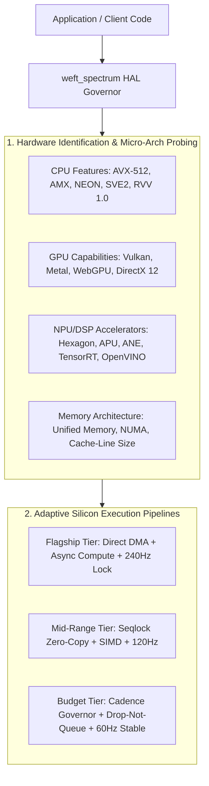
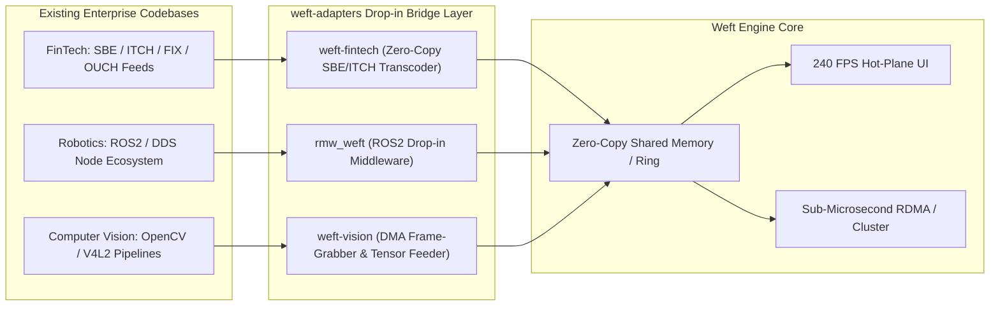

# 🏛️ Next-Generation Architectural Master Plan: Pillars 5 – 8
## Universal Hardware Spectrum, Enterprise Adapters, Weft Studio & Formal Verification

> **"Obliterate the serialization, staging, hardware boundaries, and latency taxes of modern computing."**

---

## 🌟 Executive Overview & Swarm Delivery Model

This specification defines the pillar-by-pillar architecture for the next evolutionary epoch of **Weft** (Pillars 5 through 8).

### ⚡ The 3-Engineer Swarm Delivery Workflow
All engineering deliverables are executed using our horizontal **Swarm-by-Layer** model where all 3 Senior Engineers swarm on **ONE pillar at a time**:
- **Senior Engineer 1:** Core / Protocols / Compiler AST / Memory Layouts / Formal Proofs
- **Senior Engineer 2:** Native Kernels / GPU / NPU / Hardware HAL / Kernel-Bypass Transports
- **Senior Engineer 3:** Managed Runtimes / UI Connectors / Developer Experience / SDK Adapters

Each completed pillar is packaged as an atomic bundle containing all commits, clean git patches, D-series technical audit reports, and documentation. The bundle is applied to a dedicated feature branch, verified through fail-closed extreme CI shards (with P99 perf gates), and merged into `main`.

```
┌────────────────────────────────────────────────────────────────────────────────────────┐
│                          NEXT-GENERATION PILLAR SUITE                                  │
├────────────────────────────────────────────────────────────────────────────────────────┤
│ PILLAR 5: `weft-spectrum` — Universal Hardware-Adaptive HAL                            │
│           All chips (Qualcomm, MediaTek, Apple, Nvidia, Intel, AMD, ARM, RISC-V)       │
│           Budget-aware auto-tuning across Low-End, Mid-Range, and Flagship tiers       │
├────────────────────────────────────────────────────────────────────────────────────────┤
│ PILLAR 6: `weft-adapters` — Plug-and-Play Enterprise Boosters                          │
│           Drop-in zero-copy connectors for existing codebases                          │
│           FinTech SBE/ITCH/FIX · Robotics ROS2/DDS `rmw_weft` · Edge Vision DMA        │
├────────────────────────────────────────────────────────────────────────────────────────┤
│ PILLAR 7: `weft-studio` — The Lightweight Zero-Copy IDE & Profiler                    │
│           Purpose-built standalone Studio (WebAssembly & Desktop)                      │
│           Live Cache-Line Inspector · Seqlock Visualizer · Flight Recorder Replayer    │
├────────────────────────────────────────────────────────────────────────────────────────┤
│ PILLAR 8: `weft-verify` — Formal Proofs, Static Linter & Synthetic Silicon Lab         │
│           `weftc --lint-alloc` static analyzer · TLA+ WCR1 cluster proofs              │
│           Synthetic Thermal Throttler & Virtual PCIe/RDMA Jitter Injector              │
└────────────────────────────────────────────────────────────────────────────────────────┘
```

---

## 🏛️ Pillar 5: `weft-spectrum` (Universal Hardware-Adaptive HAL)

> **Target Paradigm:** Universal silicon acceleration across all consumer phones, workstations, and embedded chips without code changes.  
> **Core Metric:** **Peak Hardware Extraction (0% wasted compute)** with auto-tuning from 2GB budget phones to 128-core flagships.



### 1. Chipset Support Matrix
- **Qualcomm Snapdragon:** FastRPC / Hexagon DSP tensor DMA & Adreno OpenCL/Vulkan interop.
- **MediaTek Dimensity:** APU Neuropilot zero-copy direct buffer import & Mali/Immortalis GPU compute.
- **Apple Silicon:** Metal 3 unified memory zero-copy texture/buffer blitting + Apple Neural Engine (ANE) zero-copy arena.
- **Nvidia & PC Workstations:** CUDA / TensorRT unified memory + Vulkan 1.3 Timeline Semaphores + AVX-512 / AMX SIMD kernels.
- **AMD & Intel:** AMD ROCm / RDNA GPU kernels + Intel Arc / Xe / OpenVINO / AMX accelerators.
- **ARM & RISC-V:** ARM SVE2 / NEON vector pipelines + RISC-V RVV 1.0 vector extensions.

### 2. Swarm Layer Breakdown (Pillar 5)
- **Senior Engineer 1:** Architecture-neutral hardware capability descriptor (`weft_hw_profile_t`), cache-line probing, NUMA topology detection, dynamic budget governor.
- **Senior Engineer 2:** Native hardware accelerator drivers (Qualcomm FastRPC, MediaTek Neuropilot, Apple Metal 3, Nvidia CUDA/Vulkan, ARM SVE2, RISC-V RVV).
- **Senior Engineer 3:** Managed adaptive bridge for TypeScript, Swift, Dart, and Python; seamless dynamic fallback orchestration (NPU → GPU → SIMD CPU → Scalar C) without runtime panics.

---

## 🏛️ Pillar 6: `weft-adapters` (Plug-and-Play Enterprise Boosters)

> **Target Paradigm:** Zero-friction enterprise adoption — existing codebases plug in directly and immediately receive 0ns decode and zero-copy performance.  
> **Core Metric:** **Drop-in compatibility** for existing FinTech, Robotics, and Vision architectures.



### 1. Key Enterprise Adapters
- **FinTech / High-Frequency Trading (HFT):**
  - Simple Binary Encoding (SBE) XML compiler & NASDAQ ITCH/OUCH 5.0 zero-copy parsers.
  - In-place Level 3 Order Book builder feeding directly into `heddle-2.0` 240 FPS canvas.
- **Robotics & Autonomous Systems (`rmw_weft`):**
  - Drop-in ROS2 RMW middleware replacing CycloneDDS/FastDDS inter-process copies with zero-copy shared memory rings on the same host.
  - Zero-copy sensor DMA pipeline for 6-DOF IMUs, LiDAR point clouds, and stereo camera feeds.
- **Computer Vision & Video DMA:**
  - V4L2, GStreamer, and Libcamera memory-mapped zero-copy frame grabbers feeding directly into `weft-tensor` without heap copies.

### 2. Swarm Layer Breakdown (Pillar 6)
- **Senior Engineer 1:** SBE XML schema parser & ITCH 5.0 layout generator emitting bit-exact L1 cache-line `.weft` structures; hardware-accelerated CRC32C/Adler32 validation.
- **Senior Engineer 2:** `rmw_weft` C implementation of the ROS2 Middleware interface; zero-copy V4L2/GStreamer DMA frame capture engine.
- **Senior Engineer 3:** Plug-and-play SDKs in TypeScript, Python, C++, and Rust; pre-built Level 3 Order Book and ROS2 sensor HUD widgets for React, Flutter, and SwiftUI.

---

## 🏛️ Pillar 7: `weft-studio` (Lightweight Dedicated IDE & Realtime Profiler)

> **Target Paradigm:** Purpose-built, ultra-responsive developer environment for zero-copy and continuous-state architectures.  
> **Core Metric:** **Instant zero-backend startup**, < 15MB standalone binary, 120 FPS interactive memory canvas.

```
┌────────────────────────────────────────────────────────────────────────────────────────┐
│                                     WEFT STUDIO                                        │
├──────────────────────────────────────┬─────────────────────────────────────────────────┤
│ 1. .weft SCHEMA DESIGNER & ABI VIEWER│ 2. LIVE CACHE-LINE & MEMORY MAPPER              │
│ • Real-time syntax & error checking  │ • Visual 64B/128B cache line alignment map      │
│ • Instant codegen preview (7 langs)  │ • Zero-copy padding & field offset visualizer   │
│ • Schema hash & crypto version lock  │ • Struct size & memory efficiency audit         │
├──────────────────────────────────────┼─────────────────────────────────────────────────┤
│ 3. LIVE SEQLOCK & ATOMIC MONITOR     │ 4. FLIGHT RECORDER TIME-TRAVEL DEBUGGER         │
│ • Real-time writer/reader contention │ • Microsecond scrubbing of .weftrec traces      │
│ • Dropped frame & torn-read counters │ • Step-by-step memory mutation playback         │
│ • Virtual multi-device telemetry HUD │ • Instant export of reproducible crash dumps    │
└──────────────────────────────────────┴─────────────────────────────────────────────────┘
```

### 1. Key Innovations
- **Interactive Cache-Line Map:** Visualizes struct alignment, padding holes, and cache-line boundaries in real time as the developer types `.weft` definitions.
- **Live Seqlock & Contention Profiler:** Attaches to running POSIX shared memory or WebAssembly `SharedArrayBuffer` to graph atomic operations, contention, and torn-read avoidance.
- **Flight Recorder (`weftrec`) Time-Travel Replayer:** Microsecond-precision scrubber allowing developers to step forwards and backwards through live memory mutation traces.

### 2. Swarm Layer Breakdown (Pillar 7)
- **Senior Engineer 1:** `weft-lsp` (Language Server Protocol for `.weft`), WebAssembly `weftc` compiler engine for zero-install in-browser compilation, `.weftrec` binary trace indexing engine.
- **Senior Engineer 2:** WebGL2/WebGPU interactive memory canvas renderer, kernel-level lock-free metric scraper, POSIX shared memory attach daemon.
- **Senior Engineer 3:** Dark-mode responsive Studio UI built with `@weft/react-heddle` (dogfooding our own 240 FPS hot-plane), time-travel scrub controls, lightweight desktop packaging (Tauri / Webview2).

---

## 🏛️ Pillar 8: `weft-verify` (Formal Proofs, Static Linter & Synthetic Silicon Lab)

> **Target Paradigm:** Exhaustive software-based verification, compile-time allocation safety, and pre-silicon hardware simulation.  
> **Core Metric:** **100% formal and static certainty** before physical hardware lab deployment.

### 1. Key Innovations
- **Static Zero-Allocation Linter (`weftc --lint-alloc`):** Static analyzer that scans TypeScript, Swift, Dart, and Rust codebases to guarantee zero heap allocations in hot loops at compile time.
- **TLA+ Formal Verification:** Model checking WCR1 cluster consensus, lease renewal, split-brain fencing, and dynamic node partition healing under arbitrary network partitions.
- **Synthetic Silicon & Network Chaos Lab:**
  - *Virtual Thermal Throttler:* Simulates clock stretching and frame drops to verify `weft-cadence` drop-not-queue behavior.
  - *RDMA / XDP Network Chaos Injector:* Simulates packet drops, out-of-order deliveries, and split-brain network partitions in CI.
  - *Memory Bus Saturation Stressor:* Contends on shared cache lines to verify false-sharing immunity under high core count load.

### 2. Swarm Layer Breakdown (Pillar 8)
- **Senior Engineer 1:** `weftc --lint-alloc` compiler scanner, TLA+ formal models and invariant checkers for distributed cluster consensus.
- **Senior Engineer 2:** Synthetic silicon jitter, thermal throttling, and virtual RDMA network chaos simulation engine.
- **Senior Engineer 3:** Automated CI matrix integration, scorecard aggregator, and D-series audit report generator.

---

## 🗺️ Roadmap Execution Matrix

| Stage | Pillar | Deliverable Artifacts | Primary Verification Gate |
|---|---|---|---|
| **Phase 1** | **Pillar 5: `weft-spectrum`** | Universal HAL, 6 silicon backends, budget governor | All silicon backends compile & pass SIMD/DMA parity in CI |
| **Phase 2** | **Pillar 6: `weft-adapters`** | SBE/ITCH FinTech, `rmw_weft` ROS2, V4L2 Vision | 100k msgs/sec zero-copy throughput with 0 allocations |
| **Phase 3** | **Pillar 7: `weft-studio`** | Standalone Studio, LSP, Live Memory & Seqlock Visualizer | Sub-15MB bundle, 120 FPS interactive memory canvas |
| **Phase 4** | **Pillar 8: `weft-verify`** | `weftc --lint-alloc`, TLA+ proofs, Synthetic Silicon Lab | TLA+ TLC model check passes + 0-alloc static scan passes |
