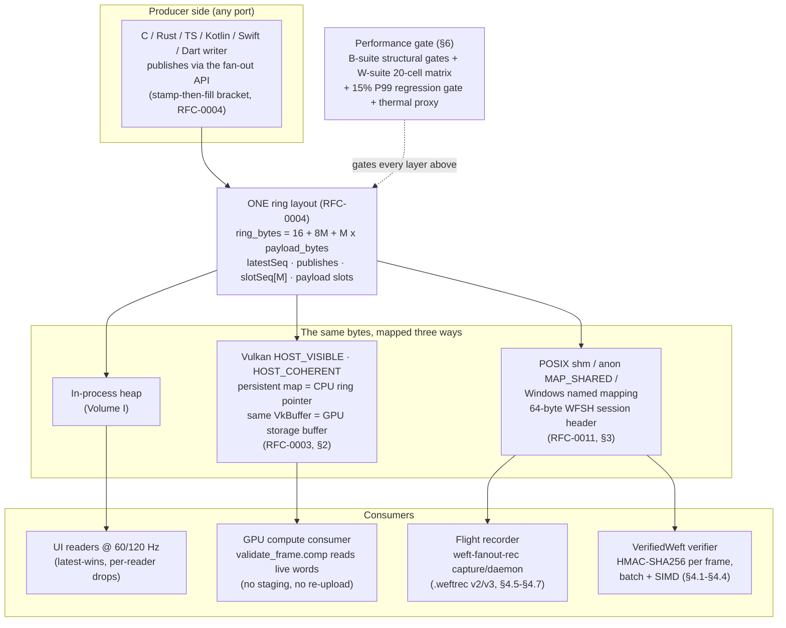
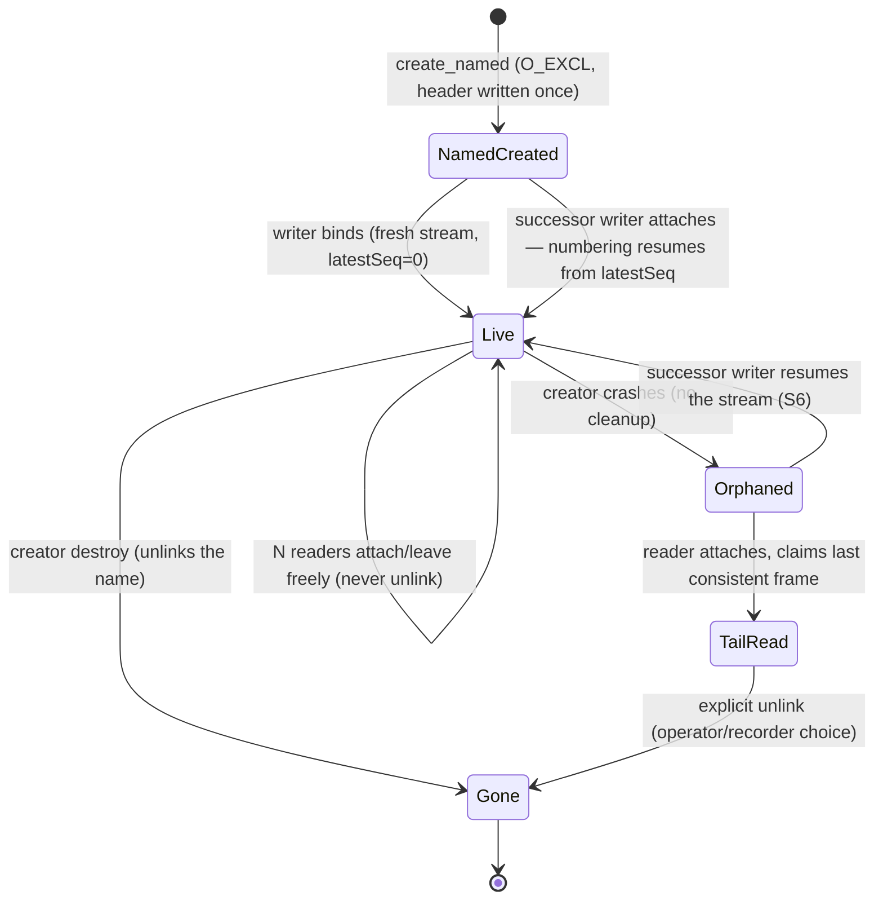

# Weft Technical Whitepaper — Volume II
## Hardware Acceleration, GPU Rings, Inter-Process IPC, Cryptographic Trust & the Performance Gate

> **Volume II · v1.0.0** · 2026-09-18 · applies-to `main@6a9a4db` (post-Series-7 merge)
>
> **Series context.** This is the second volume of the definitive three-volume technical whitepaper for the Weft project. Volume I covers the continuous-state plane itself: the founding problem, the frozen kernel, the RFC-0004 fan-out driver layer, and the language ports. **Volume II — this volume — covers the high-throughput infrastructure beneath and around the plane:** hardware-resident memory, cross-process exchange, cryptographic trust, and the empirical performance machinery that gates every release. Volume III covers the adversarial verification superstructure — chaos engines, exhaustive state-space proofs, and formal models.
>
> **Kernel:** FROZEN (`weft.c` / `weft.h` byte-identical since the freeze). Every module in this volume is driver-layer: it composes beside the kernel without touching it. This document describes what **IS** — in the tree, at the commit above, with evidence attached.
>
> **Founding document:** `docs/WHITEPAPER.md` v1.0.4 (the problem statement and the kernel's own evidence triad). This volume extends, never re-litigates, that ground.

### Evidence conventions (inherited from the founding whitepaper)

Every quantitative claim in this document carries one of four labels. The label is part of the claim, not decoration:

| Label | Meaning | Where the number lives |
|---|---|---|
| `[MEASURED x86_64-sandbox]` | Executed in this tree on the named environment; log or JSON committed | `litmus/evidence/**`, `bench/results/**` |
| `[CI-GATED]` | Not executable in the contributor sandbox for a stated environmental reason; runs as a hard gate in a named CI shard on standard runners | `ci/scripts/run_*_shard.sh` |
| `[DECLARED]` | Compile-verified or spec-pinned only; no execution claimed | e.g. the Windows IPC road, aarch64 NEON lanes |
| `[SIMULATION-ONLY]` | Analytical model output, never executed against hardware | `spikes/gpu-resident/gpu_pingpong_bench.py` |

No GPU performance numbers are quoted from software Vulkan execution, and none exist in this tree. No hand-typed benchmark numbers appear in the B/W-suite tables: the B-suite figures bind to `bench/results.json` (sha256 `16b5c663433a3754…`, the same artifact the founding whitepaper's machine-generated tables bind to), the W-suite figures bind to `bench/results/wsuite-x86_64-sandbox.json` (sha256 `651c922f31cc90da…`), and the thermal figures to `bench/results/wsuite-thermal-x86_64-sandbox.json` (sha256 `8dbec979f1612e21…`). If a number below is not in one of those artifacts or a committed evidence log, it is a mistake, and the errata process (`docs/ERRATA.md`) applies.

### Source material for this volume

| Layer | RFCs | Primary code | Merged via |
|---|---|---|---|
| GPU-resident rings | RFC-0003 (Draft, spike attached), RFC-0004 (Accepted, driver-layer) | `core/c/{gpu_ring,gpu_probe,vk_min}.{h,c}`, `probes/compute/validate_frame.{comp,spv}` | PR #14 (`contrib/hardware-accel`), Series 7 |
| Inter-process IPC | RFC-0011 (Draft, implementation attached) | `core/c/{shm_ring,shm_runner,shm_test}.{h,c}`, `core/rust/src/shm.rs` | PR #14, Series 7 |
| Cryptographic trust | RFC-0005 (Implemented, ratification pending) | `core/c/{verified,verified_mb,sha256,sha256_hw,sha256_mb,hmac}.{h,c}`, `core/rust/src/verified.rs`, `core/ts/verified.ts` | PR #7 (base), #10 (Series 6 HW), #14 (Series 7 SIMD) |
| Flight recorder & compression | RFC-0010 (Draft, implementation + e2e attached) | `tools/weft-fanout-rec/`, `tools/FORMATS.md` §1.5–1.6 | PR #8 (v2), #10 (v3 + daemon) |
| Benchmark & gate machinery | — | `core/c/bench_runner.c`, `bench/**`, `ci/scripts/run_perf_regression_shard.sh` | PRs #1–#14 cumulative |

---

## Table of Contents

1. [Executive Overview: Bridging Silicon, OS & Process Boundaries](#1-executive-overview-bridging-silicon-os--process-boundaries)
2. [RFC-0003: Hardware-Backed Acceleration & GPU-Resident Rings](#2-rfc-0003-hardware-backed-acceleration--gpu-resident-rings)
3. [RFC-0011: Shared-Memory IPC Ring Sessions (WFSH)](#3-rfc-0011-shared-memory-ipc-ring-sessions-wfsh)
4. [RFC-0005 & RFC-0010: Cryptographic Trust & Stream Archival](#4-rfc-0005--rfc-0010-cryptographic-trust--stream-archival)
5. [Complete Hardware, IPC & Tooling API Reference](#5-complete-hardware-ipc--tooling-api-reference)
6. [Extreme Benchmark Matrix & Performance Gate](#6-extreme-benchmark-matrix--performance-gate)
7. [Appendix A — Evidence Index](#appendix-a--evidence-index)
8. [Appendix B — Glossary](#appendix-b--glossary)
9. [Appendix C — Cross-Volume Map](#appendix-c--cross-volume-map)

---

## 1. Executive Overview: Bridging Silicon, OS & Process Boundaries

### 1.1 The three boundaries

Volume I established the continuous-state plane: a frozen 1-writer/1-reader kernel, an RFC-0004 seqlock fan-out ring layered beside it, and byte-compatible ports across C, Rust, TypeScript, Kotlin, Swift, and Dart. That construction solves the *in-process* exchange problem — one runtime, several consumers, zero steady-state allocation, no torn frames.

This volume is about what happens when the frame stream must cross a boundary the runtime does not span:

- **The silicon boundary (CPU → GPU).** A compute or render pipeline wants the same live frames the CPU publishes. The industry-default answer is a staging buffer plus `vkCmdCopyBuffer` (or a `MAP_READ` round-trip in WebGPU): every frame pays a host upload, a queue submission, and a copy through a second allocation. RFC-0003's Triad-2 design and its Series-7 driver-layer spike replace that with a ring the GPU dereferences *directly* — one allocation, zero staging copies (§2).
- **The process boundary (PID → PID).** A native engine process, a renderer process, a capture daemon, and a telemetry inspector are separate address spaces. The industry-default answers are pipes, sockets, and message queues — every message pays a kernel transition. RFC-0011 replaces that with one shared-memory object speaking the same ring protocol, on which the *entire data path executes zero syscalls* — not "few," zero, proven under `strace -f` (§3).
- **The trust boundary (ours → theirs).** When a stream crosses a machine, a tenant, or an origin — WebSocket bridge, multi-tenant IPC, cross-origin `SharedArrayBuffer` — integrity can no longer be assumed. RFC-0005's VerifiedWeft layers per-frame HMAC-SHA256 authentication over the stream *without changing the exchange hot path*, and RFC-0010's `.weftrec` v3 makes long archival sessions affordable with a self-limiting compression codec (§4).

Each boundary has its own module, but the architectural answer is a single move, applied three times:

> **The RFC-0004 ring layout is the universal exchange format. Every "transport" in this volume is just another mapping of the same bytes.**

In-process, the ring lives on the heap. Across processes, the identical bytes live in a POSIX shared-memory object behind a 64-byte `WFSH` session header. On the GPU road, the identical bytes live in a `HOST_VISIBLE | HOST_COHERENT` Vulkan allocation whose persistent mapping *is* the CPU's ring pointer and whose `VkBuffer` *is* the GPU's storage buffer. A producer that speaks one road speaks all of them — `gpu_ring.h` and `shm_ring.h` share the same session-header dialect, and the GPU conformance suite explicitly checks that the two modules produce byte-identical session headers (`litmus/evidence/gpu-ring/gpu-series.log`, GPU-series conformance: "WFSH header identical in both modules' dialects — PASS").

### 1.2 The stack at a glance



Two properties of this stack are load-bearing for everything that follows, so we state them up front:

- **The data path never allocates and never enters the kernel.** Publish and claim are bounded loops of atomic loads and stores (Law 1: no spin, no lock, no wait; Law 2: zero is a contract). Session creation and attach may each pay a syscall and an allocation — once, at setup, never per frame. The zero-syscall property is not an optimization target; it is proven, by counting, under a tracer (§3.6).
- **Trust is an overlay, not a bypass.** VerifiedWeft authenticates the *record stream* (envelope ‖ payload ‖ tag) that surrounds the ring frames; a frame that fails verification is dropped and counted, never consumed. The ring's latest-wins semantics are untouched — nothing in this volume weakens a Volume-I contract.

### 1.3 Design axioms carried into hardware territory

The kernel's Four Laws (`docs/PHILOSOPHY.md` §2) are the constitution; every module in this volume is their extension across boundaries:

| Law | In this volume's terms |
|---|---|
| **Law 1** — the reader is always right; the writer is never blocked | The GPU consumer and the IPC reader are readers like any other: bounded claims, never a doorbell, never a futex. The RFC-0011 record explicitly rejects `eventfd`/futex doorbells — "the ring's bounded claim IS the doorbell." |
| **Law 2** — zero is a contract, not a goal | `create`/`attach` may allocate; publish/claim allocate nothing. B5 and the W-suite's `alloc_assert_zero` make this mechanical (§6). The crypto layer adds its own zero-allocation clause: no path in `verified_mb.h` allocates, per-batch staging lives on the caller's stack. |
| **Law 3** — mechanism, not policy | The modules provide exchange, authentication, and compression *mechanisms*; cadence policy (RFC-0009), replay pacing, and drop handling are the consumer's decisions. Replay is content-faithful, not seq-faithful — a *declared* boundary, not a hidden policy. |
| **Law 4** — honesty is a feature | Every claim carries its backend tag, its environment label, or its deferral list. The GPU module's CPU fallback reports itself; the software-ICD evidence says "NOT discrete-GPU performance evidence" in the log itself; the compression codec *declines* on incompressible data and the e2e measures the decline (§4.7). |

To these, this volume inherits one contract axiom from `05-CONTRACTS.md`:

- **AXIOM T — telemetry is not a correctness reference.** The `WFSH` header's `creator_pid` and `created_unix_ns` are diagnostics; the recorder's capture telemetry is advisory; no logic in any module branches on a telemetry counter. Correctness authority lives exclusively in the ring's own stamps.

### 1.4 What this volume does not claim

Boundaries of the whole volume, stated once, in the house style:

- **No discrete-GPU or real-Metal numbers.** The Vulkan road is executable-verified against Mesa lavapipe 25.0.7 — a *real* Vulkan loader/driver stack executing in software — which proves the structure (allocation, persistent map, live publishes through the mapping, and in CI, full compute dispatch) but says nothing about discrete-GPU throughput. Discrete-GPU, Mali/Adreno/Apple-Silicon thermal, and real-Metal numbers remain hardware-deferred exactly as RFC-0003 defers them.
- **No Windows IPC execution.** The Windows named-mapping road is compile-gated (`_WIN32`) and compile-verified by the Windows CI leg; the sandbox is POSIX. Declared, not hidden.
- **No cross-machine transport.** WFSH sessions are single-machine. A network protocol is out of scope for the ring layer; VerifiedWeft exists precisely because that boundary, when crossed, needs authentication.
- **No confidentiality.** The v3 compression codec makes no encryption claim — it is a storage-cost optimization with an integrity contract. Authenticated capture uses RFC-0005 *on top*; a `.weftrec` × VerifiedWeft binding is an open question (§4.8).
- **No scheduling guarantees.** IPC sessions do not schedule processes; priorities and pinning belong to the OS. The modules remove kernel transitions from the data path — that is the entire claim, and it is the claim the strace evidence pins (§3.6).

### 1.5 How to read this volume

Sections 2–4 are engineering narratives: what each layer is, why it exists, what it proves, and what it refuses to claim, with the governing RFC's own language carried through. Section 5 is the complete API reference — every public symbol in the four modules, plus the `weft-fanout-rec` CLI and the `gpu-probe` exit-code contract — formatted for direct use by binding authors. Section 6 is the performance gate: the B-suite structural gates, the 20-cell W-suite matrix, the 120-second thermal proxy, and the release-gate machinery that turns Law 2 and Law 4 from philosophy into red/green CI. The appendices index every evidence artifact cited, so that any number in this document can be traced to a committed log in one hop.

---
## 2. RFC-0003: Hardware-Backed Acceleration & GPU-Resident Rings

> **Status:** Draft — "design exploration accepted, pending hardware-backed spike." The spike now exists, driver-layer shaped, merged at `main@6a9a4db`. This section describes the implementation and its evidence; the staff decision line in the RFC remains the staff's to flip.

### 2.1 The staging-copy problem

Graphics-adjacent consumers of hot state — spectrogram waterfalls, particle fields, dense heatmaps — want the *same* frames the CPU publishes, inside the GPU, where the rasterizer lives. The conventional pipeline hands those frames over through a staging allocation: the CPU writes host memory, the driver copies into a device-local transfer buffer, a command buffer submits `vkCmdCopyBuffer`, and only then can a shader see the bytes. Each frame pays a queue submission and a full-payload copy through a second allocation; the host upload is the tax.

RFC-0003's original motivation quantified the alternative analytically: three device-local buffers rotated by index exchange, ~0.47 µs of metadata handoff versus ~84 µs of software staging per frame — a ~180× theoretical improvement.

> **Epistemic disclosure (SIMULATION-ONLY), carried verbatim from the RFC:** the 0.466 µs / 180.7× figure is derived from an analytical Python simulation model (`spikes/gpu-resident/gpu_pingpong_bench.py`) of index pointer swaps versus memory-copy staging. **No physical GPU or WebGPU backend was exercised for that number.** It is quoted here as motivation, not as a result.

The Series-7 spike takes a different, stronger position than the simulation: instead of rotating three `GPUBuffer`s by index exchange (Triad-2's original shape), it allocates the *entire RFC-0004 fan-out ring* — control words, slot stamps, and payloads — in memory the GPU dereferences directly. The index-exchange protocol the RFC proposed turns out to already exist: it is the ring's own slot stamps (M = 3 is simply the triad), and the session header (`WFSH`, shared with RFC-0011's IPC sessions) is the descriptor-side contract. Nothing new was invented; the ring was pointed at different memory.

### 2.2 One allocation, two aliases

The core mechanism, in one paragraph: `weft_gpu_create()` allocates a `VkBuffer` of exactly `header + ring_bytes` bytes in Vulkan device memory with `VK_MEMORY_PROPERTY_HOST_VISIBLE_BIT | VK_MEMORY_PROPERTY_HOST_COHERENT_BIT`, maps it **persistently**, and hands the CPU-side pointer to the ordinary fan-out writer/reader APIs. The *same* `VkBuffer` is bound as a `std430` **storage buffer** in the compute pipeline. The CPU's ring pointer and the GPU's storage-buffer binding alias the same device allocation — so a compute shader consumes live Weft frames with **no staging copy and no `vkCmdCopyBuffer` anywhere in the path**, and no re-upload between frames. `HOST_COHERENT` means the CPU's releases are visible to GPU reads without explicit `vkFlushMappedMemoryRanges` traffic; the probe issues no host-side barriers at all.

```
        CPU side                                    GPU side
 ┌───────────────────────┐                 ┌──────────────────────────┐
 │ weft_fanout_t writer  │                 │ compute pipeline          │
 │ begin()/publish() on  │                 │ (validate_frame.comp)     │
 │ the mapped pointer    │                 │                           │
 └──────────┬────────────┘                 └────────────┬──────────────┘
            │ write (fenced acq/rel,                read (storage buffer,
            │  the RFC-0004 regime)                  std430, binding 0)
            ▼                                          ▼
 ╔══════════════════════════════════════════════════════════════════╗
 ║ ONE VkDeviceMemory allocation — HOST_VISIBLE | HOST_COHERENT     ║
 ║ persistently mapped (vkMapMemory, lifetime of the session)       ║
 ║ ┌────────────────────────────────────────────────────────────┐   ║
 ║ │ WFSH session header (64 B)  — the shared attach contract  │   ║
 ║ ├────────────────────────────────────────────────────────────┤   ║
 ║ │ RFC-0004 ring (byte-identical to heap / shm / every port) │   ║
 ║ │  latestSeq (u64) | publishes (u64) | slotSeq[M] (u64)     │   ║
 ║ │  payload slot 0 .. M-1                                     │   ║
 ║ └────────────────────────────────────────────────────────────┘   ║
 ╚══════════════════════════════════════════════════════════════════╝
     CPU alias: weft_gpu_ring_bytes()          GPU alias: storage buffer
```

This is why the spike removes the *structural* copy rather than tuning it: there is no second allocation to copy through. The claim is structural, and the conformance suite pins it mechanically — "session span IS the VkBuffer (one allocation, no staging buffer) — PASS" (`litmus/evidence/gpu-ring/gpu-series.log`, Vulkan leg).

### 2.3 The loader discipline: zero link-time SDK dependency

The kernel's no-new-library rule is kept at the DSO boundary. `core/c/vk_min.h` is a hand-written **minimal Vulkan 1.0 ABI** — the subset of structure layouts and constants this tree uses, with the numbers verbatim from the spec (`VK_STRUCTURE_TYPE_*` tags, `VK_QUEUE_COMPUTE_BIT`, `VK_MEMORY_PROPERTY_HOST_*_BIT`, `VK_BUFFER_USAGE_STORAGE_BUFFER_BIT`, and so on). The loader is resolved at **runtime**: `dlopen("libvulkan.so.1")` (or `LoadLibraryA` on Windows), then the `vkGetInstanceProcAddr` / `vkGetInstanceProcAddr`-chain bootstrap. No Vulkan SDK, no `libvulkan` link-time dependency, no header from Khronos.

Handle discipline is explicit and compile-time checked: on every 64-bit target, dispatchable handles (instance, device, queue, command buffer) are pointers and non-dispatchable handles (buffer, memory, pipeline) are 64-bit integers — the same width as `void*`. `vk_min.h` declares all handles as `void*` and passes their addresses where the ABI expects handle pointers; `static_assert`s pin the width match. The probe builds its entire compute pipeline through `weft_gpu_vk_proc()` — a `vkGetDeviceProcAddr` resolver on the ring's own device — so `gpu_probe.c` itself carries no Vulkan symbols either.

Backend selection is resolved in a fixed order and **reported honestly**: `VULKAN` (first compute-capable queue family, `HOST_VISIBLE|HOST_COHERENT`, persistent map) → `METAL` (Apple unified memory: the mapping *is* the RAM the GPU reads, `MTLResourceStorageModeShared` semantics; compile-guarded `__APPLE__`, compiled by the Apple CI leg, **not** executable-tested in the x86-64 sandbox — declared, per the `sha256_hw.c` ARM-CE precedent) → `CPU` (anonymous `MAP_SHARED` fallback: byte-identical protocol, no GPU, fully testable on GPU-less hosts). The backend tag travels with every claim (Law 4): `weft_gpu_backend()`, `weft_gpu_backend_name()`, and `weft_gpu_device_name()` exist so that logs and gates can *name* what actually ran — "llvmpipe (LLVM 19.1.7, 256 bits)" in the sandbox evidence, never an unqualified "GPU."

### 2.4 The GPU-side consumer contract

The shader-visible word map is normative, documented in `gpu_ring.h`, and shared with the shm dialect. The buffer bound at descriptor set 0, binding 0 is the **session span** (header + ring) as `u32` words, `std430`:

| Region | Word indices (LE) | Meaning |
|---|---|---|
| Session header | `words[0..16)` | the 64-byte `WFSH` header (magic at `words[0..1)`) |
| `latestSeq` | `words[16..18)` | u64 LE — the publish counter |
| `publishes` | `words[18..20)` | u64 LE |
| `slotSeq[k]` | `words[20+2k .. 20+2k+2)` | u64 LE slot stamp, `0` = invalidated |
| payload word `i` of slot `k` | `words[20+2M + k·W + i]` | `W = payload_bytes/4` |

The reference consumer, `probes/compute/validate_frame.comp` (GLSL 450, `local_size_x = 64`), is a complete zero-copy consumer in ~70 lines: it reads `latestSeq`, resolves slot `k = (seq-1) mod M`, checks the slot stamp equals `latestSeq` (the FI1 stamp-then-fill bracket, seen from the GPU), and validates **every payload word** against the cross-port mixer family — `expect = mix32(seq·2654435761 + i)`, the same wrapping-u32 `mix32` every port and every conformance battery uses. Each of the 64 local invocations checks a strided subset of payload words; a `shared`-memory reduction sums the mismatches; invocation 0 writes the result record:

| Result word | Meaning |
|---|---|
| `result[0]` | `0` iff session magic OK ∧ slot stamp == `latestSeq` ∧ all payload words match ∧ seq fits 32 bits |
| `result[1]` | `latestSeq` (lo word) — the frame the GPU actually saw |
| `result[2]` | payload word 0 of that slot (echo, for CPU cross-check) |
| `result[3]` | `0x54464557` — `"WEFT"` LE, the "GPU ran this" magic |

The push-constant interface carries exactly the geometry (`slots`, `words`) — nothing else — so the same SPIR-V validates any ring shape. The committed `validate_frame.spv` is canonical; the CI gate rebuilds it with `glslangValidator` when present and requires the rebuild to be **byte-identical** (§2.6), which is what makes a corrupted shader unable to sneak into the tree.

### 2.5 The proof protocol: two dispatches, one advancing seq

`core/c/gpu_probe.c` is the executable claim. Its protocol is deliberately minimal:

1. Create a GPU ring (Vulkan backend required for the proof legs), publish frame 1 CPU-side, **dispatch** the shader, read the result buffer.
2. Publish N more live frames, **dispatch again**, read again.
3. Assert: both result records carry the `WEFT` magic, `result[0] == 0` (payload valid), and — the load-bearing assertion — `result[1]` **advanced** between the two dispatches.

The seq-advance assertion is what proves *liveness*, not just correctness: the GPU is not reading a stale snapshot or a cached copy; it is reading the ring's current words through the persistent mapping, with no re-upload, no barrier, and no staging between the two observations. A geometry sweep (`--payload`/`--slots` variations) exercises the push-constant path, and the SPIR-V byte-identity gate closes the toolchain loop.

The probe's exit codes are part of its public contract, because CI and evidence both branch on them:

| Exit | Meaning |
|---|---|
| `0` | zero-copy proof **PASSED** — Vulkan backend, both dispatches executed, seq advanced, payloads valid |
| `1` | proof **FAILED** — mismatch / bad result magic / wrong seq |
| `2` | environment error — shader file missing, allocation failure |
| `3` | no Vulkan backend (CPU fallback): tool functional, **claim not proven here** — install an ICD |
| `4` | allocation + persistent map **PROVEN**, dispatch unavailable *in this environment* — the ICD's shader JIT cannot reserve its address space |

### 2.6 Evidence, and the boundary it draws

`litmus/evidence/gpu-ring/gpu-series.log` (x86-64 sandbox, gcc 14.2.0 `-O2`, Vulkan loader 1.4.309, ICD: Mesa lavapipe 25.0.7 / llvmpipe / LLVM 19.1.7) records three legs:

- **CPU-fallback conformance** — the module contract everywhere: create/destroy cycles, geometry from the session, span = header + `ring_bytes` (the RFC-0004 identity), fresh-ring ctrl invariants, writer/reader attach over the mapping, 5,000 frames with sampled claims bit-exact, telescoping exact, the word-map checks (`latestSeq` at `words[16..18)`, `slotSeq[0]` at `words[20..22)`, slot-0 payload word 0 at `words[28]`), and the honest skip of the Vulkan leg. Verdict: **PASS**.
- **Vulkan conformance (lavapipe)** — everything above, plus: the chosen backend reported as `vulkan` / `llvmpipe`, the session span *is* the `VkBuffer`, device + compute queue family exported, device-level proc resolution working, and **1,000 live frames published through the Vulkan mapping**. Verdict: **PASS** `[MEASURED x86_64-sandbox]`.
- **gpu-probe** — `vkCreateShaderModule` returns `OUT_OF_HOST_MEMORY` in this sandbox: a single mapping is capped at ~126 GiB while llvmpipe's LLVM JIT reserves ~94 TB of address space for shader codegen. Exit code **4** — allocation leg proven (100 live frames, `latestSeq=100`, `publishes=100`), dispatch leg environment-limited. The full dispatch proof — both dispatches, the seq-advance assertion, the geometry sweep, and the SPIR-V rebuild byte-identity gate — runs in the **`gpu-native` CI shard** (ubuntu-latest + `mesa-vulkan-drivers` + `glslang-tools`), which requires exit **0** `[CI-GATED]`.

The honesty boundary is stated in the log itself, and restated here as the volume's own position: lavapipe is a real Vulkan driver stack (loader, instance/device creation, storage-buffer dispatch, mapped-memory visibility) executing CPU-side under Mesa. It is **not** discrete-GPU performance evidence, and per the round-7 F-2 precedent, **no GPU performance numbers are claimed from software execution and none are quoted anywhere in this tree**. What the spike removes is the structural staging copy — which is what RFC-0003 proposes — and the structure is what the evidence proves.

### 2.7 From spike to system

The GPU road is intentionally shaped as a *driver-layer module* (`weft.c`/`weft.h` untouched), so it composes with everything else in this volume: the session bytes are the shm dialect (§3), so a `weft_fanout_shm_attach_reader` and a compute consumer can watch the same stream; the flight recorder (§4.5) can capture the same ring by name; and the probe's result-buffer pattern (GPU writes, CPU polls a bounded result) is the template for real GPU-side consumers — a shader that validates, filters, or reduces frames and reports back through one small buffer, never a doorbell, never a blocking handoff.

The open questions the RFC carries remain open, declared: `AHardwareBuffer`/`IOSurface` integration (the Android/iOS AHB road is the hardware-deferred list's headline), the MSL binding story on the Metal backend, and WebGPU (`GPUBufferUsage.MAP_READ`) which stays browser-gated and unclaimed.

---
## 3. RFC-0011: Shared-Memory IPC Ring Sessions (WFSH)

> **Status:** Draft — implementation + evidence attached (PR #14). C module `core/c/shm_ring.{h,c}`, Rust twin `core/rust/src/shm.rs`, conformance `core/c/shm_test.c` (S-series), torture/strace runner `core/c/shm_runner.c`.

### 3.1 Why a session protocol

Before this RFC, the ring was already cross-thread and cross-language — byte-compatible across five ports, proven by the xlang fixtures — and the flight recorder already attached to POSIX `shm` objects *by name*. But the plumbing lived inside the tool, with no session protocol: geometry was guessed from a bare `fstat` size, nothing recorded what the object *was*, and the kernels exposed no IPC surface at all. Every deployment shape the RFCs name — a native engine process feeding a renderer, a capture daemon watching a producer, cross-process telemetry for the Inspector — had to re-derive the contract privately.

RFC-0011 promotes the shm object from "a ring happens to be in there" to **a session**: a self-describing, version-gated, attach-validated object whose data path is pure shared-memory atomics. The design constraint is the one §1.2 stated: the ring protocol itself (FI1–FI3, stamp-then-fill, telescoping) is **unchanged and byte-identical** — the session header is metadata *for attach*, never a correctness authority (AXIOM T; the ring's own stamps remain the only authority).

### 3.2 The 64-byte `WFSH` session header

Little-endian, written **once** by the creator, before any publish. The ring follows at offset 64, byte-identical to `core/c/fanout.c`, `core/rust/src/fanout.rs`, and `core/ts/fanout.ts`:

```
offset  size  field             value / meaning
──────  ────  ───────────────   ───────────────────────────────────────────────────────
0       4     magic             "WFSH" = 0x48534657 (LE u32)
4       2     version           1          — bump on header layout change
6       2     header_size       64         — self-describing growth mechanism
8       4     flags             0          — unknown bits REJECT on attach
12      4     payload_bytes     ring slot capacity (multiple of 4)
16      4     slot_count        ring depth M
20      8     ring_bytes        16 + 8M + M·payload_bytes   (RFC-0004 identity)
28      4     creator_pid       advisory only (AXIOM T)
32      8     created_unix_ns   advisory only (AXIOM T)
40      24    reserved          zero        — nonzero REJECTS on attach
64      …     the RFC-0004 ring, byte-identical to every port
```

Every field is a gate, not a hint. `weft_shm_attach_named()` validates **magic, version, `header_size`, reserved-zero, geometry reconciliation, and the exact mapping size** (`header + ring_bytes`) — and refuses anything else with an error, **never guesses**. The conformance suite plants decoys to prove it: a garbage object (bad magic/size) and a zeroed object of exactly the right size (no header) are both refused (S2). Versioning is the standard discipline: an attacher that does not understand `version` or sees unknown flag bits rejects, exactly like the `.weftrec` version gates in §4.6 — a mismatched object is a version violation, not a best-effort parse.

The geometry identity deserves emphasis because it is the whole interoperability story in one line: `ring_bytes = 16 + 8·M + M·payload_bytes` — 16 bytes of control (`latestSeq` + `publishes`, two u64s), M slot stamps (u64 each), M payload slots. A 64 B × 4-slot session is 304 bytes of ring, 368 bytes of object. The same arithmetic in the GPU header, the same in the Rust twin, the same in every port's allocator — one formula, five languages, checked mechanically at attach.

### 3.3 Four transport roads, one API

| Road | Creation | Attach | Verified how |
|---|---|---|---|
| **POSIX named** | `shm_open(O_CREAT\|O_EXCL)` + `ftruncate` + `mmap` | `shm_open` by name + header validation; `read_only=1` maps `PROT_READ` (the recorder posture) | Executable: S1–S3, S9, multi-process torture, strace gate `[MEASURED x86_64-sandbox]` |
| **Anonymous fork-inherited** | `mmap(MAP_ANONYMOUS\|MAP_SHARED)` — no name, no fd | inherited by `fork()` children — same pages | Executable: S4 (3 readers × 200k frames) `[MEASURED x86_64-sandbox]` |
| **fd-passed (memfd)** | caller creates; fd passed (`SCM_RIGHTS`-shaped) | `weft_shm_attach_fd()` — map owns the fd thereafter | Executable: S7 (same object/geometry, cross-mapping visibility, garbage fd refused) |
| **Windows named file mapping** | `CreateFileMappingA` | `OpenFileMappingA` + `MapViewOfFile` | Compile-gated `_WIN32`, compile-verified by the Windows CI leg `[DECLARED]` — no execution claimed on this POSIX sandbox |

Three design points in the roads:

- **`O_EXCL` is the anti-hijack stance.** A second `create` of an existing name is refused — replace-stale is the *caller's* explicit choice (`weft_shm_unlink`, the road the recorder's replay mode takes). The name grammar is pinned (`[A-Za-z0-9._-]`, 1–80 chars, no leading `-`) so a session name can never escape the object namespace.
- **Read-only mappings are first-class.** A recorder that never writes the ring maps `PROT_READ` and claims frames through it — S2 proves a frame published over mapping A is claimed bit-exact through a read-only mapping B.
- **The anonymous road is POSIX-fork-shaped on purpose.** Windows has no `fork()`; the named road is the Windows story, and the RFC says so rather than inventing a cross-platform fiction.

### 3.4 The cross-process memory model

`C11 atomics over MAP_SHARED mappings are cross-process-safe on every platform this tree targets` — the same physical pages are mapped cache-coherently in every process, so the fan-out ordering regime (release-stamped publication, acquire loads, relaxed-atomic payload words, the two SeqCst bracket fences) applies **across address spaces unchanged**. This is the documented foundation of every shared-memory IPC library; Weft adds no new ordering rules and invents no new primitives — which is precisely why the existing torture evidence (TSAN-clean at 100k frames in-thread, §6.2's kernel gates) carries over: the *protocol* is identical, only the backing pages differ.

The single-creator contract is documented, not defended: the creator unlinks on destroy; **attachers never unlink** (a reader destroying the object under a live writer would be a use-after-unlink). A crashed creator leaves the object attachable — by design, because that is exactly the crash-tolerant posture the recorder wants.

### 3.5 Session lifecycle and the crash posture



The two crash-adjacent states are evidence-backed, not aspirational:

- **S6 (producer handoff):** a successor writer attaches to a live session and frame numbering *continues from `latestSeq`* — stamp monotonicity holds across processes; 1,000 unseen frames are accounted as drops with no phantom loss, and handoff payloads are bit-exact.
- **S8 (crashed producer):** the producer exits without cleanup; a reader attaches to the orphaned ring and reads the tail — the last consistent frame, payload bit-exact at frame 500 in the evidence run.

### 3.6 The zero-syscall data-path proof

The claim that makes this RFC worth its complexity is measured, not asserted. `shm_runner.c strace-proof` publishes 50,000 frames and executes one claim between two marker `write(2)` calls, designed to run under `strace -f` with **all** syscalls traced. The evidence (`litmus/evidence/shm-ring/s-series.log`):

```
strace-proof: 50000 frames published + 1 claim; between the markers only the marker writes appear -> OK
4154  write(2, "MARKER-PUBLISH-START\n", 21) = 21
4154  write(2, "MARKER-PUBLISH-END\n", 19) = 19
non-marker syscalls between markers: 0
```

**Zero syscalls of any kind between the markers** — no `futex`, no pipe, no socket, no `poll`, not even a page-fault-driven one. This is the same latency class the kernel delivers in-process, extended across the process boundary. The proof is a hard gate in the `fanout-native` CI shard (§6.5), so a future "innocent" convenience — a doorbell, a yield, an `msync` — turns the build red.

The corollary the RFC draws is architectural: `eventfd`/futex doorbells were considered and rejected — they would add syscalls and wakeups to a path whose consumers poll at frame cadence by design (60–240 Hz UI tick). *The ring's bounded claim is the doorbell.*

### 3.7 Conformance and torture evidence

The S-series (`core/c/shm_test.c`, 48 checks, green under ASAN) `[MEASURED x86_64-sandbox]`:

| Test | What it pins |
|---|---|
| S1 | named create: header + ring invariants, geometry identity, exact mapping size, ctrl zero-initialized, creator-destroy unlinks |
| S2 | attach validation: magic/version/size refusals (garbage + zeroed-right-size decoys), read-only mapping claims bit-exact |
| S3 | `O_EXCL` semantics: second create refused; recreate after unlink; unlink-absent tolerated |
| S4 | anonymous + fork: 3 forked readers × 200,000 frames — integrity + telescoping, zero torn |
| S5 | named + fork: attach-by-name children, 3 readers × 200,000 frames — same gates |
| S6 | producer handoff: stamp monotonicity across processes, drops accounted, bit-exact |
| S7 | fd road: same object/geometry, cross-mapping visibility, garbage fd refused |
| S8 | crashed producer: orphaned ring attachable, tail readable, bit-exact |
| S9 | fan-out bindings round trip: 5,000 frames, sampled claims bit-exact |

At scale, the multi-process torture runner (`shm_runner.c torture`, named+attach and anonymous+fork roads, 4 reader *processes* × 100,000 frames, 64 B × 4 slots) reports per-reader telescoping exact, `torn_exhausted=0` everywhere, and writer throughput of **3,214,762 frames/s** on the named road and **1,285,809 frames/s** on the anonymous road — informational numbers in the house style (sandbox, 2 vCPU Xeon), with the *invariants* as the normative result.

The cross-language road is exercised too: `shm_runner.c dump-session` prints the header + ctrl state as JSON, and a Node peer maps the same object and validates the same fields — the `xlang` leg of the evidence log shows `{"name":"weft-dump-demo","payload_bytes":64,"slot_count":4,"ring_bytes":304,"latest_seq":100,"publishes":100}` validated bit-exact from the second runtime.

### 3.8 The Rust twin

`core/rust/src/shm.rs` is a zero-crate mirror (raw `libc`-shaped FFI declarations only — `shm_open`, `mmap`, `ftruncate`, `fork`, `waitpid` — no dependency added): `weft_core::shm::{create_named, attach_named, create_anon, unlink}`, `ShmMap::{ring_ptr, ring_bytes, payload_bytes, slot_count, name, attach_writer, attach_reader}`, and the fan-out conveniences `fanout_create_named`, `fanout_attach_writer_named`, `fanout_attach_reader_named`. It shares the S-series semantics (mirrored in `core/rust/tests/shm_test.rs`), so a Rust engine process and a C renderer process interoperate on the same session with no protocol negotiation beyond the header — which is the point of having a header at all.

---
## 4. RFC-0005 & RFC-0010: Cryptographic Trust & Stream Archival

> **Status:** RFC-0005 Implemented (contribution pending ratification), across all six ports; RFC-0010 Draft (implementation + e2e evidence attached). Series 5 delivered the base layer, Series 6 the hardware acceleration and batch path, Series 7 the SIMD multi-buffer engine.

### 4.1 The threat model, and the overlay principle

When a Weft stream crosses a trust boundary — a WebSocket bridge, multi-tenant IPC, cross-origin `SharedArrayBuffer` — the consumer can no longer assume the bytes are what the producer wrote. The adversary model is **integrity and authenticity**: spoofed frames, tampered payloads, spliced records. It is explicitly *not* denial-of-service (a flood is a flood; Law 4 keeps that boundary), and it is explicitly *not* confidentiality (the codec in §4.7 is not encryption).

VerifiedWeft's design rule is the overlay principle: authentication wraps the **record stream** — `envelope ‖ payload ‖ tag` — that *surrounds* the exchange, it never modifies the exchange itself. The frozen kernel is untouched and unaware; the ring's hot path is unchanged; and a frame that fails verification is **dropped and counted, never consumed** — the latest-wins contract is not weakened by the trust layer, it is defended by it.

### 4.2 Authenticated framing: the wire record and the key schedule

The verified record format (RFC-0005 "extended record"):

```
offset            field
[0 .. 16)         frame envelope v1  (magic "WEFT", version, header_size, seq, payload_len)
[16 .. 16+N)      payload (N bytes)
[16+N .. +32)     HMAC-SHA256 tag (32 bytes)
```

Key derivation is **domain-separated**, so a leaked stream key does not leak the master secret:

```
auth_key = HMAC-SHA256(secret, "Weft-VerifiedWeft-v1:key")     — one-time per secret
tag      = HMAC-SHA256(auth_key, envelope[0..16) ‖ payload)    — per frame
```

The tag covers `envelope[0..16] ‖ payload` — every integrity-relevant envelope field (magic, version, header_size, seq, payload_len) lives in the signed prefix, so an attacker cannot so much as renumber a frame without breaking the tag. The alternatives the RFC weighed and rejected are instructive: CRC32 is fast (<50 ns) but is not adversarial protection at all; Ed25519 provides non-repudiation but costs >50 µs/frame — two orders beyond the frame budget. HMAC-SHA256 is the deliberate middle: symmetric, hardware-accelerable (§4.4), and exactly fast enough once amortized (§4.5).

Verification is **constant-time** (`weft_vw_ct_eq`) — the compare runs in time independent of the mismatch position, so a timing side channel cannot perform byte-at-a-time tag forgeries. Result codes are numerically identical across all kernels, so a binding author can switch languages without re-mapping error enums:

| Code | Meaning |
|---|---|
| `0` `WEFT_VW_OK` | verified — envelope/payload views are safe to consume |
| `1` `WEFT_VW_ERR_SHORT` | record shorter than the 16+32 minimum |
| `2` `WEFT_VW_ERR_BAD_MAGIC` | envelope magic ≠ "WEFT" |
| `3` `WEFT_VW_ERR_TAG` | HMAC mismatch — tampered or wrong key |

### 4.3 The implementations: six ports, one fixture set

The driver layer ships in C (`core/c/verified.{h,c}` + `sha256.{h,c}` + `hmac.{h,c}`, zero-dependency C99), Rust (`core/rust/src/verified.rs`, zero-crate), and TypeScript (`core/ts/verified.ts`, mirrored to `packages/core/src/verified.ts`, parity pair 11/11), with the JVM/Apple/Dart legs covered by their package CI. Correctness is cross-checked against shared HMAC vectors (RFC 4231 TC1–4, 6, 7 plus Weft edge shapes; digests were cross-checked against `node:crypto` at fixture-generation time) — **the same fixture set every port must pass**, which is what makes the xlang tamper gate meaningful:

- C producer → TS consumer: 5,000/5,000 records verified, tag + payload bit-exact.
- TS producer → C consumer: 5,000/5,000 records verified.
- Single-bit tamper (byte 40 flipped): **both kernels go red** — the bidirectional tamper gate.

The original RFC benchmark claims (2.10 µs encode / 2.09 µs decode / 4.19 µs roundtrip / "~480,000 frames/s", software) were re-measured when the implementation landed, and the RFC now carries the correction table in-tree — the honest delta between claim and artifact:

| Metric | RFC claim | C (Series 5, scalar) | Rust (Series 5, scalar) | Verdict |
|---|---|---|---|---|
| Encode | 2.10 µs/frame | 1.74 µs | 1.03 µs | claim met (beaten) |
| Decode | 2.09 µs/frame | 1.77 µs | 1.27 µs | claim met (beaten) |
| Roundtrip | 4.19 µs/frame | 3.52 µs | 2.29 µs | claim met (beaten) |
| Throughput | ~480 K/s | 284 K/s (rtt) / 574 K/s (enc) | 437 K/s (rtt) / 971 K/s (enc) | claim **clarified** |

The clarification is falsifiability hygiene: the RFC's "~480,000 authenticated frames/sec" is the *encode-only* rate (1/2.10 µs = 476 K/s), not the signed+verified roundtrip (1/4.19 µs = 239 K/s). Both readings are now kept separate in the RFC's own table so the claim stays testable.

### 4.4 Series 6: hardware SHA-256 and the pre-keyed verifier

RFC-0005's Hardware Deferral List item — "dedicated hardware cryptographic instruction set acceleration is deferred" — is **REALIZED** for x86 SHA-NI and ARMv8 Crypto Extensions in `core/c/sha256_hw.c`: runtime-dispatched accelerated compression (x86 SHA extensions via `target("sha,sse4.1")` function attributes; aarch64 CE via `-march=armv8-a+crypto` + `HWCAP` probe), with the scalar transform kept as the normative reference. The second Series-6 move is API-shaped: `weft_vw_verifier_t` is a **pre-keyed** verifier (init once per key, amortizing the HMAC ipad/opad schedule across the whole stream), and `weft_vw_batch_decode_verify` walks a buffer of concatenated records in one call.

Measured `[MEASURED x86_64-sandbox, SHA-NI, 200,000 frames, 64 B payload]` (`litmus/evidence/verified/series6-hw-bench.log`):

| Path | Series 5 (scalar) | Series 6 (SHA-NI) | vs >1,000 K/s target |
|---|---|---|---|
| Sign (encode) | 1.517 µs · 659,009 f/s | **0.517 µs · 1,933,909 f/s** | met (2.9×) |
| Verify one-shot (per-call key schedule) | 1.736 µs · 576,102 f/s | — | superseded by pre-keyed |
| Verify pre-keyed (stream) | — | **0.517 µs · 1,935,402 f/s** | met (3.4× vs one-shot) |
| Batch decode-verify (one walk) | — | **0.517 µs · 1,935,523 f/s** | met |

Digest equivalence between regimes is **gated, not asserted**: V8 sweeps the shared vectors plus 512 randomized buffers (0–511 B) under both `weft_sha256_force_scalar()` and runtime dispatch and requires byte-identical tags; the xlang C↔TS gate runs green under the accelerated regime. The aarch64 CE transform is compile-guarded and covered by the ARM CI leg — declared, mirroring the NEON declaration in §4.5.

Batch semantics are pinned by V10 and worth restating because stream consumers depend on them: walk records in order; return `OK` with `n_verified` when all verify; **stop at the first bad record**, returning its code with `n_verified` counting only the good prefix and `bytes_consumed` pointing at the end of the last *verified* record — so a consumer can log, drop, and resync (§4.5's scan primitive) without losing the verified prefix. Views are zero-copy into the source buffer; truncated tails are surfaced, not guessed.

### 4.5 Series 7: multi-buffer SIMD verification and crash-tolerant resync

The batch path's remaining serialization is the HMAC shape itself: each record costs ~4–5 *sequential* SHA-256 compressions (ipad re-seed, variable data, outer finish), even with SHA-NI. But the records in a batch are **independent messages under one key** — the textbook multi-buffer shape. Series 7 parallelizes it:

- **`core/c/sha256_mb.{h,c}`** — multi-buffer SHA-256: 8-way AVX2 on x86-64 (`__m256i` lane *j* carries message *j*'s state/schedule words; all lanes run the same FIPS 180-4 §6.2.2 round structure on different data, so digests are bit-identical to the scalar reference *by construction*), 4-way NEON compile-guarded on aarch64, and a scalar lane-loop reference. The subtle piece is **snapshot lane semantics**: lanes may declare different block counts, and lane *j*'s output state is captured immediately after its last block's feed-forward — later groups load zero blocks into a finished lane, whose register state becomes garbage *after* its snapshot is out. That is what lets the HMAC orchestration batch records of **mixed payload length** in one pass.
- **`core/c/verified_mb.{h,c}`** — `weft_vw_batch_decode_verify_mb`, the multi-buffer mirror of the Series-6 batch API: `weft_vw_mb_t` pre-keys `inner_after_ipad` / `outer_after_opad` H-states once per key, then each 8-record group costs two lane-batched transforms (one inner, one outer). Semantics are pinned **identical** to the serial API by the VMB3/VMB4 sweeps (same codes, same stop-at-first-bad, same `n_verified`/`bytes_consumed`, same zero-copy views) — acceleration changes where the cycles go, never what a consumer may conclude. Records at or under `WEFT_VW_MB_MAX_PAYLOAD` (4096 B) take the SIMD path; larger records route to the serial pre-keyed verifier with identical semantics.
- **`weft_vw_scan_magic`** — a vectorized scan for the next `"WEFT"` envelope magic at **any** byte offset (AVX2 byte-mask AND chain; NEON phase-shifted dword compares). The serial batch path checks magic only at record boundaries; a consumer resyncing past a corrupted span — crash-tolerant `.weftrec` ingestion — had no in-tree primitive. This is it, and the resync idiom in `verified_mb.h` is three lines around it.

Measured `[MEASURED x86_64-sandbox, AVX2+SHA-NI, 20,000 frames]` (`litmus/evidence/verified-mb/bench-mb-payloadsweep.log`):

| Payload | Series 6 batch (SHA-NI, serial) | Series 7 batch (AVX2, 8-way) | Speedup |
|---|---|---|---|
| 16 B | 2,457,304 f/s (0.407 µs) | **5,221,073 f/s (0.192 µs)** | 2.12× |
| 64 B | 1,936,874 f/s (0.516 µs) | **4,013,683 f/s (0.249 µs)** | 2.07× |
| 256 B | 1,569,276 f/s (0.637 µs) | **2,298,883 f/s (0.435 µs)** | 1.46× |
| 1024 B | 894,210 f/s (1.118 µs) | 867,176 f/s (1.153 µs) | 0.97× (parity) |

The crossover is honest and stated: multi-buffer wins where records are **short** — the flight-recorder and bridge-ingestion hot case, where the HMAC pad blocks dominate the math; at ~1 KiB, SHA-NI's single-stream multi-block advantage balances the lane packing, and the cap boundary routes larger records to the serial path with identical semantics. The magic scan measures **6.6–7.4 GB/s** on a 64 MB haystack against 2.6 GB/s scalar, with the 29-byte window seams covered exactly — VMB6 plants a needle at **every** offset and the sweep reports 262,144/262,144 found.

Equivalence is gated, as always: VMB1 sweeps the transform against the per-lane scalar reference across staggered and zero lane counts under both regimes; VMB2/3/4 sweep the batch API against the Series-6 serial path across 149 generated streams and every corruption class — codes, counters, and views byte-identical. The NEON lanes are compile-guarded aarch64, covered by ARM CI — declared `[DECLARED]`, mirroring the CE declaration.

### 4.6 The flight recorder: `.weftrec` v1 → v2

The flight recorder is the consumer RFC-0004's motivation explicitly named, and the tool that made IPC real before RFC-0011 formalized it. Its container format is normative in `tools/FORMATS.md` — written before any recorder code, because *the format is the contract*.

**v1 (ephemeral kernel capture, 32-byte header):** magic `WREC` (`0x43455257` LE), `format_version` 1, `header_size` 32, `envelope_version` 1, `frame_count` **patched at close** with the crash-tolerant rule `0 ⇒ scan to EOF`, CRC-32/zlib over bytes 0..20. Records: `rec_len` + 16-byte envelope + payload + CRC over envelope‖payload. The recorder is a *protocol reader*: it claims frames and serializes what it claimed, stale returns included — the file is the honest capture.

**v2 (fan-out flight recorder — Series 5, PR #8):** the recorder becomes **one of N readers** of an RFC-0004 ring, and the record grows the honesty that implies. Header: version 2, flags `FANOUT (0x1)`, `envelope_version` 0 (fan-out frames carry no envelope — *the slot stamp is the frame id*). Record:

```
offset  size  field         meaning
0       4     rec_len       total length incl. itself and crc
4       2     kind          1 = fanout claim record
6       2     reserved      0
8       8     seq           claimed frame seq (u64)
16      8     dropped       frames completed without the recorder observing them
24      4     payload_len   bytes of payload copied
28      4     reserved      0
32      N     payload       the claimed frame's bytes
32+N    4     crc32         CRC-32/zlib over kind..payload
```

Two contracts make a v2 file *more* than a dump:

- **Per-record gap accounting + the telescoping identity**: `dropped_i == seq_i − seq_{i−1} − 1` per record, and `sum(dropped) == final_seq − records` for the whole file. `validate` enforces both — drops are visible in the file, never hidden, and the arithmetic must close exactly.
- **Content-faithful, not seq-faithful replay** (a *declared* boundary): `replay` republishes recorded payloads into a fresh ring, which renumbers 1..K; recorded seqs and drop accounting live in the file, enforced by `validate`. Replay reproduces *content*, and says so.

The version gates are bidirectional and tested by forgery: v1 tooling rejects v2 files and vice versa; and the selftest gate runs the full loop — **writer thread → capture → validate(mixer) → replay → recapture → payload-exact compare** — under four builds (O2 fenced acq/rel, all-seq_cst, ASAN, TSAN), 20,000 frames each, all green (`litmus/evidence/fanout/flight-recorder.log`).

### 4.7 `.weftrec` v3: self-limiting compression (RFC-0010)

Long daemon sessions are the post-mortem record of a fan-out stream: at 8 kHz × 256 B payloads a session writes ~7.3 MB/minute — **~26 GB/day** — for payloads that are, in real applications (stroke batches, PCM frames, telemetry curves), highly redundant frame-to-frame. v3 adds per-record payload compression with a codec chosen under the repo's zero-dependency bar: **delta-zigzag-varint (dzv) over u32 words**, ~90 lines of C, no zlib/lz4/zstd linkage for the codec itself (the CRC remains the §1.4 contract):

- **Compress:** `d[i] = w[i] − w[i−1]` (wrapping u32, `w[−1] = 0`); zigzag (`z = (s << 1) ^ (s >> 31)`, the shift arithmetic on the signed view); LEB128 varint (7 bits/byte, high bit = continuation). Decompress is the exact inverse; a stream that overruns, underruns, or leaves trailing bytes is corruption — rejected.
- **Self-limiting rule (normative):** a writer emits codec 1 **only when `stream_len < payload_len`** — never grow a record. Otherwise codec 0, stored verbatim.
- **Wire transparency:** `payload_len` stays the *original* ring length; validate/replay/compare see wire-identical payloads after decompression. The per-record CRC covers the codec stream, so tamper detection is preserved — compression is a storage optimization with an integrity contract, and makes **no** confidentiality claim.
- **Versioning:** v2-only tooling rejects v3 (version gate + the v2 `flags == FANOUT` contract); v3 reads v2; v1 stays in its own lane. The v3 divergence is deliberate and small: `rec_len` becomes **byte-granular** (codec streams have no word alignment).

The falsifiable claims are measured by the e2e gate (`tools/weft-fanout-rec/e2e.sh`, evidence `litmus/evidence/fanout/v3-compression-e2e.log`) `[MEASURED x86_64-sandbox]`:

| Claim | Measured |
|---|---|
| Wave family (900k-amplitude curves + 37th-harmonic ripple — the real-signal shape), 19k-frame session, 256 B payloads | v3 4,184,839 B vs v2-equivalent 5,525,516 B → **1.32×** |
| Mixer family (pseudorandom control) | **0 dzv / 100% stored** — the honest decline, costing one codec word per record |
| Round-trip | capture → validate (bit-exact through decompression) → replay → recapture → ordered subsequence compare — all green |
| Version gates | forged v2-shaped header (v2 + compressed flags + patched CRC) rejected by the v2 flags contract; JS v2 parser rejects v3 **15/15** tests |

The mixer leg is the design's signature: the conformance payload family is *deliberately pseudorandom* — the incompressible control — and the codec must decline it honestly rather than grow records. A compressor that only ever flatters its author is a brochure; this one reports its own refusal, and the e2e measures it.

### 4.8 The recorder as a daemon, and the Inspector contract

Series 6 productized the recorder for exactly the long-session shape v3 targets: `weft-fanout-rec daemon` is signal-driven — `SIGINT`/`SIGTERM` close the file **crash-tolerantly** and exit 0; `SIGHUP` prints stats without stopping capture. The evidence run attached to a live 8 kHz mixer producer for 4 seconds, captured 12,175 claims with 2,530 drops accounted, shut down on signal, and validated telescoping-exact end to end (`litmus/evidence/fanout/daemon-productization.log`). The JS side is part of the contract: the Inspector's v2 parser carries 14 v2 tests + 8 v1 + 31 existing (53 green), and — per §4.7 — rejects v3 15/15, so the browser timeline keeps its version boundary honest until the JS dzv reader lands (an open Series-7 item, alongside the `.weftrec` × VerifiedWeft binding: authenticated captures would sign the *record stream* exactly as §4.2 defines, composing the two RFCs without a new format).

### 4.9 The conformance spine

Everything in this section is gated by name, in the `verifiedweft` CI shard (§6.5): C V-series + ASAN (V1 shared vectors, V2 derivation, V3 roundtrip 0..300 B, V4 **exhaustive 768 single-bit tamper sweep**, V5 rejections, V6 ct-equality semantics, V7 perf vs RFC claims, V8 HW-dispatch equivalence, V9 pre-keyed ≡ one-shot, V10 batch semantics), the Rust and TS V-series on the same fixtures, the xlang tamper-both-red gate, and the Kotlin/Swift/Dart legs on their package CI. The SIMD layer adds the VMB series (VMB1 transform equivalence across staggered/zero lane counts, VMB2–VMB4 batch equivalence across 149 streams and every corruption class, VMB6 needle-at-every-offset scan sweep, VMB8 cap-boundary routing).

---
## 5. Complete Hardware, IPC & Tooling API Reference

All symbols below are public driver-layer API at `main@6a9a4db`. Layer discipline throughout: `weft.c`/`weft.h` (the frozen kernel) are untouched by every module listed; no new link-time library dependencies (Vulkan is resolved at runtime via `dlopen`/`LoadLibrary`; POSIX shm needs only libc+RTLD; the crypto stack is zero-dependency C99). Law 2 applies uniformly: **create/attach/init may allocate; the data path never does.**

### 5.1 GPU Ring API — `core/c/gpu_ring.h`

| Symbol | Signature | Semantics |
|---|---|---|
| `weft_gpu_create` | `int weft_gpu_create(weft_gpu_ring_t** out, size_t payload_bytes, unsigned slot_count)` | Create a session: same geometry rules as the fan-out ring, same `WFSH` header. Backends probed in documented order (VULKAN → METAL → CPU); chosen backend reported by `weft_gpu_backend()`. Returns 0 on success. |
| `weft_gpu_backend` | `weft_gpu_backend_t weft_gpu_backend(const weft_gpu_ring_t* g)` | Which backend the ring actually got — `WEFT_GPU_BACKEND_CPU / _VULKAN / _METAL`. For logging/evidence; never a correctness input. |
| `weft_gpu_backend_name` | `const char* weft_gpu_backend_name(const weft_gpu_ring_t* g)` | `"vulkan" / "metal" / "cpu"` for logs and gates. |
| `weft_gpu_device_name` | `const char* weft_gpu_device_name(const weft_gpu_ring_t* g)` | Human-readable device (e.g. the Vulkan physical-device name; `"anonymous mapping"` for CPU). Advisory (AXIOM T). |
| `weft_gpu_ring_bytes` | `uint8_t* weft_gpu_ring_bytes(weft_gpu_ring_t* g)` | CPU-side ring pointer — pass to `weft_fanout_attach_writer` / `weft_fanout_reader_init` exactly like any foreign ring (layout = shm session: 64-byte header, then the RFC-0004 ring). |
| `weft_gpu_ring_span` / `weft_gpu_payload_bytes` / `weft_gpu_slot_count` | `size_t …(const weft_gpu_ring_t* g)` / `unsigned …(const weft_gpu_ring_t* g)` | Session span (header + ring), slot capacity, ring depth. |
| `weft_gpu_vk_buffer` | `const void* weft_gpu_vk_buffer(const weft_gpu_ring_t* g)` | GPU-side export (Vulkan only): the `VkBuffer` the ring lives in — bind as a storage buffer. `NULL` on non-Vulkan backends (Metal binds the pointer; CPU has no GPU consumer). |
| `weft_gpu_vk_buffer_bytes` | `size_t weft_gpu_vk_buffer_bytes(const weft_gpu_ring_t* g)` | Size of that `VkBuffer`. |
| `weft_gpu_vk_device` | `const void* weft_gpu_vk_device(const weft_gpu_ring_t* g)` | The `VkDevice` — for building pipelines that consume the ring. |
| `weft_gpu_vk_queue_family` | `uint32_t weft_gpu_vk_queue_family(const weft_gpu_ring_t* g)` | The compute-capable queue family index. |
| `weft_gpu_vk_proc` | `const void* weft_gpu_vk_proc(const weft_gpu_ring_t* g, const char* name)` | Resolve a device-level Vulkan entry point by name (`vkGetDeviceProcAddr` under the hood) — how a consumer builds its pipeline **without any link-time Vulkan dependency of its own**. |
| `weft_gpu_destroy` | `void weft_gpu_destroy(weft_gpu_ring_t* g)` | Destroys GPU objects, unmaps, frees. NULL-safe. |

**GPU-side consumer contract** (normative word map, §2.4's table): descriptor set 0, binding 0 = the session span as u32 words, `std430`; header `words[0..16)`, `latestSeq words[16..18)`, `publishes words[18..20)`, `slotSeq[k] words[20+2k)`, payload word *i* of slot *k* at `words[20+2M+k·W+i]`. The reference consumer is `probes/compute/validate_frame.comp`; its compiled `validate_frame.spv` is canonical.

**Probe tool** — `core/c/gpu_probe.c` (`make -C core/c gpu-probe`): `gpu-probe [--frames N] [--payload B] [--slots M]`, exit codes `0` proof passed (Vulkan, dispatch executed) / `1` failed / `2` environment error / `3` no ICD (CPU fallback, declared) / `4` allocation+map proven, dispatch environment-limited (§2.5).

### 5.2 IPC Session API — `core/c/shm_ring.h`

Constants: `WEFT_SHM_HEADER_BYTES 64`, `WEFT_SHM_MAGIC 0x48534657`, `WEFT_SHM_VERSION 1`. The map handle:

```c
typedef struct weft_shm_map {
    uint8_t* base;          /* mapping start (the session header)          */
    uint8_t* ring;          /* base + 64 (RFC-0004 layout)                 */
    size_t   mapping_bytes; /* 64 + ring_bytes                             */
    int      fd;            /* POSIX fd; -1 for anonymous mappings         */
    int      creator;       /* 1 = created here (destroy unlinks the name) */
    char     name[96];      /* object name; "" = anonymous                 */
} weft_shm_map_t;
```

| Symbol | Signature | Semantics |
|---|---|---|
| `weft_shm_create_named` | `int weft_shm_create_named(const char* name, size_t payload_bytes, unsigned slot_count, weft_shm_map_t* out)` | Named session (POSIX shm object; Windows named file mapping). Name grammar `[A-Za-z0-9._-]`, 1–80 chars, no leading `-`. Fails on invalid name, bad geometry, **existing object** (`O_EXCL` — replace-stale is the caller's explicit `weft_shm_unlink` choice), or resource exhaustion. Header fully written; ctrl zero-initialized (fresh-ring invariants). |
| `weft_shm_attach_named` | `int weft_shm_attach_named(const char* name, weft_shm_map_t* out, int read_only)` | Attach an existing session. Validates magic, version, `header_size`, reserved-zero, geometry, **exact** mapping size; refuses anything else. `read_only=1` maps `PROT_READ`. |
| `weft_shm_create_anon` | `int weft_shm_create_anon(size_t payload_bytes, unsigned slot_count, weft_shm_map_t* out)` | `MAP_ANONYMOUS\|MAP_SHARED` — fork-inherited, no name, no fd. (Windows: unsupported, `-1`, declared.) |
| `weft_shm_attach_fd` | `int weft_shm_attach_fd(int fd, weft_shm_map_t* out, int read_only)` | fd road (memfd / passed shm fd). Caller owns the fd before the call; the map owns it after (destroy closes). |
| `weft_shm_unlink` | `int weft_shm_unlink(const char* name)` | Explicit stale-object removal (the replay road). Ignores absence. |
| `weft_shm_destroy` | `void weft_shm_destroy(weft_shm_map_t* m)` | Unmap and release; **creator also unlinks the name**. Idempotent. |
| `weft_shm_payload_bytes` / `weft_shm_slot_count` / `weft_shm_ring_bytes` / `weft_shm_ring` | geometry accessors from the session header | `weft_shm_ring()` is the pointer fan-out binds to. |
| `weft_fanout_shm_create` | `int weft_fanout_shm_create(const char* name, size_t payload_bytes, unsigned slot_count, weft_fanout_t* f, weft_shm_map_t* m)` | Create a named session **and** bind a broadcaster (creator starts a fresh stream). |
| `weft_fanout_shm_attach_writer` | `int weft_fanout_shm_attach_writer(const char* name, weft_fanout_t* f, weft_shm_map_t* m)` | Successor writer: frame numbering **continues from the ring's `latestSeq`** (producer restart / handoff). |
| `weft_fanout_shm_attach_reader` | `int weft_fanout_shm_attach_reader(const char* name, weft_fanout_reader_t* r, weft_shm_map_t* m, int read_only)` | One call per reader, N readers per session, each fully independent (RFC-0004). `read_only=1` is the flight-recorder posture. |

**Rust twin** — `core/rust/src/shm.rs` (zero-crate): `weft_core::shm::{create_named, attach_named, create_anon, unlink}`, `ShmMap::{ring_ptr, ring_bytes, payload_bytes, slot_count, name, attach_writer, attach_reader}`, and the fan-out conveniences `fanout_create_named`, `fanout_attach_writer_named`, `fanout_attach_reader_named`. S-series semantics mirrored in `core/rust/tests/shm_test.rs`.

### 5.3 VerifiedWeft API — `core/c/verified.h`, `verified_mb.h`, `sha256_mb.h`, `hmac.h`

Constants: `WEFT_VW_KEY_LEN 32`, `WEFT_VW_TAG_LEN 32`, `WEFT_VW_ENVELOPE_LEN 16`, `WEFT_VW_MB_MAX_PAYLOAD 4096`. Result codes: `WEFT_VW_OK 0 / ERR_SHORT 1 / ERR_BAD_MAGIC 2 / ERR_TAG 3` — numerically identical across all kernels.

**Key schedule and signing:**

| Symbol | Semantics |
|---|---|
| `void weft_vw_derive_key(const uint8_t* secret, size_t secret_len, uint8_t out_key[32])` | One-time domain-separated derivation: `out = HMAC(secret, "Weft-VerifiedWeft-v1:key")`. |
| `void weft_vw_signer_init(weft_vw_signer_t* s, const uint8_t auth_key[32])` | Reusable pre-keyed signer state. No allocation. |
| `void weft_vw_sign(weft_vw_signer_t* s, const uint8_t* envelope, const uint8_t* payload, size_t payload_len, uint8_t out_tag[32])` | `tag = HMAC(auth_key, envelope[0..16) ‖ payload)`. |
| `size_t weft_vw_record_encode(const uint8_t* envelope, const uint8_t* payload, size_t payload_len, const uint8_t tag[32], uint8_t* dst, size_t dst_len)` | Encode a full record `envelope ‖ payload ‖ tag` into `dst`; returns bytes written or 0. |

**Verification:**

| Symbol | Semantics |
|---|---|
| `weft_vw_result_t weft_vw_verify(const uint8_t auth_key[32], const uint8_t* envelope, const uint8_t* payload, size_t payload_len, const uint8_t tag[32])` | One-shot verify, constant-time compare. |
| `void weft_vw_verifier_init(weft_vw_verifier_t* v, const uint8_t auth_key[32])` | Pre-keyed verifier (Series 6): amortizes the HMAC schedule across a stream. |
| `weft_vw_result_t weft_vw_verifier_verify(weft_vw_verifier_t* v, …)` | Identical accept/reject semantics to one-shot; only the key schedule is amortized. Stream hot path. |
| `weft_vw_result_t weft_vw_record_decode_verify(const uint8_t auth_key[32], const uint8_t* src, size_t src_len, const uint8_t** envelope, const uint8_t** payload, size_t* payload_len)` | Decode + verify from wire bytes; on OK the views point **into** `src` (zero-copy). |
| `weft_vw_result_t weft_vw_batch_decode_verify(const uint8_t auth_key[32], const uint8_t* src, size_t src_len, weft_vw_record_view_t* views, size_t views_cap, size_t* n_verified, size_t* bytes_consumed)` | Walk concatenated records; stop at first bad record (`n_verified` = good prefix, `bytes_consumed` = end of last verified record — the resync point). Views are zero-copy, cap-bounded (extra records still verify and count). |
| `int weft_vw_ct_eq(const uint8_t* a, const uint8_t* b, size_t len)` | Constant-time equality — exposed for tests and custom verification paths. |

**Multi-buffer (Series 7):**

| Symbol | Semantics |
|---|---|
| `void weft_vw_mb_init(weft_vw_mb_t* v, const uint8_t auth_key[32])` | Pre-key the SIMD verifier: `inner_after_ipad` / `outer_after_opad` H-states — the once-per-key amortization. |
| `weft_vw_result_t weft_vw_batch_decode_verify_mb(const uint8_t auth_key[32], …)` | Multi-buffer mirror of the batch API — identical semantics (VMB3/VMB4-pinned); vector-lane batches when the CPU offers a backend, serial otherwise. Records > `WEFT_VW_MB_MAX_PAYLOAD` route to the serial path. |
| `int weft_vw_scan_magic(const uint8_t* src, size_t len, size_t from, size_t* out_off)` | Find the next `"WEFT"` magic at any byte offset ≥ `from` — the crash-tolerant resync primitive (AVX2/NEON vectorized). |

**Hash and HMAC primitives:**

| Symbol | Semantics |
|---|---|
| `void hmac_sha256_init_key(hmac_sha256_key_t* k, const uint8_t* key, size_t key_len)` | RFC 2104 pre-keyed state (inner ctx + opad block). |
| `hmac_sha256_update` / `hmac_sha256_final` / `hmac_sha256` | Feed / finalize (state stays valid for the next message) / one-shot. |
| `weft_sha256_mb_lanes()` / `weft_sha256_mb_active_impl()` | 8 (AVX2) / 4 (NEON) / 0 (none); and which backend dispatch currently uses (evidence logs name the regime). |
| `weft_sha256_mb_force_scalar()` / `weft_sha256_mb_force_auto()` | Pin/restore the scalar lane loop — A/B benchmarking and conformance sweeps (test/bench-only). |
| `int weft_sha256_mb(uint32_t state_out[][8], const uint32_t state_in[][8], const uint8_t* const msg[], const size_t nblocks[], int lanes)` | Compress `nblocks[j]` blocks through lane *j* in parallel; snapshot lane semantics (§4.5). `lanes` must equal the active backend's lane count; any value in [1,8] legal under forced scalar. |

### 5.4 CLI — `tools/weft-fanout-rec` (`.weftrec` v2/v3 flight recorder)

```
weft-fanout-rec capture <file> --shm <name> --payload <bytes> --slots <n>
                     [--max-frames n] [--max-secs s] [--idle-ms ms] [--compress]
weft-fanout-rec daemon <file> --shm <name> --payload <bytes> --slots <n>
                     [--idle-ms ms] [--stats-secs s] [--compress]
weft-fanout-rec replay  <file> --shm <name> --payload <bytes> --slots <n> [--hz h]
weft-fanout-rec validate <file> [--expect-mixer | --expect-wave]
weft-fanout-rec produce --shm <name> --payload <bytes> --slots <n>
                     --frames <n> [--hz h] [--family mixer|wave]
weft-fanout-rec selftest [--frames n] [--words w]
weft-fanout-rec e2e     (see tools/weft-fanout-rec/e2e.sh — the scripted road)
```

| Subcommand | What it does | Contract notes |
|---|---|---|
| `capture` | Attach as an N+1th reader to a live RFC-0004 shm ring and record every fresh claim | The honest capture — drops kept and accounted; `--compress` writes v3 |
| `daemon` | Signal-driven long-running capture | `SIGINT`/`SIGTERM` → crash-tolerant close, exit 0; `SIGHUP` → stats. `--compress` writes v3 |
| `replay` | Republish a capture into a fresh shm ring | Content-faithful; seqs renumbered 1..K — **declared** boundary |
| `validate` | CRC + strict seq increase + per-record gap accounting + telescoping identity; optional payload-family check | `--expect-mixer` / `--expect-wave` check every payload word against the shared cross-port generators (v3 validates decompressed payloads) |
| `produce` | Live producer for e2e/demo | mixer or wave family, paced `--hz` |
| `selftest` | End-to-end gate: writer → capture → validate → replay → recapture → payload-exact compare | The CI regression gate, both ordering regimes |
| `e2e` | The scripted full matrix | `make e2e` — the v3 falsifiable-claims measurement (§4.7) |

The recorder maps sessions **through** `shm_ring` (§3): its shm objects carry the `WFSH` header, attach validates the full contract, and a bare ring without the header is refused with guidance.

### 5.5 Binary formats — normative pointer

`tools/FORMATS.md` is normative for all tool implementations (§1.1–1.4 v1, §1.5 v2, §1.6 v3, §3 forward interface). The byte-level tables are reproduced in §4.6–§4.7 of this volume; the version-gate rules are: **v1 tooling rejects v2 and vice versa; v2-only tooling rejects v3; v3 reads v2; unknown flag bits are header-level version violations (reject, not skip).** Semantic change to any existing field is a new `format_version`, never an in-place edit — the rule that has held across all three versions.

---
## 6. Extreme Benchmark Matrix & Performance Gate

> The suite's charter, verbatim from `bench/README.md`: *"Without numbers, Weft is a blog post. With numbers, it is the standard."* This section covers both suites that gate the tree — the B-suite microbenchmarks (structural) and the W-suite workload matrix (comparative) — plus the thermal proxy and the release-gate machinery. Absolute sandbox numbers are informational; **the structural gates are normative** — that sentence is the suite's own honesty label and this volume repeats it as law.

### 6.1 Methodology

Two pins make the matrix defensible, and both are mechanically enforced:

- **The fairness pin.** All four W-suite implementations run **byte-identical draw code** — only the state plumbing differs. Any FPS delta is attributable to the state layer (recomposition, allocation, GC, marshalling, handoff) and nothing else; the harness verifies the pin (same draw-call count per frame, same element count) and records the verification in every result. Without it, the suite is attackable; with it, it is a measurement.
- **The competitor-is-serious pin.** Backend B is platform best practice done seriously (deferred draw-phase reads, pooled arrays, no amateur mistakes). *B vs. C is the result that matters*; A vs. C merely demonstrates the failure mode. A suite that only flatters its author is a brochure — so the W-suite publishes C's losses too (§6.3, W4).

Measurement hygiene per the methodology attestation (`bench/REPORT.md` §4.1–4.8): monotonic clocks only (`CLOCK_MONOTONIC` / `Instant` / `hrtime.bigint`); block + sampled modes cross-checked; tails mandatory (p50/p90/p99/p999/max, no trimming); warmup ≥ 1 s and ≥ 10⁵ ops; ≥ 30 windows for B1/B2, ≥ 5,000 samples/size for B3, ≥ 10 s/config for B4; environment captured per run; kernel frozen with zero benchmark code inside it.

### 6.2 The B-suite (B1–B5): structural microbenchmarks

Source: `bench/results.json`, sha256 `16b5c663433a3754…` — the same artifact the founding whitepaper's machine-generated tables bind to; harness `bench_driver.py v1`; env `x86_64-sandbox` (2× Xeon, gcc 14.2.0, rustc 1.98.1, node 24.19.0, 2026-09-11). `[MEASURED x86_64-sandbox]`

**B1 — uncontended publish throughput** (one writer, block mode):

| Metric | C | Rust | TS |
|---|---|---|---|
| ops/s | **2,916,757** | 2,327,011 | 1,611,026 |
| publish p50 / p99 / p999 (ns) | 45 / 53 / 96 | 208 / 485 / 1,800 | 138 / 241 / 2,005 |
| clock overhead (ns) | 23 | 24 | 154 |

**B2 — contended** (a publisher and a claimer hammering the same kernel triad from two threads):

| Metric | C | Rust | TS |
|---|---|---|---|
| claims/s | **11,579,138** | 8,118,699 | 1,559,006 |
| publishes/s | 1,002,408 | 323,937 | 1,559,006 |
| sampled claim p50 / p99 (ns) | 38 / 465 | 40 / 733 | 95 / 220 |
| sampled publish p50 / p99 (ns) | 277 / 765 | 1,343 / 7,274 | 147 / 300 |

**B3 — scaling fingerprint** (claim p50 by payload size; the zero-copy proof):

| Size | C p50 (ns) | Rust p50 (ns) | TS p50 (ns) |
|---|---|---|---|
| 64 B | 40 | 38 | 161 |
| 256 B | 40 | 38 | 114 |
| 1 KB | 39 | 38 | 114 |
| 4 KB | 39 | 38 | 90 |
| 64 KB | 47 | 46 | 101 |
| **ratio 64K/64B** | **1.175** | **1.211** | **0.627** |

**Gate: ratio < 2.0 — structural.** A memcpy-based claim would scale ~1,000× from 64 B to 64 KB; the measured ratios are ~1.2×. Zero-copy is not asserted, it is fingerprinted. All three languages pass.

**B4 — display-adversarial** (writer paced against a display-hold reader — the "number that goes in the README" shape):

| Metric | C | Rust | TS |
|---|---|---|---|
| claim p99 (ns) | **44** | **46** | 3,438 |
| publish p99 / p999 (ns) | 49 / 49 | 2,229 / 2,229 | — |
| delivered frames/s | 13,498,648 | 14,010,015 | 60.0 |

The native claim tail barely moves under adversarial pacing (44 ns vs. 53 ns uncontended in C) — wait-freedom is visible in the tail, not just the mean. The TS row is the honest adversarial result for the JS runtime under this configuration, published per the suite's own rule.

**B5 — memory contract** (Law 2's teeth):

| Gate | C | Rust | TS |
|---|---|---|---|
| alloc_bytes_delta / alloc_count_delta | **0 / 0** | **0 / 0** | −936,344 / 0 (GC-noisy, advisory) |
| RSS growth (pages) | **0** | **0** | 0 |

**Gate: C and Rust must measure exactly zero** — a hard red on violation. The TS row is advisory by declared necessity (a GC'd runtime cannot promise zero *measured* allocation), and its honesty note is part of the result.

Run-to-run variance is real and visible in the committed artifacts: the 2026-09-16 `bench/REPORT.md` run recorded C B1 at 2.87 M ops/s and Rust at 4.08 M on a different sandbox instance. Absolute numbers are informational; the structural gates (B3 ratio < 2.0, B5 == 0) are normative and hold across every recorded run.

### 6.3 The W-suite (W1–W5 × 4 backends): the 20-cell matrix

Source: `bench/results/wsuite-x86_64-sandbox.json`, sha256 `651c922f31cc90da…`; harness `wsuite_runner.py v1`; 10 s measured + 1 s warmup per cell; FPS = 1/dt between successive publish+draw cycles. Headline metric: **P99 FPS** (smooth medians hide jank; P99 does not — WO-P5-RELEASE decision 4). `[MEASURED x86_64-sandbox]`

The workloads: W1 audio visualizer (1,024-float PCM @ 60/120 Hz — the canonical hot-state surface), W2 particle field (500 × 6-DOF RK4 @ 120 Hz), W3 spectrogram/heatmap (256×64 float matrix @ 60 Hz), W4 data grid (10k×20 live-cell subset), W5 order book (1,000 levels × 10 fields, 60 Hz L2 feed vs. 120 Hz display).

| Cell | A — ReactiveNaive | B — BestPractice | C — Weft | D — HandRolled |
|---|---|---|---|---|
| W1 p50/p99 | 118.3 / 120.7 | **139.2 / 142.0** | **139.2 / 141.5** | 86.4 / 87.6 |
| W2 p50/p99 | 76.4 / 79.1 | **110.2 / 112.4** | 109.4 / 111.7 | 44.2 / 44.9 |
| W3 p50/p99 | 9.2 / 9.7 | **11.2 / 11.4** | **11.2 / 11.4** | 6.1 / 6.2 |
| W4 p50/p99 | 2,746.7 / 2,853.9 | **2,903.3 / 3,007.6** | 2,770.2 / 2,871.9 | 2,734.3 / 2,832.0 |
| W5 p50/p99 | 18.1 / 18.4 | **23.6 / 24.2** | **23.6 / 24.0** | 11.4 / 11.5 |

Structural columns, all 20 cells `[MEASURED x86_64-sandbox]`:

| Property | A | B | C | D |
|---|---|---|---|---|
| `alloc_assert_zero` (asserted, red on violation) | not asserted | not asserted | **true × 20/20** | **true × 20/20** |
| GC pause count per 10 s cell (typical) | 0–1 | 0–1 | **0–1** | **0–1** |
| Cold start (W1, ms) | 0.97 | 0.79 | 1.18 (incl. `ctypes.CDLL` + `weft_init`) | 1.16 |

Reading the matrix honestly, in three sentences. **A vs. B/C** is the failure mode made numbers: the naive-reactive plumbing loses 15 % (W1) to 80 % (W3/W5) of achievable FPS. **B vs. C** is the headline: C ties or matches B within noise on W1/W3/W5, is within 0.7 % on W2, and **loses W4 by 4.8 %** — published, per the suite's rule, because C's per-claim validation buys the telescoping and integrity contracts that B does not provide; the sandbox's interpreted-Python harness makes absolute FPS informational (the harness's own honesty note) and the *comparison* is the signal. **D vs. C** is the cost-of-library question: in this ctypes harness D's triple-buffer discipline pays more FFI crossings per frame than C's single claim, so D lands below C — on the device matrix (§6.1's tier table) D is the ceiling reference, and the sandbox column ordering is explicitly not the headline claim.

### 6.4 The 120-second thermal decay proxy

Source: `bench/results/wsuite-thermal-x86_64-sandbox.json`, sha256 `8dbec979f1612e21…`; directive WO-P5-RELEASE §1.T3; W2 (particle field) × all four backends, sustained 120 s, 119 samples at 1 Hz. `[MEASURED x86_64-sandbox]`

| Backend | first-10 s avg FPS | last-10 s avg FPS | min / max | decay |
|---|---|---|---|---|
| A | 468.6 | 471.8 | 419.3 / 474.9 | **+0.69 %** |
| B | 679.5 | 676.1 | 589.6 / 682.5 | **−0.49 %** |
| C | 675.0 | 674.6 | 640.2 / 678.4 | **−0.06 %** |
| D | 384.2 | 385.3 | 353.5 / 386.8 | **+0.28 %** |

All four curves are flat within ±0.7 %. The honesty label carried in the artifact itself matters more than the numbers: *"Headless server has no meaningful thermal envelope; if the FPS curve is flat, the report says 'no thermal decay observable on headless server — expected; device thermal is Phase 6+.' No invented throttling."* The proxy's real content is the machinery — sustained-load sampling, decay extraction, and the discipline of not inventing a thermal story a headless host cannot produce. The 30-minute device-matrix thermal run (with throttle-event counting and battery drain) is the Phase-6+ device program defined in `bench/README.md` §5–§6.

### 6.5 The gate machinery: what turns red

The suites are wired into CI as named gates; each is a shard script whose failure fails the build:

| Shard | Gates (any failure ⇒ red) |
|---|---|
| `run_perf_regression_shard.sh` | **The 15 % gate:** W-suite (W1–W5 × A,B,C,D, 5 s/cell) vs the pinned baseline `ci/baselines/wsuite-p99-baseline.json` — FAIL iff any cell's P99 FPS drops **>15 %** below baseline. Baseline updates are a reviewed event: a PR carrying the label `perf-baseline-update` re-pins from its own run. |
| `run_bench_shard.sh` | B-suite with the structural gates normative: **B3 ratio < 2.0** (zero-copy fingerprint) and **B5 alloc_delta == 0** for C and Rust (zero-alloc contract); environment captured per run. |
| `run_fanout_native_shard.sh` | (1) C F-series, both ordering regimes; (2) C torture 1W×4R, 200 k frames, both regimes; (3) Rust suite incl. the exhaustive Loom model (bound 2); (4) xlang interop both directions, bit-exact; (5) RFC-0009 governor G-series + G5 trace parity across TS/C/Rust; (6) **IPC: S-series conformance + multi-process torture (both roads) + the strace zero-syscall gate** — §3's evidence, mechanically enforced. |
| `run_verifiedweft_shard.sh` | (1) C V-series + ASAN; (2) Rust V-series; (3) TS V-series + `node:crypto` ground-truth re-check; (4) **xlang tamper-both-red** (single-bit flip rejected by both kernels); (5) Kotlin V-series (JVM); (6) Swift (Apple CI); (7) Dart. |
| `run_gpu_native_shard.sh` | (1) GPU-series conformance **with and without** an ICD (Vulkan leg + CPU-fallback leg, both must pass); (2) gpu-probe **exit 0** — the full dispatch proof (two dispatches, seq advance, geometry sweep) on standard kernels; (3) `validate_frame.spv` **byte-identity on rebuild** (a corrupted shader cannot sneak in). |

Above the shards sits the release gate (`bench/README.md` §8): a release candidate that regresses any published C-row metric — P99 beyond the noise band, or any nonzero bytes/frame — **fails release** and blocks until fixed or the regression is publicly explained. That last clause is deliberate: Law 4 means regressions are *explained*, never hidden — the gate is Law 2's teeth at release time, and the reason the philosophy survives contact with a thousand contributors.

### 6.6 What the matrix enforces, in one paragraph

The performance program in this tree does not exist to win benchmarks; it exists to make four sentences unfalsifiably true at every commit: **publish and claim are wait-free in the tail** (B1/B2/B4 sub-microsecond P99s in the native ports, under contention and adversarial pacing); **the claim is zero-copy** (B3's ratio gate, structural, ~1.2× measured where a copy would show ~1,000×); **the data path allocates nothing** (B5's exact zero, and W-suite `alloc_assert_zero` × 20 cells, hard red on violation); and **none of it regresses silently** (the 15 % P99 gate, the baseline-review protocol, and the release gate). Everything in §2–§4 rides on those four sentences: the GPU ring's zero-staging claim, the IPC road's zero-syscall claim, and the crypto layer's zero-allocation clause are all *the same contract, measured at different boundaries*.

---

## Appendix A — Evidence Index

Every measured or gated claim in this volume traces to one of these committed artifacts, in one hop:

| Artifact | Backs |
|---|---|
| `litmus/evidence/gpu-ring/gpu-series.log` | §2: GPU conformance (CPU + lavapipe legs), session-span-is-the-VkBuffer, 1,000 live frames through the Vulkan mapping, gpu-probe exit 4 allocation leg |
| `probes/compute/validate_frame.comp` + `.spv` | §2.4: the GPU-side consumer contract (word map, mix32, result record) |
| `litmus/evidence/shm-ring/s-series.log` | §3: S1–S9, multi-process torture both roads (writer 3,214,762 f/s named / 1,285,809 f/s fork), **strace zero-syscall proof**, xlang session validation |
| `litmus/evidence/verified/series6-hw-bench.log` | §4.3–4.4: V1–V10, Series-6 SHA-NI bench (sign 1.93 M f/s, pre-keyed 1.94 M, batch 1.94 M), xlang tamper-both-red |
| `litmus/evidence/verified-mb/bench-mb-payloadsweep.log` | §4.5: MB payload sweep (2.12× @16 B → 0.97× @1 KiB), magic scan 6.6–7.4 GB/s |
| `litmus/evidence/verified-mb/vmb-series.log` | §4.9: VMB conformance sweeps |
| `litmus/evidence/fanout/flight-recorder.log` | §4.6: v2 selftest × 4 builds (fenced / seq_cst / ASAN / TSAN), telescoping exact |
| `litmus/evidence/fanout/v3-compression-e2e.log` | §4.7: v3 e2e — 1.32× wave ratio, 0-dzv mixer decline, version-gate forgery test, JS 15/15 |
| `litmus/evidence/fanout/daemon-productization.log` | §4.8: daemon 8 kHz × 4 s signal shutdown, JS Inspector 53 tests |
| `bench/results.json` (sha256 `16b5c663433a3754…`) | §6.2: B-suite matrix (bound artifact; also feeds `docs/WHITEPAPER-TABLES.md`) |
| `bench/results/wsuite-x86_64-sandbox.json` (sha256 `651c922f31cc90da…`) | §6.3: W-suite 20-cell matrix |
| `bench/results/wsuite-thermal-x86_64-sandbox.json` (sha256 `8dbec979f1612e21…`) | §6.4: 120 s thermal proxy |
| `ci/scripts/run_{gpu_native,fanout_native,verifiedweft,perf_regression,bench}_shard.sh` | §6.5: the gate machinery |
| `docs/WHITEPAPER.md` v1.0.4 + `docs/WHITEPAPER-TABLES.md` | §1: founding document; machine-generated bound tables (B-suite, litmus 24-cell, evidence triad) |

## Appendix B — Glossary

| Term | Meaning |
|---|---|
| **WFSH** | The 64-byte inter-process session header (`magic 0x48534657`, version 1) preceding the RFC-0004 ring in shm/GPU sessions; the attach contract (§3.2) |
| **Ring identity** | `ring_bytes = 16 + 8M + M·payload_bytes` — control (latestSeq, publishes), M slot stamps, M payload slots (§3.2) |
| **Stamp-then-fill bracket (FI1)** | `begin()` invalidates the slot stamp before the fill; `publish()` re-stamps then flips `latestSeq` — the bracket that makes tears detectable |
| **Telescoping identity (FI3)** | `sum(dropped) == lastSeq − freshClaims` — per-reader drop accounting that must close exactly; enforced per-record in `.weftrec` (`dropped_i == seq_i − seq_{i−1} − 1`) |
| **Latest-wins** | Each reader independently claims the freshest consistent frame; stale/skipped ticks are drops, counted, never hidden |
| **Mixer family / `mix32`** | The shared pseudorandom payload generator (`mix32(seq·2654435761 + i)`, wrapping u32 xorshift-multiply) used by every port's conformance battery — and the deliberately incompressible control for v3 |
| **HOST_VISIBLE \| HOST_COHERENT** | Vulkan memory properties: CPU-mappable, and CPU writes visible to device reads without explicit flush — the basis of the GPU road's barrier-free path (§2.2) |
| **lavapipe / llvmpipe** | Mesa's software Vulkan ICD (CPU-executed) — a real loader/driver stack; proves structure, never discrete-GPU performance (§2.6) |
| **VerifiedWeft** | RFC-0005's authenticated framing: `tag = HMAC-SHA256(auth_key, envelope ‖ payload)` with `auth_key = HMAC(secret, "Weft-VerifiedWeft-v1:key")` (§4.2) |
| **ct_eq** | Constant-time byte comparison — tag verification that leaks no mismatch position (§4.2) |
| **Pre-keyed verifier** | HMAC state with the ipad/opad schedule amortized once per key instead of once per record (§4.4) |
| **Multi-buffer / snapshot lanes** | 8 (AVX2) / 4 (NEON) independent SHA-256 streams advanced in one pass through the vector registers; a finished lane's state is snapshotted at its own last block, enabling mixed-length batches (§4.5) |
| **dzv** | Delta-zigzag-varint: wrapping-u32 frame deltas, zigzag-coded, LEB128-packed; self-limiting (stored when it would not shrink) (§4.7) |
| **Content-faithful replay** | Replay reproduces recorded *payloads* into a fresh ring with seqs renumbered 1..K — a declared boundary, not seq restoration (§4.6) |
| **`.weftrec`** | The flight-recorder container: v1 kernel-envelope capture, v2 fan-out claims, v3 compressed claims (§4.6–4.7; normative in `tools/FORMATS.md`) |
| **AXIOM T** | Telemetry is not a correctness reference — advisory fields never branch logic (`05-CONTRACTS.md`) |
| **The Four Laws** | (1) reader always right / writer never blocked; (2) zero allocations is a contract; (3) mechanism, not policy; (4) honesty is a feature (`docs/PHILOSOPHY.md` §2) |
| **xlang** | Cross-language interop gates: one port's producer, another port's consumer, bit-exact validation both directions |

## Appendix C — Cross-Volume Map & Series Chronology

**Where the boundaries sit:**

- **Volume I** — the continuous-state plane: the founding problem, the frozen kernel and its evidence triad, the RFC-0004 fan-out driver layer, and the byte-compatible language ports (TS/C/Rust/Kotlin/Swift/Dart), including the port-ordering maps in `docs/PORTS.md`.
- **Volume II (this volume)** — the infrastructure the plane rides on when it leaves the process: GPU-resident memory, inter-process sessions, cryptographic trust, archival formats, and the benchmark/gate machinery.
- **Volume III** — the adversarial verification superstructure: deterministic chaos engines and golden fixtures, exhaustive state-space proofs (RFC-0011's proofs sibling), TLA+ formal models of the fan-out seqlock, the guardian watchdog, and the governed-cadence layer (RFC-0009 governor, 0-GC recyclers, render-thread adapters) that builds on this volume's roads.

**Series chronology for the layers in this volume** (post-merge `main@6a9a4db`):

| Series | Delivered | Merged via |
|---|---|---|
| Series 5 | VerifiedWeft base (all kernels, shared fixtures, xlang gates); VM-port fan-out parity; `.weftrec` v2 flight recorder + `FORMATS.md` §1.5 | PR #7, PR #8 |
| Series 6 | `sha256_hw` (SHA-NI / ARMv8 CE dispatch), pre-keyed verifier + batch API; `.weftrec` v3 (dzv) + `daemon` + JS Inspector contract | PR #10 |
| Series 7 | GPU-resident rings (RFC-0003 spike), WFSH IPC sessions (RFC-0011), multi-buffer SIMD verification (`sha256_mb` / `verified_mb`) | PR #14 (with PR #13's Series-7 wave) |

The volume was authored against `main@6a9a4db`; the evidence artifacts it cites are the committed logs and result JSONs of that tree, and the gate scripts it documents are the scripts CI runs. If the tree moves, the volume's claims move with their labels — measured stays measured, CI-gated stays CI-gated, declared stays declared.
