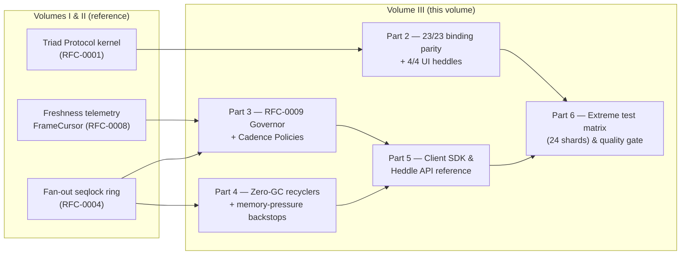
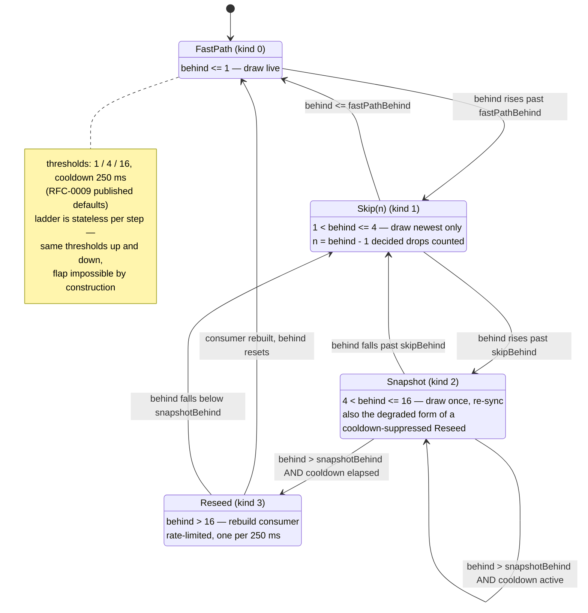
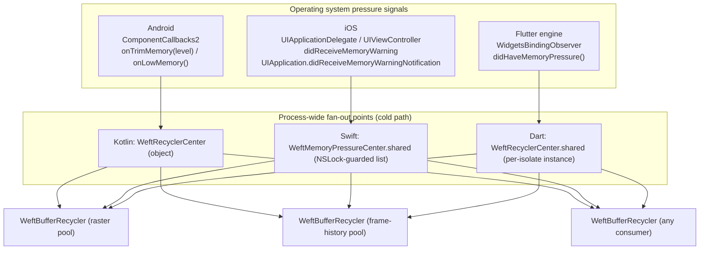
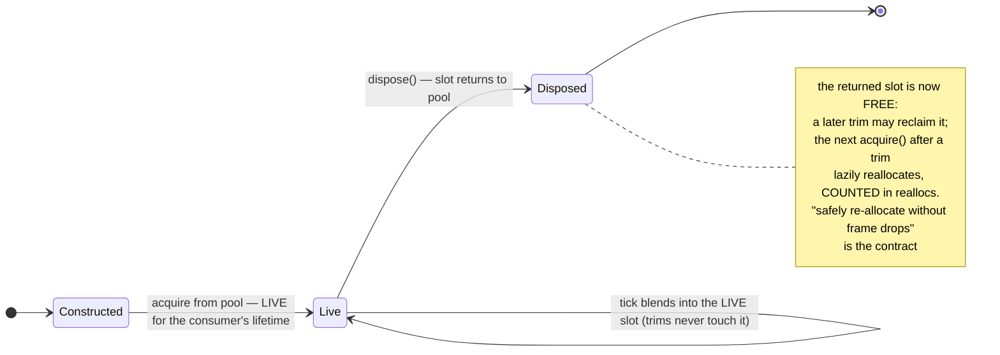
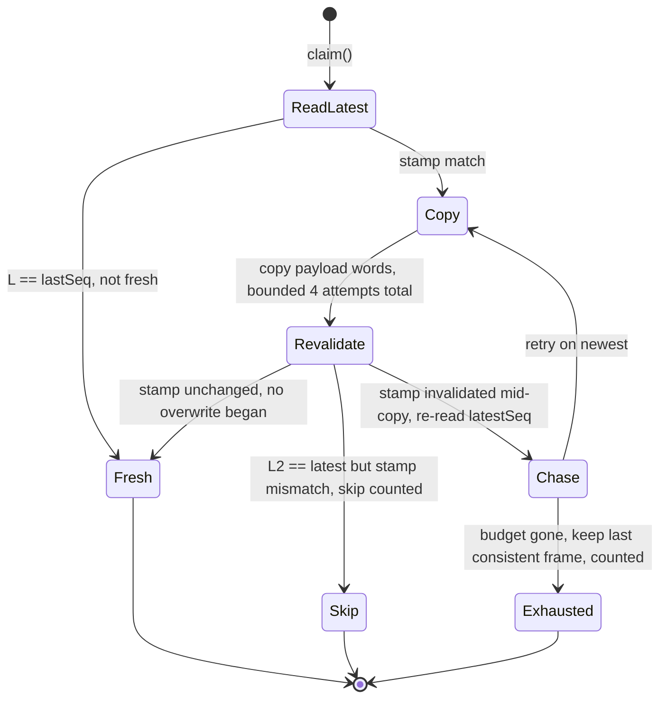
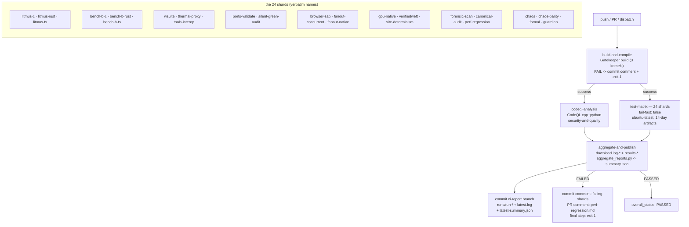
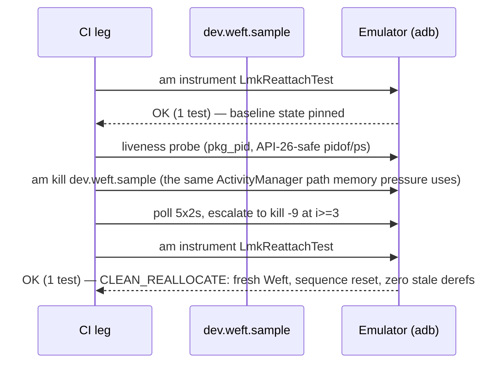

# Weft Technical Whitepaper — Volume III

## Cross-Platform Runtimes, Cadence Governance, Zero-GC Hardening & Extreme CI Matrix

| | |
|---|---|
| **Volume** | III of III — the definitive Weft technical whitepaper |
| **Assigned to** | Engineer 3 — Mobile Runtimes, Cadence Governance & Quality Systems Engineer |
| **Scope** | Production integration, client-side UI rendering, adaptive frame pacing, mobile memory-lifecycle safety, and the testing pipelines across 24 CI shards |
| **Repository state** | `main` @ `6a9a4db` (Merge PR #13 `feat/cadence-zerogc-lifecycle`; PR #12 `feat/chaos-torture-and-formal-proofs` and PR #14 `contrib/hardware-accel` both merged) |
| **Evidence snapshot** | `ci-report` run **#113**: `shards_total: 24, shards_passed: 24, shards_failed: 0` — overall **PASSED** (2026-09-17) |
| **Format** | Publication-grade GitHub-Flavored Markdown; verbatim API signatures; lifecycle state machines; CI matrix flowcharts |
| **Status** | Final draft for staff review |

> **Reading note on verbatim material.** Every code signature, constant, banner quote, and threshold in this volume was extracted directly from the cited source files at `main@6a9a4db`. Where the repository itself makes an honesty declaration — `SOURCE-ONLY, PENDING REAL-DEVICE VERIFICATION`, the per-port honesty wall, `AXIOM T` — that declaration is reproduced rather than paraphrased, because the honesty *is* the engineering (Law 4: *Honesty is a feature*).

---

## Abstract

Volume III documents the layer of Weft that touches production UI: the client SDKs that carry the Triad Protocol and the fan-out seqlock ring onto JVM/Android, Swift/Apple, and Dart/Flutter runtimes; the RFC-0009 **Adaptive Freshness Governor** that converts `framesBehind` telemetry into automatic consumer-side decisions and the three **Cadence Presentation Policies** that decide which frame a display tick presents; the **Zero-GC buffer recyclers** and tiered memory-pressure backstops that keep garbage collectors out of the frame path entirely; and the **Extreme Test Matrix** — 24 parallel CI shards, a mechanically-enforced no-silent-green pipefail audit, the Telemetry Guardian watchdog (≥ 3 % throughput drops and single-byte wire-layout drift), deterministic chaos fuzzing at 2 M frames per PR and 10 M frames per night, TLA+/TLC model checking, and real Android-emulator process-death legs — that makes the claim "runs everywhere, proven" an auditable fact instead of a slogan.

The through-line of the volume is **predictability under disconnection**: sensors produce at 240 Hz while displays refresh at 60–240 Hz, consumers lag and stall and die, garbage collectors strike at the worst moment — and yet the frame the user sees at every vsync is fresh, continuous, bounded, and *counted*. Every drop in the system is either physically impossible (proven by model checker and chaos engine) or explicitly a decision with a counter attached (Law 4). Nothing is silent.

---

## Table of Contents

- [Part 1 — Executive Overview: Delivering Predictability to the UI & Render Thread](#part-1--executive-overview-delivering-predictability-to-the-ui--render-thread)
- [Part 2 — Universal 23/23 Binding Parity & 4/4 UI Heddles](#part-2--universal-2323-binding-parity--44-ui-heddles)
- [Part 3 — RFC-0009 Adaptive Freshness Governor & Cadence Policies](#part-3--rfc-0009-adaptive-freshness-governor--cadence-policies)
- [Part 4 — Zero-GC Recycler & Memory-Pressure Backstops](#part-4--zero-gc-recycler--memory-pressure-backstops)
- [Part 5 — Complete Client SDK, Governor & Heddle API Reference](#part-5--complete-client-sdk-governor--heddle-api-reference)
- [Part 6 — Extreme Test Matrix & Quality Engineering Gate](#part-6--extreme-test-matrix--quality-engineering-gate)
- [Appendix A — Cited Code Artifacts Inventory](#appendix-a--cited-code-artifacts-inventory)
- [Appendix B — Constants Master Table](#appendix-b--constants-master-table)
- [Appendix C — Glossary](#appendix-c--glossary)
- [Appendix D — The Honesty Wall (Status Banners)](#appendix-d--the-honesty-wall-status-banners)

---

# Part 1 — Executive Overview: Delivering Predictability to the UI & Render Thread

## 1.1 The mobile/client dilemma: disconnected ingest rates vs. display refresh cycles

Modern client applications sit at the junction of two clocks that have nothing to do with each other. On one side, producers: IMU and sensor pipelines sampling at 100–240 Hz, telemetry feeds bursting 24 frames every 10 ticks, websocket or worker feeds whose inter-arrival gaps swing between 0 and hundreds of milliseconds, render peers pushing through a shared-memory ring at rates the network decided for them. On the other side, the display: a rasterizer that wakes on vsync at exactly 60, 90, 120, or 240 Hz — and *wants one frame per wake, come what may*.

Three failure modes emerge from this disconnection, and every real app contains at least one hand-rolled, vibes-tuned bandage for each:

1. **The staleness failure.** A consumer falls behind the writer (a long frame, a background task, a stalled feed). When it recovers, replaying every missed frame is wrong — the user wants *now*, not a flipbook of the past. But dropping blindly loses the audit trail: how far behind was it, how often, and was the drop a decision or an accident?
2. **The cadence failure.** Given a vsync tick and a volatile feed, which frame do we present this tick? Draw-if-new aliases between 0 and 1 presents per tick as bursts land (a visibly stuttering raster). Always-lerp displays a blended frame that may be a lie for state content (charts, telemetry). Throttle-to-half-rate solves nothing when the feed is 240 Hz on a 60 Hz panel.
3. **The GC failure.** A consumer that allocates per frame — the blend buffer, the two-frame history, the cursor record — hands the runtime's garbage collector a steady 60–120 Hz garbage stream. On JVM/ART, Swift, and Dart alike, a nursery collection at the wrong instant costs 4–16 ms: an entire dropped frame, *exactly when the UI thread finally had work to do*.

Weft's position is that these are not app problems. They are **protocol and driver-layer problems** that must be spec'd, proven, and tested once, centrally — because a ladder living inside app code is untestable by construction: *"duplicated per app, tuned by vibes, untestable, because it lives inside app code where litmus cannot reach it"* (RFC-0009 Motivation).

## 1.2 Eradicating UI garbage-collection pauses and frame drops in frontend runtimes

Weft attacks the three failures with an architecture that separates the **state plane** (kernels and rings with wait-free, zero-allocation read/write mechanics) from the **driver layer** (policy objects that decide, never touch memory ordering, and allocate nothing), and then *proves* both layers continuously:

- **The state plane never blocks, never allocates.** The Triad Protocol (RFC-0001) is three off-heap buffers plus a single shared atomic `latest` sequence, exchanged acquire/release; the multi-reader fan-out seqlock ring (RFC-0004) is one flat byte arena — `16 + 8·M + M·payload_bytes` — where writers invalidate-and-fill under a stamp bracket and readers claim with a bounded (≤ 4 attempts) copy-revalidate protocol. The writer is never blocked (Law 1); the hot path allocates nothing (Law 2).
- **Policy lives above the plane, and is pure.** The FreshnessGovernor's `step()` is a pure function of its trace — time is *injected*, not read — so the identical input trace yields byte-identical decision logs in TypeScript, C, Rust, Kotlin, Swift, and Dart (gates G5/PC3). The governor is *advisory*: *"Nothing in this class branches on a telemetry counter"* (AXIOM T discipline in `GovernedFanoutConsumer.kt`).
- **Memory is pooled once and reused forever.** The Series-7 recyclers give every per-frame scratch buffer a bounded, identity-stable pool with a tiered OS-pressure backstop that prunes only *free* slots — the backstop physically cannot drop a frame mid-blend because it cannot free a *live* slot.
- **Every claim is proven, continuously, by machinery that must bite.** 24 CI shards; a pipefail audit that found six live silent-green holes the day it landed; a Telemetry Guardian whose selftest *poisons itself* with a 3.41 % throughput-drop fixture and a one-byte wire drift to prove it still trips; chaos fuzzing injecting thread preemptions, stalls, throttles, and reorders at 2 M frames per PR and 10 M per night across five language ports with byte-identical verdicts; TLA+/TLC exhaustive state-space proofs (19,443 states at PR bounds) that no schedule accepts a torn frame.

## 1.3 The Four Laws (the constitution all of this derives from)

From `docs/PHILOSOPHY.md` §2 — cited throughout this volume because every API decision below traces to one of them:

| Law | Statement | Where it binds in this volume |
|---|---|---|
| **Law 1** | *The reader is always right; the writer is never blocked.* | Fan-out ring writer path is pure store-and-advance; governor/policy are consumer-side only; writer-side pacing was explicitly rejected in RFC-0009. |
| **Law 2** | *Zero is a contract, not a goal.* (zero-allocation hot path) | Governor `step()`, CadencePolicy `step()`, recycler `acquire()/release()`, consumer `tick()` — all zero-alloc, with JVM allocated-bytes audits asserting **0 bytes over 100,000 ticks**. |
| **Law 3** | *Mechanism, not policy.* | The kernel/ring provides mechanism; the governor stays advisory and never touches a Triad; presentation policy is a driver-layer state machine with a closed set. |
| **Law 4** | *Honesty is a feature.* | Decided drops counted (`decidedDrops`, `coalescedByDecision`), invention counted (`interpFrames`), SOURCE-ONLY banners carried until proven, per-port honesty walls for what each runtime can prove. |

Plus the telemetry axiom: **AXIOM T** — every counter is advisory telemetry; no decision path branches on a counter, and every counter is exact enough to *close an equation* (the PC2/Law-4 telescoping identities in §3.5).

## 1.4 The multi-platform VM architecture at a glance

Volume III covers three "VM" runtimes (the browser/TS/Native-C story is Volumes I–II):

| Runtime | Package target | Kernel binding | Fan-out binding | Notes |
|---|---|---|---|---|
| **Kotlin / JVM & Android SDK** | `android/weft-core` (Gradle, AAR + R8 APK) | Direct ByteBuffer + VarHandle (`Fanout.kt`), TriadNative JNI | VarHandle ring (`Fanout.kt`) + `FanoutCompat` for API < 33 + JNI road to the C ring | API 33+ uses `MethodHandles.byteBufferViewVarHandle`; API < 33 routes to `AtomicLongArray` SC-stamp compat ring via `WeftFanoutFactory` |
| **Swift / macOS & iOS (SPM)** | `Package.swift` (`WeftCore`, `.iOS(.v15)`, `.macOS(.v12)`) | Off-heap 64-byte-aligned `UnsafeMutableRawPointer` | `swift-atomics` views bound into ring memory; SC stamps carry the full bracket duty | Zero dependencies beyond `swift-atomics ≥ 1.2.0`; bytes interop with the C ring by raw-copy contract |
| **Dart / Flutter FFI & cross-isolate** | `weft_flutter` (pub.dev-style package) | Pure-Dart single-isolate reference (`core/dart/weft.dart`) | FFI to the C ring (`WeftFanoutFFI`) + zero-copy cross-isolate sessions (`CrossIsolateFanoutSession`) | Reader handles cross isolates **as raw addresses**; the payload is never copied across isolates |

Each runtime mirrors its canonical sources **byte-identically** from `core/` into its package target — 23/23 byte pairs + 4/4 shim surfaces, hash-guarded in CI (Part 2).

## 1.5 What Volume III covers



The dependency is deliberate: telemetry (RFC-0008) measures, the governor (RFC-0009) decides, the recyclers fund the decision with memory that never GCs, the heddles put it on screen, and the matrix proves all of it — on every platform, every push, every night.

---

# Part 2 — Universal 23/23 Binding Parity & 4/4 UI Heddles

## 2.1 Why byte-identity is the contract

Weft keeps **one canonical implementation per language** and *deliberate build-mirror copies* for the platform build systems that cannot reach across the tree (RFC-0002, single-source packaging):

```
core/kotlin/*.kt   <->  android/weft-core/src/main/kotlin/dev/weft/*.kt   (Gradle)
core/dart/*.dart   <->  packages/flutter_weft/lib/src/reference/*.dart     (pub/Flutter)
core/ts/weft.ts    <->  packages/core/src/*.ts                             (npm/tsup)
```

The guard script's own header states the rationale verbatim (`ci/scripts/run_binding_parity.sh`):

> *"Every drift incident in the tree's history (the heddles/ forks that kept a bug their packaged twin had already fixed) started as an unnoticed edit to ONE side of a pair. Byte-identity is the contract; this guard makes any unilateral edit RED in CI instead of silent."*

Remediation rule (also verbatim): **edit the canonical side (`core/*`), then copy to the mirror.** The pairs are byte-identical by design — no normalization, no excludes.

## 2.2 The 23 byte-identical mirror pairs

The `PAIRS` table in `ci/scripts/run_binding_parity.sh` defines exactly 23 pairs — **10 Kotlin (9 `.kt` + 1 `.java`), 10 Dart, 3 TypeScript**. Reproduced verbatim:

| # | Canonical (source of truth) | Mirror (package target) |
|---|---|---|
| 1 | `core/kotlin/FrameCursor.kt` | `android/weft-core/src/main/kotlin/dev/weft/FrameCursor.kt` |
| 2 | `core/kotlin/Fanout.kt` | `android/weft-core/src/main/kotlin/dev/weft/Fanout.kt` |
| 3 | `core/kotlin/FanoutCompat.kt` | `android/weft-core/src/main/kotlin/dev/weft/FanoutCompat.kt` |
| 4 | `core/kotlin/Steward.kt` | `android/weft-core/src/main/kotlin/dev/weft/Steward.kt` |
| 5 | `core/kotlin/TriadNative.kt` | `android/weft-core/src/main/kotlin/dev/weft/TriadNative.kt` |
| 6 | `core/kotlin/Weft.kt` | `android/weft-core/src/main/kotlin/dev/weft/Weft.kt` |
| 7 | `core/kotlin/Governor.kt` | `android/weft-core/src/main/kotlin/dev/weft/Governor.kt` |
| 8 | `core/kotlin/Recycler.kt` | `android/weft-core/src/main/kotlin/dev/weft/Recycler.kt` |
| 9 | `core/kotlin/GovernedFanoutConsumer.kt` | `android/weft-core/src/main/kotlin/dev/weft/GovernedFanoutConsumer.kt` |
| 10 | `core/kotlin/FanoutVhBridge.java` | `android/weft-core/src/main/java/dev/weft/FanoutVhBridge.java` |
| 11 | `core/dart/frame_cursor.dart` | `packages/flutter_weft/lib/src/reference/frame_cursor.dart` |
| 12 | `core/dart/fanout.dart` | `packages/flutter_weft/lib/src/reference/fanout.dart` |
| 13 | `core/dart/heddle.dart` | `packages/flutter_weft/lib/src/reference/heddle.dart` |
| 14 | `core/dart/steward.dart` | `packages/flutter_weft/lib/src/reference/steward.dart` |
| 15 | `core/dart/weft.dart` | `packages/flutter_weft/lib/src/reference/weft.dart` |
| 16 | `core/ts/weft.ts` | `packages/core/src/weft.ts` |
| 17 | `core/ts/fanout.ts` | `packages/core/src/fanout.ts` |
| 18 | `core/ts/verified.ts` | `packages/core/src/verified.ts` |
| 19 | `core/kotlin/Verified.kt` | `android/weft-core/src/main/kotlin/dev/weft/Verified.kt` |
| 20 | `core/dart/verified.dart` | `packages/flutter_weft/lib/src/reference/verified.dart` |
| 21 | `core/dart/governor.dart` | `packages/flutter_weft/lib/src/reference/governor.dart` |
| 22 | `core/dart/recycler.dart` | `packages/flutter_weft/lib/src/reference/recycler.dart` |
| 23 | `core/dart/governed_consumer.dart` | `packages/flutter_weft/lib/src/reference/governed_consumer.dart` |

The pair count grew with the protocol surface — 9 pairs (wave 1) → 14 (wave 3) → 16 (wave 4) → **23 today** (the Series-7 governor/recycler/consumer trio added six). Every Series-7 artifact this volume documents is inside the guard.

## 2.3 Hash method and failure behavior

Per pair, the guard computes **sha256 of the CR-stripped byte stream** (the single normalization, for cross-OS line endings):

```bash
h_canon=$(tr -d '\r' < "$canon" | sha256sum | cut -d' ' -f1)
h_mirror=$(tr -d '\r' < "$mirror" | sha256sum | cut -d' ' -f1)
```

Properties of the mechanism, all deliberate:

- **Hashes are computed at run time, never stored.** There is no expectations file to go stale; drift is detected as *pair divergence*, so adding a mirror pair requires adding it to the table — the list cannot silently rot.
- **Fail-fast.** Byte-table drift exits before the shim table runs and prints a 40-line `diff -u` of the offending pair into the log, so the fix is mechanical.
- **Machine-readable results.** The shard writes `ci/run-artifacts/binding-parity-results.json`, whose final line is the headline:

```json
{"shard":"binding-parity","byte_pairs":{"passed":23,"failed":0,"total":23},
 "shim_pairs":{"passed":4,"failed":0,"total":4,"cells":{...}}}
```

- **Live verification.** On `main@6a9a4db` the guard reports `✅ Binding parity: 23/23 pairs byte-identical`, and the CI run #113 shard log confirms the same at head.

## 2.4 The 4/4 UI heddle shim parity

`heddles/{react,vue,svelte,react-native}/` are **deliberate compatibility shims**, not implementations. Each carries the banner `STATUS: SHIM — canonical implementation: @weft/<pkg>` and re-exports from the canonical package; they exist *"so the structural validator (tools/port_validator.py) and any historical import path keep working. Do not add features here — implement them in packages/* and re-export."*

Byte-hash is impossible across that boundary (the shim is 20–28 lines of re-exports; the package is hundreds). The honest guard is **surface parity**:

| Shim | Canonical package | Rule |
|---|---|---|
| `heddles/react/WeftCanvas.tsx` | `packages/react/src/index.ts` | every `export {…}` name in the shim must exist in the canonical source surface, and the shim must name the right canonical package |
| `heddles/vue/useWeft.ts` | `packages/vue/src/index.ts` | 〃 |
| `heddles/svelte/weft-action.ts` | `packages/svelte/src/index.ts` | 〃 |
| `heddles/react-native/weft-rn.ts` | `packages/react-native/src/index.ts` | 〃 |

Implementation: inline Python regexes extract the shim's `export (type)? {…}` names (stripping `type`, honoring `as` aliases) and check each with a `\b<name>\b` match against the canonical file. Drift banner: `❌ HEDDLES SURFACE PARITY: N of 4 shims diverged` plus the remediation line *"implement in packages/\*, re-export from heddles/\* — never fork."* The check runs in the same guard script and is CI-gated by the same four workflows (below). Design lineage: the surface-parity extension is specified in `patches/PATCHES-WAVE3.md` §12.

**Consuming gates** (workflow → job → step, verbatim):

| Workflow | Job | Step | Purpose |
|---|---|---|---|
| `npm-packages.yml` | `build-and-test` | "Binding parity guard (core/ts <-> packages/core)" | TS mirrors + React/Vue/Svelte/RN shims |
| `android-packages.yml` | `build-and-test` | "Binding parity guard (core/kotlin <-> android mirror)" | Gradle mirrors |
| `flutter-packages.yml` | `flutter-test` (3-OS matrix) | "Binding parity guard (core/dart <-> flutter reference)" | Dart mirrors |
| `nightly-deep.yml` | `clean-tree-deep` | "Binding parity guard (all mirror pairs)" | Clean-tarball re-check of everything |

A related-but-separate gate pins the *published* npm surface: "Check API drift" runs `api-extractor` for all five packages and `git diff --exit-code packages/*/etc/*.api.md` — so neither the bytes (hash guard) nor the surface (API reports) can move silently.

## 2.5 The four UI Heddles (canonical `packages/*` surface)

Each heddle binds one draw loop to the kernel/ring with the same discipline: **claim + read live state inside the frame callback only — never during framework render/commit** — and a zero-allocation `rLive()`-style view per Law 2. The 2026-09 hardening round (covered by each package's test suite) removed the classic per-framework anti-patterns.

### 2.5.1 React — `<WeftCanvas />` (`@weft/react`)

```ts
export interface WeftCanvasProps extends React.CanvasHTMLAttributes<HTMLCanvasElement> {
  weft: Weft;
  draw: (ctx: CanvasRenderingContext2D, buf: Uint8Array) => void;
}

export function WeftCanvas({ weft, draw, ...canvasProps }: WeftCanvasProps)
```

- **Mechanics:** a self-scheduled rAF loop in `useEffect` keyed on `[weft]` only; per tick: `weft.claim()` → `weft.rLive()` → `drawRef.current(ctx, buf)`.
- **Latest-ref pattern:** `draw` is deliberately *not* an effect dependency. An inline-lambda `draw` (the common case) previously tore down and restarted the rAF loop on every parent render; the loop now keys only on the Weft instance and reads the freshest closure through a ref.
- **Fan-out variant:** `WeftFanoutCanvas` / `WeftFanoutCanvasProps` — `draw: (ctx, floats: Float32Array, claim: FanoutClaim) => void`; *"One heddle = one consumer slot: this binding owns its reader"* (`broadcaster.createReader()` in the effect; restart keyed on `broadcaster` identity — *"the only legitimate loop restart"*).

```tsx
// Canonical usage (fixtures/vite-react/src/App.tsx — CI-built fixture)
<WeftCanvas
  weft={weft}
  draw={handleDraw}
  width={400}
  height={300}
  style={{ border: '1px solid #334155', borderRadius: '4px' }}
/>
```

### 2.5.2 Vue 3 — `useWeft` (`@weft/vue`)

```ts
export interface UseWeftOptions {
  /** Minimum interval in milliseconds between reactive `frameCount` updates.
   *  Default: 1000 (1 Hz — HUD statistics). */
  hudIntervalMs?: number;
}

export function useWeft(
  canvasRef: Ref<HTMLCanvasElement | null>,
  weft: Weft,
  draw: (ctx: CanvasRenderingContext2D, buf: Uint8Array) => void,
  options: UseWeftOptions = {}
)
```

Returns `{ frameCount, setDraw, getRawFrameCount, dispose }`:

```ts
{
  /** Reactive frame count, updated at most once per hudIntervalMs. */
  frameCount: Ref<number>;
  /** Replace the draw closure without restarting the loop. */
  setDraw(next: (ctx: CanvasRenderingContext2D, buf: Uint8Array) => void): void;
  /** Read the unthrottled raw frame count (advisory, non-reactive). */
  getRawFrameCount(): number;
  /** Manual teardown for callers outside a component context. */
  dispose(): void;
}
```

- **The anti-pattern it kills:** the per-frame reactive write. The composable previously wrote `frameCount.value++` on every frame — *"a reactive write at display rate — the exact anti-pattern Weft exists to prevent."* The raw counter is now a plain closure variable; the reactive ref updates at most once per `hudIntervalMs` (default 1000 ms).
- **Fan-out variant:** `useWeftFanout(canvasRef, broadcaster, draw, options)` with the same return shape; owns its reader at composable setup.
- **Lifecycle:** rAF starts in `onMounted`, cancelled in `onUnmounted`, plus manual `dispose()` for non-component contexts; loop is never restarted (hot-swap via `setDraw`).

### 2.5.3 Svelte — `weftCanvas` action (`@weft/svelte`)

```ts
export interface WeftActionParams {
  weft: Weft;
  draw: (ctx: CanvasRenderingContext2D, buf: Uint8Array) => void;
}

export const weftCanvas: Action<HTMLCanvasElement, WeftActionParams>
```

- **Usage:** `use:weftCanvas={{ weft, draw }}` (object params).
- **The bug it killed:** the original action captured params forever — the *stale-Weft bug*. The `update(newParams)` lifecycle handler now re-binds on every param change; `destroy()` cancels the rAF exactly once.
- **Fan-out variant:** `weftFanoutCanvas: Action<HTMLCanvasElement, WeftFanoutActionParams>`; `update()` hot-swaps only `draw` — *"The broadcaster is fixed for the action's lifetime (unmount + re-attach to change it); the reader is bound to it."*
- **Edge case:** `getContext('2d')` returning null yields no lifecycle handlers and no loop (honest no-op).

### 2.5.4 React Native — `weft-rn` (`@weft/react-native`)

Three tiers, from simple to worklet:

```ts
// Tier 1 — the draw-phase reader loop (Reanimated-driven when available, rAF fallback, honest no-op disposer otherwise)
export function useWeftDraw(
  weft: Weft,
  draw: (buf: Uint8Array) => void,
  registerFrameCallback?: (cb: () => void) => (() => void) | void
): () => void

// Tier 1b — fan-out variant ("One heddle = one consumer slot: this hook owns its reader")
export function useWeftFanoutDraw(
  broadcaster: WeftFanoutBroadcaster,
  draw: (floats: Float32Array, claim: FanoutClaim) => void,
  registerFrameCallback?: (cb: () => void) => (() => void) | void
): () => void

// Tier 2 — the Phase-7 UI-thread surface: the protocol expressed as DATA + a real 'worklet' function
export interface UiThreadFrameSource {
  sab: SharedArrayBuffer;
  payloadFloats: number;
  slotCount: number;
  /// Bytes: 16 + 8*slotCount header, then slotCount * payloadFloats * 4.
  payloadBase: number;
  /// Reader-private last-claimed seq. MUTATED BY THE WORKLET.
  lastSeq: number;
}
export function createUiThreadFrameSource(broadcaster: WeftFanoutBroadcaster): UiThreadFrameSource;
export function uiThreadClaim(source: UiThreadFrameSource): {
  fresh: boolean; seq: number; dropped: number; skipped: boolean; payload: Float32Array;
};   // carries the 'worklet' directive
export function useWeftUiThread(
  source: UiThreadFrameSource,
  draw: (payload: Float32Array, rec: { fresh: boolean; seq: number; dropped: number; skipped: boolean }) => void,
  registerFrameCallback?: (cb: () => void) => (() => void) | void
): () => void
```

- **The honesty note (verbatim):** *"The previous version placed a `'worklet'` directive inside a closure capturing a Weft class instance. Reanimated worklets cannot capture class instances; that path would fail at runtime when actually workletized. The directive is removed and the frame callback now runs on the JS thread. True UI-thread reads require the native port that Phase 7 (RN, last) is scheduled to deliver — stated, not implied."* The worklet directive lives only where it can legally live: on `uiThreadClaim`, whose state is a `SharedArrayBuffer` descriptor (sendable) — *"No class crosses the boundary — the protocol itself does."* The claim protocol on the UI thread is the same bounded (≤ 4 attempts) stamp-bracket claim as everywhere else, with a graceful `skipped` outcome and a non-fresh tick on exhausted budget — *"NEVER a corrupt frame."*
- **Tier 3 — the governed UI thread** (`src/governed-ui-thread.ts`, Series 7): the RFC-0009 ladder and cadence policies flattened into worklet-safe pure integer state machines over plain-object state (`LadderState`, `CadenceState`, `GovernedDecision` — no class captures), parity-pinned against `@weft/core` on the canonical xorshift32 trace via `referenceTickTrace(policy, seqs, behinds, nowMs)`. The mount point:

```ts
export function createGovernedUiThread(opts: {
  policy: number;                 // CadencePolicyKind PROTOCOL value
  latestSeq: SharedNum;           // newest observed seq
  framesBehind: SharedNum;        // rec.fresh ? rec.dropped : 0 (RFC-0008)
  nowMs: SharedNum;               // injected monotonic clock (determinism)
  reassessTicks?: number;
  ladder?: Partial<LadderState>;
  out?: {                         // optional SharedNum outputs (only what the view consumes)
    action?: SharedNum; skipN?: SharedNum; present?: SharedNum; interp?: SharedNum;
    alphaQ12?: SharedNum; coalesced?: SharedNum; presentSeq?: SharedNum; k?: SharedNum;
  };
}): () => void                    // the worklet tick; register with Reanimated useFrameCallback
```

Worklet distribution is declared honestly: *"the consuming app's babel config must include this package's sources in Reanimated's `workletSources` (node_modules is excluded by default). When Reanimated is absent or the app does not opt in, createGovernedUiThread degrades HONESTLY to the JS-thread tick."*

### 2.5.5 Cross-framework mechanics comparison

| Framework | Loop | Restart trigger | Cleanup | Signature hardening |
|---|---|---|---|---|
| `@weft/react` | rAF in `useEffect` | `weft`/`broadcaster` identity only; `draw` via latest-ref | effect-return `cancelAnimationFrame` | loop survives unstable draw closures |
| `@weft/vue` | rAF from `onMounted` | never; `setDraw()` hot-swap | `onUnmounted` + `dispose()` | reactive HUD throttled to 1 Hz |
| `@weft/svelte` | rAF at action init | never; `update()` re-binds params | `destroy()` | stale-params bug fixed |
| `@weft/react-native` | Reanimated frame callback → rAF → honest no-op disposer | disposer contract only | idempotent disposer with `disposed` guard | illegal worklet directive removed; data-as-protocol UI thread |

### 2.5.6 Kernel surfaces the heddles bind to

- **`Weft` (Triad kernel, TS):** `fillPayload(seq, payloadLen)` · `wBegin(): Uint8Array` · `publish(seq, payloadLen): PubResult` · `claim(): number` · `rLive(): Uint8Array` · `rSeq()` · `tClaim(): bigint` (the telemetry counter tests use to prove a loop is dead).
- **`FrameCursor`** (`packages/core/src/cursor.ts`, RFC-0008) — where `framesBehind` telemetry lives for 1:1 Weft reads:

```ts
export interface FrameClaim {
  seq: number;          /// Envelope seq of the claimed frame
  framesBehind: number; /// Frames published between the previous claim and this one
                        /// that this reader never saw. 0 on first claim
                        /// (u32 wrap treated as writer reset)
  first: boolean;       /// True on the first claim of this cursor
  payload: Uint8Array;  /// Zero-allocation live payload view — exclusively the
                        /// reader's until its next claim (RFC-0001 §4.3)
}
export class FrameCursor {
  totalDropped = 0;  claims = 0;
  claim(weft: Weft): FrameClaim   // hot path: one exchange, one envelope read, integer math
}
```

## 2.6 What each package publishes

| Package | Name / version | Publishes |
|---|---|---|
| `packages/core` | **`@weft/core` 0.2.0** | Triad kernel + fan-out ring + verified + governor + cadence + FrameCursor + chaos parity; entries `.` and `./worker`; the three byte-mirror sources (`weft.ts`, `fanout.ts`, `verified.ts`); API report `etc/core.api.md` (560 lines) |
| `packages/react` | **`@weft/react` 0.1.0** | `WeftCanvas`, `WeftCanvasProps`, `WeftFanoutCanvas`, `WeftFanoutCanvasProps` (peer `react ≥ 18`) |
| `packages/vue` | **`@weft/vue` 0.1.0** | `useWeft`, `UseWeftOptions`, `useWeftFanout`, `UseWeftFanoutOptions` (peer `vue ≥ 3.4`) |
| `packages/svelte` | **`@weft/svelte` 0.1.0** | `weftCanvas`, `WeftActionParams`, `weftFanoutCanvas`, `WeftFanoutActionParams` (peer `svelte ≥ 4`) |
| `packages/react-native` | **`@weft/react-native` 0.1.0** | `useWeftDraw`, `useWeftFanoutDraw`, `createUiThreadFrameSource`, `uiThreadClaim`, `useWeftUiThread`, `UiThreadFrameSource` + the governed worklet set (`createGovernedUiThread`, `createLadderState`, `createCadenceState`, `createDecision`, `ladderStep`, `cadenceStep`, `referenceTickTrace`, types) (peer `react-native ≥ 0.73`, optional) |
| `packages/flutter_weft` | **`weft_flutter` 0.1.0** | FFI fan-out (`WeftFanoutFFI`, `WeftFanoutReaderFFI`, bindings), `CrossIsolateFanoutSession`, painters (`WeftFanoutPainter`, `WeftGovernedPainter`), `WeftMemoryPressureBackstop`, and `lib/src/reference/*.dart` — the 10 byte-mirror Dart sources |

`weft_flutter`'s README carries the disclosure that matters for honest expectations: the pure-Dart reference ring is single-isolate; **FFI fan-out is CI-gated against `libweft.so` compiled from `core/c/`** — the C ring is the interop truth.

---

# Part 3 — RFC-0009 Adaptive Freshness Governor & Cadence Policies

## 3.1 From measurement to action

RFC-0008 answered *"how stale is this consumer?"* with a counter (`FrameClaim.framesBehind`, or the fan-out reader's per-claim `dropped`). RFC-0009's position is blunt: *"a measurement nobody acts on is just guilt."* The governor closes the control loop:

```
consumer ──framesBehind──> GOVERNOR ──{FastPath | Skip | Snapshot | Reseed}──> consumer
```

Series 7 then answered the second half of the display problem — *given a vsync tick and a volatile feed, which frame do we present, and do we synthesize one?* — with a closed set of three cadence presentation policies:

```
ticker ──tick + latestSeq──> CADENCE POLICY ──{present? interp? alphaQ12 coalesced}──> draw loop
```

The two halves compose but never merge: **the ladder acts on staleness** (frames behind at claim time), **the policy acts on presentation** (latestSeq at display-tick time). Both are driver-layer objects with closed sets, published defaults, injected time, zero allocation, and byte-compared cross-language parity. The governor *never touches a Triad or a ring* — RFC-0009's two open questions (advisory-only, composed-by-the-app) both resolved "composed," and `GovernedFanoutConsumer` (§3.8) is that composition realized.

## 3.2 The Staleness Ladder

**Published defaults** (`GovernorConfig`, identical in all six ports):

| Threshold | Default | Meaning |
|---|---|---|
| `fastPathBehind` | **1** | behind ≤ 1 → draw live every frame (the flagship canvas) |
| `skipBehind` | **4** | behind ≤ 4 → draw newest only; `n = behind − fastPathBehind` intermediates dropped **by decision** |
| `snapshotBehind` | **16** | behind ≤ 16 → render one frame from a fresh claim, then jump expectations to `latest` |
| `reseedCooldownMs` | **250** | behind > 16 → Reseed (rebuild the consumer), rate-limited to one per cooldown; a suppressed Reseed **degrades to Snapshot** (the documented fallback) |

Action kinds are **PROTOCOL values** — `0 = FAST_PATH, 1 = SKIP, 2 = SNAPSHOT, 3 = RESEED` — packed verbatim into G5 trace bytes; renumbering them is a wire-format break, not a refactor. The four actions are a closed set: *"adding a fifth is a new RFC, because each action is a different contract with Law 4"* — drops are free, but *decided* drops must be counted as decisions, not accidents.

**Hysteresis without state.** The ladder is stateless per step — transitions use the same thresholds on the way down as on the way up — so flap is impossible *by construction*: actions depend only on the current `behind`, and Reseed is the only stateful action, gated by the cooldown. The canonical implementation (`core/kotlin/Governor.kt:138-169`, arithmetic-identical in every port):

```kotlin
fun step(framesBehind: Long, nowMs: Long): GovernorAction {
    steps++
    val behind = framesBehind.coerceAtLeast(0L)
    val a = act
    if (behind <= cfg.fastPathBehind) {
        a.kind = GovernorActionKind.FAST_PATH
        a.skipN = 0
    } else if (behind <= cfg.skipBehind) {
        val n = behind - cfg.fastPathBehind
        decidedDrops += n // Law 4: decided drops are decisions
        a.kind = GovernorActionKind.SKIP
        a.skipN = n.toInt()
    } else if (behind <= cfg.snapshotBehind) {
        a.kind = GovernorActionKind.SNAPSHOT
        a.skipN = 0
    } else {
        // behind > snapshotBehind: Reseed, rate-limited by the cooldown.
        if (lastReseedMs == NEVER_RESEEDED ||
            nowMs - lastReseedMs >= cfg.reseedCooldownMs
        ) {
            lastReseedMs = nowMs
            reseeds++
            a.kind = GovernorActionKind.RESEED
            a.skipN = 0
        } else {
            // Rate-limited: degrade to the best non-rebuild action.
            a.kind = GovernorActionKind.SNAPSHOT
            a.skipN = 0
        }
    }
    return a
}
```

**Lifecycle state machine** (per consumer; `behind` = per-consumer staleness):



## 3.3 The Cadence Presentation Policies

One `step(latestSeq)` per **display tick**. Ticks are the only clock — *"the caller's vsync source owns time"* — which is precisely what makes cross-language parity byte-comparable. The decision record is identity-stable and mutated in place (PC4). Kind values are PROTOCOL: `0 = LATEST_WINS, 1 = PACED_INTERPOLATE, 2 = BURST_COALESCE`.

### 3.3.1 `LATEST_WINS` (kind 0) — the newest-wins raster

Present iff `latestSeq` advanced since the last present; the jumped-over frames are coalesced *by decision*:

```kotlin
a.coalesced = latestSeq - lastPresentedSeq - 1
```

Steady by construction: at most one present per tick, never a stale re-raster. **Best for state canvases** (charts, telemetry) *"where a blended stale frame is a lie."*

### 3.3.2 `PACED_INTERPOLATE` (kind 1) — the display-rate raster, one period behind

Holds the last two observed sequence numbers and presents `blend(prev, newest, alpha)` on (nearly) **every** display tick while content flows, regardless of input cadence — the steady 60/120 Hz contract:

- **The alpha ladder (Q12):**

  ```text
  period   = max(1, newestObsTick - prevObsTick)      // observed inter-arrival period, in ticks
  dt       = ticks - newestObsTick
  alphaQ12 = min(4096, (dt * 4096) / period)          // integer arithmetic only
  ```

- **Arrival ticks re-window at alpha = 0.** At the arrival tick the raster equals `prev` — the *completed previous blend* — so the raster is **continuous by construction**: `GovernedFanoutConsumer.kt` states it as the invariant *"the blend at alpha=0 equals prev (the completed previous blend): the raster is continuous by construction, never extrapolated past the newest frame (saturated alpha holds)."*
- **Saturation holds rather than invents.** When `alpha` saturates at 4096, presents elide until the next arrival re-windows: honest holding, never invented future frames.
- **The elision key.** A present is issued iff the raster triple `(prevSeq, newestSeq, alphaQ12)` changed — PACED presents only when what would be drawn actually changed (PC1).
- **Interpolation is counted (Law 4 applied to invention).** Only *strictly-between* blends increment `interpFrames` — endpoint rasters (alpha 0 or 4096) show a real frame and are not synthesis.

### 3.3.3 `BURST_COALESCE` (kind 2) — the adaptive sub-rate raster

Tracks an integer **Q12 EWMA of inter-arrival gaps** (weight 1/4, updated *only* on arrival ticks) and recomputes the pacing divisor every `reassessTicks` (default **8** — *"the hysteresis: K changes at most once per window"*):

```text
gapEWMA update (arrival ticks only, non-negative split so every port's
truncating division agrees bit-for-bit):

    target = gap * 4096
    delta  = target - ewmaGapQ12
    ewmaGapQ12 += (delta >= 0) ? delta / 4 : -((-delta) / 4)

K reassess (every reassessTicks ticks):

    K = clamp( round( ewmaGapQ12 / 4096 ), 1, 64 )
      = clamp( (ewmaGapQ12 + 2048) / 4096, 1, 64 )   // integer round-half-up
```

The lead's formula, realized: **K = clamp(round(gapEWMA), 1, 64)** with `cadenceKMin = 1`, `cadenceKMax = 64`. Present at most once per K ticks (the newest at each present tick; everything between coalesced and counted).

Why the gap, not the rate (verbatim): *"the inter-arrival gap is the content-cadence estimate, and a constant gap converges exactly (an arrivals-rate EMA would oscillate forever on periodic input — the honest estimator is the gap, not the rate)."* Why K caps at 64 (verbatim): *"present every K ticks; 64 caps stall recovery — with ewma==0 K parks at the cap, presents stop until content resumes, and the reassess window bounds re-lock latency."*

**Behavior regimes (PC5-pinned, exact counts):**

| Regime | Behavior |
|---|---|
| Content at/above display rate | gap = 1 → K stays 1 → degrades to newest-wins (nothing to save) |
| Steady sub-rate (30 Hz on 120 Hz) | gap = 4 → K locks onto the content beat → raster is *steady* at the sub-rate instead of aliasing between 0 and 1 presents per tick |
| Burst feed (24 frames every 10 ticks) | paces at one present per burst — the newest, fully coalesced. Queueing is NOT done: *"bursts are absorbed latest-wins, only the PRESENT pace adapts"* |
| Stall | cadence freezes; recovery is immediate when content resumes |

## 3.4 The algebra of honesty: Law-4 telescoping identities (PC2)

The counters are not decoration; they are *closed under exact identities*, asserted over volatile random traces in every port's battery:

```text
LATEST_WINS / BURST_COALESCE:   sum(coalesced) == lastPresentedSeq - presents
PACED_INTERPOLATE:              sum(coalesced) == newestSeq   - arrivalTicks
```

Fan-out side, the same discipline: `sum(dropped) == lastSeq - freshClaims` per reader. A dropped frame anywhere in Weft is either a ring-level physical fact (the seqlock overwrote it — L-C5: bounded, never silent) or a governor/policy *decision* with a counter — and the counters must telescope or the gate goes red.

## 3.5 Cross-language parity: G5 / PC3

Because `step()` is pure and time is injected, parity is checkable *byte-for-byte*:

| Gate | Fixture | Evidence on `main` |
|---|---|---|
| **G5** (ladder) | `fixtures/xlang-governor/` — one deterministic xorshift32 trace, emitters in TS/C/Rust + `vm/` for Kotlin/Swift/Dart | action log **byte-identical across six ports — 20,001 bytes**, all four action classes exercised |
| **PC3** (cadence) | `fixtures/xlang-cadence/` — one xorshift32 arrival trace, four emitters (TS/Kotlin/Swift/Dart) | packed decision log **byte-identical — 120,001 bytes** (ticks=10000, interpPacked=10000, coalescedPacked=36240), all three policies in one stream |

Ports also pin local FNV-1a-64 trace hashes so the battery fails on drift *without any other toolchain present* (Swift CI on macOS, Dart on VM): **ladder `0x3c33156204c7cfdf`**, **cadence `0x6f654c298cbcc9f4`** — the same pins in `GovernorTests.swift` and `governor_test.dart` (labeled "TS reference"). The cadence-parity gate runs as CI step "cadence PC3 trace parity (TS + VM emitters present)" inside the `fanout-native` shard; `docs/PORTS.md §9` records the Dart emitter verdict verbatim: *"emitters byte-IDENTICAL to TS (20001 / 120001 bytes)."*

## 3.6 Conformance gates

**G-series (the ladder):**

| Gate | Assertion |
|---|---|
| **G1** | every `behind` in 0..64 maps to the documented action |
| **G2** | monotone: larger `behind` never yields a *fresher-class* action |
| **G3 / G3b** | 10k random behind-spikes with cooldown — Reseed count bounded by `ceil(10k / cooldown)` and spacing enforced; a suppressed Reseed degrades to Snapshot |
| **G4** | `step()` allocates nothing — JVM: ThreadMXBean allocated-bytes delta **exactly 0** over 100k steps; Swift/Dart: identity-stable-record audits (the per-port honesty wall, §4.6) |
| **G5** | cross-language trace parity (above) |
| **Law 4** | `decidedDrops` distinct from ring counters |

**PC-series (cadence policies):**

| Gate | Assertion |
|---|---|
| **PC1** | bounded rate: never > 1 present per tick; LATEST_WINS never presents an unchanged seq; PACED only when the raster triple changes; BURST only when `tickInCycle ≥ K` AND seq advanced |
| **PC2** | the telescoping identities (§3.4), exact |
| **PC3** | cross-language byte-parity (above) |
| **PC4** | zero allocation (per-port honesty wall) |
| **PC5** | steady cadence under volatility: 30-on-120 (PACED presents 398/400 after warmup; BURST K converges to 4 and presents on the beat), 240-on-120 (LATEST/BURST every tick; PACED every tick one period behind), 8 kHz bursts (LATEST coalesces ~66/120 per present; BURST K→1) — **exact counts pinned**, because the traces are deterministic and *"a range gate would be weaker than the truth"* |
| **PC6** | policy-switch safety: switching kind mid-trace never presents a seq older than the last presented (monotone `presentSeq`); counters survive the switch |

## 3.7 Composition: the GovernedFanoutConsumer pipeline

The composition class per VM port (Kotlin/Swift/Dart, line-for-line parallel) wires the whole story per display tick. The repository's canonical ASCII pipeline (identical in all three files, quoted from `core/kotlin/GovernedFanoutConsumer.kt`):

```
//   ticker ──tick──> CONSUMER ──┬─ claim()          (fan-out reader, zero alloc)
//                               ├─ governor.step()  (staleness CLASS: FastPath /
//                               │                    Skip / Snapshot / Reseed —
//                               │                    advisory; the app decides
//                               │                    what a class MEANS)
//                               ├─ policy.step()    (PRESENTATION: present? interp?
//                               │                    alphaQ12 — the raster decision)
//                               └─ raster           (blend(prev, new, alphaQ12)
//                                                    into a pooled slot — LATEST/
//                                                    BURST copy newest directly)
```

As a sequence:

```mermaid
sequenceDiagram
    participant T as Display ticker (vsync)
    participant C as GovernedFanoutConsumer
    participant R as Fan-out reader
    participant G as FreshnessGovernor
    participant P as CadencePolicy
    participant M as Pooled raster slot
    T->>C: tick()
    C->>R: claim()
    R-->>C: rec { fresh, seq, dropped } (identity-stable, zero-alloc)
    C->>G: step(behind = rec.fresh ? rec.dropped : 0, nowMs())
    G-->>C: action { kind, skipN } + actionChanged edge
    C->>C: on fresh claim: prevWords := newWords; newWords := view()
    C->>P: step(latestSeq = rec.seq)
    P-->>C: decision { present, interp, alphaQ12, coalesced, presentSeq, k }
    alt decision.present and decision.interp
        C->>M: blendQ12(prevWords[i], newWords[i], alpha, 4096-alpha) per word
    else decision.present
        C->>M: copy newWords[i] per word (little-endian u32 pack)
    else elided
        Note over M: untouched this tick
    end
    C-->>T: PresentDecision (read synchronously)
```

Key wiring facts, each load-bearing:

- **The staleness input is per-consumer:** `rec.dropped` *is* RFC-0008's per-consumer `framesBehind` — *"the frames this consumer missed since its last fresh claim"* (`GovernedFanoutConsumer.kt:121`).
- **The governor stays advisory:** `tick()` returns the presentation decision; the ladder action is exposed via `action` + `actionChanged` (a class-change *edge*) for the app's class response — skip decorative work on Skip, re-snapshot on Snapshot, rebuild on Reseed. *"Nothing in this class branches on a telemetry counter (AXIOM T)."*
- **The two-frame history is preallocated** (`prevWords`/`newWords`), the raster is a pooled slot that is **LIVE for the consumer's lifetime** — the memory-pressure backstop can never take it mid-blend; `dispose()` returns it to the pool.
- **Single-threaded by contract** — the draw thread, matching the reader's discipline.

## 3.8 Platform adapters driving the one composition

| Platform | Adapter | Discipline |
|---|---|---|
| Compose (Android) | `android/weft-compose/.../WeftGovernedDraw.kt` | DrawScope adapter — one `tick()` per draw |
| Flutter | `packages/flutter_weft/lib/src/governed_painter.dart` (`WeftGovernedPainter`) | one `consumer.tick()` per paint pass; paints only on present ticks (*"the decision is made where the data lives, not where the framework guesses"* — `shouldRepaint` always true); Impeller-safe packed-u32-LE raster |
| SwiftUI / MTKView (Apple) | `Sources/WeftSwiftUI/WeftHeddleView.swift` (`WeftMetalCoordinator: NSObject, MTKViewDelegate`) | `draw(in:)` = one claim per frame; UIView/NSView representables; the trio itself imports no UIKit/MetalKit |
| React Native | `createGovernedUiThread` + Reanimated `useFrameCallback` | worklet-safe flattened ladder/policy (§2.5.4 Tier 3); honest JS-thread degradation |

## 3.9 What the governor buys (measured)

The B4 display-adversarial benchmark (`demos/web/scripts/governor_bench.ts`, evidence committed) ran naive vs governor draw policy on a real worker-driven fan-out ring:

- **Redundant-poll regime** (hold = 0): **100 % of draw memcpys elided**, **22–43 % of claim fences elided**, convergence gated per row.
- **Paced-reader regime** (hold ≥ 10 ms): savings ~0 — *"honest finding, nothing to elide when the consumer is slower than the writer."*

Its Series-7 successor, `cadence_bench.ts`, drives a 120 Hz ticker against a volatile worker feed and records per-policy present-rate steadiness — the PC5 regimes at production scale. The honest negative is preserved in both: the governor is a *decision* engine, not a magic slowdown.

---

# Part 4 — Zero-GC Recycler & Memory-Pressure Backstops

## 4.1 Why per-frame allocation is the jank engine

A PACED_INTERPOLATE consumer retains a previous-frame snapshot and a raster scratch buffer; a governed consumer holds a two-frame history; every blend writes into a same-sized byte slot. Allocate those per present and you hand the GC a steady 60–120 Hz garbage stream — *"exactly the jank source mobile hardening exists to kill"* (`Recycler.kt` header). On JVM/ART a nursery collection costs 4–16 ms (a full dropped frame at 60–120 Hz); on Dart, young-gen collections stall the UI isolate; on Swift, high-frequency malloc/free of identical sizes is pure waste. The Series-7 answer is a pool with a contract: **allocate once, reuse forever, prove zero.**

The Law-2 stakes are not hypothetical — the audits *found* real leaks in this very codebase before they shipped (§4.7): a 2-`ByteBuffer`-per-call API, an endian bug hiding under them, and a VarHandle bridge allocating **4.6 KB per claim** (458 MB per 100k-tick audit window).

## 4.2 `WeftBufferRecycler` — the 0-GC pool

Canonical surface (`core/kotlin/Recycler.kt`, mirrored byte-identically to the Android SDK; Swift/Dart ports in §5.7):

```kotlin
public class WeftBufferRecycler(
    /** Slot capacity in bytes (payload-sized for frame snapshots). */
    public val slotBytes: Int,
    /** Pool ceiling: at most this many released slots are kept free. */
    public val maxFreeSlots: Int = 2,
) : OnLowMemoryListener {
    public fun acquire(): ByteArray
    public fun release(slot: ByteArray): Boolean   // true = pooled; false = pool full, slot dropped to GC
    public fun trim(keepFree: Int = 0)             // drop FREE slots down to keepFree; LIVE never touched
    public override fun onLowMemory(level: Int)    // documented level mapping (§4.4)

    // counters (advisory, AXIOM T; the battery pins the exact ones)
    public var acquires: Long; public var releases: Long      // private set
    public var reallocs: Long; public var trims: Long; public var trimmedSlots: Long
    public val liveNow: Int; public val pooledNow: Int
}
```

Mechanics, each point load-bearing:

1. **Hot path allocates nothing on the pooled path.** `acquire()` pops from a fixed-capacity deque of references (`removeLast`); `release()` pushes back (`addLast`) while `free.size < maxFreeSlots`. No boxing, no wrappers.
2. **Bounded steady state.** Excess releases are *dropped to the GC* — a burst consumer never grows the pool beyond its working set (`maxFreeSlots` default 2). The cold side of Law 2 is a bound, not a leak.
3. **LIFO reuse = identity-stable.** The most recently released slot is the next acquired (cache-warm and provably the *same object* — Swift tests assert `===` on the boxed reference, Dart `identical()`).
4. **Trims touch FREE slots only.** *"LIVE slots (checked out, mid-frame) are NEVER touched — the backstop cannot drop a frame because it cannot free the buffer a raster is being blended into."* This is the pool's safety theorem, and it is structural, not incidental.
5. **Realloc accounting (AXIOM T).** `reallocs` counts allocations caused by an *effective* trim (one that dropped ≥ 1 slot). Steady-state first-fill allocations are not reallocs; *"the cost of pressure is what the counter is for."* A UI_HIDDEN-class trim that keeps everything never marks the pool trimmed.

## 4.3 Tiered memory-pressure management

The work order named the hook: **`OnLowMemoryListener`**. The app registers *one* platform callback; the center fans out to every registered recycler (and any governed consumer). Registration and pressure events are cold-path only — never per-frame.



**The trim-level ladder** (ComponentCallbacks2-compatible values, mirrored into every port so no platform import leaks into pure modules):

| `TrimLevel` | Value | Recycler response | Rationale |
|---|---|---|---|
| `COMPLETE` | 80 | `trim(0)` — drop **all** free slots | hard pressure; the pool must give everything back |
| `RUNNING_CRITICAL` | 15 | `trim(0)` | the app is foreground and dying; same as complete |
| `MODERATE` | 60 | `trim(free.size / 2)` — drop half (floor, newest-first) | reclaim a share, stay warm |
| `BACKGROUND` | 40 | `trim(free.size / 2)` | 〃 |
| `RUNNING_LOW` | 10 | `trim(free.size / 2)` | 〃 |
| `UI_HIDDEN` | 20 | `trim(free.size)` — **keep all** | *"the UI is hidden, nothing is drawing, the pool costs nothing until the surface returns — and then it must be warm"* |
| `RUNNING_MODERATE` | 5 | keep all | 〃 |
| unknown / 0 | — | keep all | the conservative keep |

`onLowMemory()` (no level) maps to `COMPLETE` — drop all.

## 4.4 Operating-system pressure mapping, per platform (the honest matrix)

| Platform | Signal source | What the engine forwards | Mapping into Weft |
|---|---|---|---|
| **Android (Kotlin)** | `ComponentCallbacks2.onTrimMemory(level)` / `onLowMemory()` | the full level ladder (5/10/15/20/40/60/80) | forwarded verbatim to `WeftRecyclerCenter.onTrimMemory(level)` — the classed ladder applies |
| **iOS (Swift)** | `didReceiveMemoryWarning()` (UIApplicationDelegate/UIViewController) or `UIApplication.didReceiveMemoryWarningNotification` | **one** pressure class — iOS has no trim ladder | `WeftMemoryPressureCenter.handleMemoryWarning()` → `onLowMemory(level: TrimLevel.complete)` → drop all free slots. (Documented twin: *"the iOS twin of the Kotlin OnLowMemoryListener / Android ComponentCallbacks2 fan-out."*) |
| **Flutter (Dart)** | `WidgetsBindingObserver.didHaveMemoryPressure()` via the package's `WeftMemoryPressureBackstop` (install/dispose) | a boolean — *"the Flutter engine does not forward trim levels — didHaveMemoryPressure is the whole signal (it maps to the COMPLETE class: drop all free slots)"* | `WeftRecyclerCenter.shared.handleMemoryWarning()`; *"the classed WeftRecyclerCenter.onLowMemory(level) API remains available for hosts that wire their own MethodChannel; declared, per the per-port honesty culture"* |

The Dart center is deliberately **per-isolate** (*"Dart isolates share nothing"*): any isolate can wire its own pressure signal to its own recyclers; the backstop ships in `packages/flutter_weft` and is a five-line observer.

## 4.5 Guaranteed live-raster protection & lifecycle

The consumer lifecycle makes the backstop's safety property explicit:



## 4.6 The proof: 0 bytes over 100,000 ticks — and what "provably zero" honestly means per runtime

**The JVM leg (the strongest proof in the fleet).** `HotspotAllocAudit` (dedicated test helper, `android/weft-core/src/test/kotlin/dev/weft/HotspotAllocAudit.kt`) reflectively obtains `com.sun.management.ThreadMXBean` → `getThreadAllocatedBytes(threadId)`. The flagship assertion, **R8** (`RecyclerTest.kt` — *"the WHOLE Series-7 per-frame drawing path is allocation-free on the JVM"*):

- runs the full consumer path on a dedicated thread — claim → `rLiveWords` → cadence step → integer blend into the pooled raster slot → pool round-trip;
- **warmup = 20,000 ticks, measured = 100,000 ticks**, across **3 windows**;
- requires **at least one exactly-zero allocated-bytes window**, plus `presents > 10,000` and `pool.reallocs == 0`.

The **zero-window discipline** is the subtle part, quoted verbatim:

> *"HotSpot's tiered compilation can land a tiny asynchronous allocation (observed: 136 bytes once in ~20 runs) inside ANY window — JIT noise, not a code allocation. The contract is STEADY-STATE zero: the audit re-measures up to 3 windows and requires at least ONE exactly-zero window. A real per-tick leak (the bridge bug this audit caught: 4.6 KB/claim = 458 MB per window) can NEVER produce a zero window — the gate stays exact, not tolerant."*

The same discipline appears as **C5** in `GovernedFanoutConsumerTest.kt` (100k-tick governed consumer tick on a draw thread) and was ported to TS as the G4 heap-noise gate with bounded re-measurement ("the R8/C5 discipline", commit `3fc1cca`).

**The per-port honesty wall.** Swift and Dart have **no portable allocation counter** — every port's header says so. Their proofs pin the *identity discipline* instead: a released-then-reacquired slot comes back as the **same object** (`===` on the boxed Swift reference / `identical()` on the Dart `Uint8List`), the counter equations close exactly, and the pool stays stable under drawing-loop churn (Dart's extra R7 test). The declaration is citable: `litmus/evidence/governor-vm/swift-source-only.md`. This is Law 4 applied to proof itself — state what each runtime can actually prove, prove that, and say the rest out loud.

## 4.7 What the audits caught (the case studies that justify the machinery)

Three real defects, found by the Series-7 allocation batteries and fixed in-wave (recorded in RFC-0009's implementation record):

1. **`Weft.rLiveBuf()` allocated 2 `ByteBuffer` wrappers per call** — the per-frame API is now **`rLiveWords()`** (zero allocation). The fix the R8 audit exists for.
2. **A WIRE-ORDER bug hiding under it:** Java's `ByteBuffer.slice()` does **not** inherit the source buffer's order, so `wBegin()`/`rLiveBuf()` were **BIG_ENDIAN slices over the LITTLE_ENDIAN wire buffer** — every u32/f32 word through them was byte-swapped since the port landed. Byte-granular users were unaffected (masking the bug); the recycler battery's *word-level* parity check caught it.
3. **The VarHandle boxing leak:** Kotlin cannot emit signature-polymorphic `MethodHandle.invokeExact` call sites (KT-20871), so every ring access went through `invokeWithArguments`, boxing each argument — measured **4.6 KB per claim = 458,800,000 bytes per 100k-tick window at 64 words**. Fixed by `FanoutVhBridge.java` (§5.3), after which R8/C5 read **zero bytes**.

Moral, stated as policy: the zero-window audits are not ceremony — on this codebase they paid for themselves three times over before the ink on Series 7 dried.

---

# Part 5 — Complete Client SDK, Governor & Heddle API Reference

This part is the reference: every public surface a client integrates against, with verbatim signatures per port. The UI Heddle component APIs are specified in §2.5; this part adds the VM/FFI SDK underneath them.

## 5.1 The fan-out wire format (the interop contract)

Identical in every port — C, Rust, TS, Kotlin, Swift, Dart — and guarded field-by-field by the Telemetry Guardian (§6.5):

```text
byte 0              latestSeq   i64/u64   0 = no frame yet; frames from 1
byte 8              publishes   i64/u64   telemetry (one add per publish)
byte 16 + 8k        slotSeq[k]  i64/u64   0 = INVALIDATED (fill in progress)
byte 16 + 8M        payload     M slots x payload_bytes (slot k at +k*payload_bytes)

ring_bytes = 16 + 8M + M * payload_bytes
```

**Protocol constants** (verbatim per port):

| Constant | C | Kotlin | Swift | Dart | Value |
|---|---|---|---|---|---|
| Max slots | `WEFT_FANOUT_MAX_SLOTS 64u` | `WEFT_FANOUT_MAX_SLOTS = 64` | `WEFT_FANOUT_MAX_SLOTS = 64` | `weftFanoutMaxSlots = 64` | **64** |
| Bounded claim attempts | `WEFT_FANOUT_MAX_CLAIM_ATTEMPTS 4` | `WEFT_FANOUT_MAX_CLAIM_ATTEMPTS = 4` | `WEFT_FANOUT_MAX_CLAIM_ATTEMPTS = 4` | `weftFanoutMaxClaimAttempts = 4` | **4** |
| Control indices | `CTRL_LATEST/PUBLISHES/SLOTSEQ 0/1/2` | `CTRL_LATEST=0, CTRL_PUBLISHES=1, CTRL_SLOTSEQ=2` | `FAN_IDX_* = 0/1/2` (private) | implicit in ByteData layout | 0/1/2 |

Mechanics every port shares: **version-tag stamps, not odd/even** — `slotSeq[k] = frame_seq` with `0` as the invalidated/fill-in-progress tag. Writer: advance `wSeq`, invalidate the target slot's stamp (release/fence), fill, re-stamp `slotSeq[k] = wSeq` then `latestSeq = wSeq` (release), bump `publishes`. Reader `claim()`: bounded ≤ 4 attempts — stamp-match before copy, revalidate after copy (an unchanged stamp proves no overwrite began); a torn window retries on the newest seq; exhausted budget keeps the last consistent frame and counts `tornExhausted` — **never a corrupt frame**. There are **no magic values** in the ring (grep-verified across ports); the only sentinels are `latestSeq == 0` and `slotSeq[k] == 0`. Allocation alignment is 64 bytes; seq stays `< 2^53` on cross-language sessions (TS surfaces seq as `Number`).

## 5.2 Kotlin SDK (`core/kotlin/Fanout.kt`, package `dev.weft`)

```kotlin
fun weftFanoutRingBytes(payloadBytes: Int, slotCount: Int): Int
// 16 + 8*slotCount + slotCount*payloadBytes; 0 on bad geometry

class FanoutClaim(var fresh: Boolean, var seq: Long, var dropped: Long)
// identity-stable — mutated in place per claim; "the FanoutClaim pattern"

class FanoutReaderStats(
    val reads: Long, val fresh: Long, val drops: Long,
    val skippedMidOverwrite: Long, val tornExhausted: Long)

class FanoutDebugStats(
    val latestSeq: Long, val publishes: Long, val slotCount: Int,
    val payloadBytes: Int, val slotStamps: LongArray)

class WeftFanoutBroadcaster(
    val payloadBytes: Int,            // positive, multiple of 4
    val slotCount: Int = 4            // in [2, 64]
) {
    val ring: ByteBuffer              // one DIRECT, LITTLE_ENDIAN allocation —
                                      // "the bytes are the interop contract"
    fun begin(): ByteBuffer           // invalidate slot stamp (setVolatile + fullFence), return LE slice
    fun fill(src: IntArray, words: Int): Int   // opaque u32 stores; words, or -1 on bad args / no begin()
    fun publish(): Long               // Release stamps slot + latestSeq; getAndAdd publishes; returns wSeq or 0
    fun createReader(): WeftFanoutReader
    fun debugStats(): FanoutDebugStats          // cold path — allocates
    companion object { const val CTRL_LATEST = 0; const val CTRL_PUBLISHES = 1; const val CTRL_SLOTSEQ = 2 }
}

class WeftFanoutReader(
    ring: ByteBuffer,                 // borrowed; capacity must equal weftFanoutRingBytes(...)
    val payloadBytes: Int,
    val slotCount: Int = 4
) {
    fun claim(): FanoutClaim          // bounded <= 4 attempts; zero-alloc; mutates its record in place
    fun view(): IntArray              // pre-allocated copy buffer, stable identity (Float.fromBits(view()[i]))
    fun stats(): FanoutReaderStats    // cold path — allocates
}
```

**The JNI road** (`TriadNative.kt:60-86`, binds `core/c/fanout.{h,c}` via `weft_jni.c`): `fanoutCreate` / `fanoutCreateForeign(ringBuf, …)` / `fanoutRingBytes` / `fanoutDestroy` / `fanoutBegin` / `fanoutFill` / `fanoutPublish` / `fanoutLatestSeq` / `fanoutPublishes` / `fanoutReaderCreate` / `fanoutReaderCreateForeign` / `fanoutReaderDestroy` / `fanoutClaim` (+ `fanoutClaimFresh`, `fanoutClaimDropped`) / `fanoutViewBuffer` / `fanoutReaderStatsReads|Fresh|Drops|Skipped|Exhausted` — each with a `safe*` panic-shield wrapper that returns `0L`/`null`/`false`/`-1` and **never throws across the boundary**.

## 5.3 The VarHandle bridge (`core/kotlin/FanoutVhBridge.java`, 95 lines)

Kotlin cannot emit signature-polymorphic `MethodHandle.invokeExact` call sites (KT-20871); every Kotlin VarHandle access initially routed through `invokeWithArguments`, **boxing each primitive argument** and allocating an `Object[]` per call — measured **4.6 KB per claim** (§4.7). The bridge is the javac-compiled shim Kotlin cannot emit; its six static methods each perform `mh.invokeExact(...)` with exact static types (zero boxing; JIT inlines the full access):

```java
static long  getAcquireLong(MethodHandle mh, ByteBuffer buf, int byteOffset)
static void  setReleaseLong(MethodHandle mh, ByteBuffer buf, int byteOffset, long v)
static void  setVolatileLong(MethodHandle mh, ByteBuffer buf, int byteOffset, long v)
static long  getAndAddLong(MethodHandle mh, ByteBuffer buf, int byteOffset, long delta)
static int   getOpaqueInt(MethodHandle mh, ByteBuffer buf, int byteOffset)
static void  setOpaqueInt(MethodHandle mh, ByteBuffer buf, int byteOffset, int v)
```

Cast-context pitfall, documented in the commit (`636c60f`): cast to `(long)`, **not** `(Long)` — *"the boxed cast types the call site as a reference return and throws WrongMethodTypeException."* `Fanout.kt` routes all six accessors through it (`internal object FanoutVh`): *"Same access modes, same ordering — only the invocation mechanics changed (the F-series battery pins the semantics)."* Requires JVM 9+ / **Android API 33+**.

## 5.4 Android API < 33: `FanoutCompat.kt` + the factory gate

Not legacy shims — a **complete second implementation of the whole ring** for Android API levels where `MethodHandles.byteBufferViewVarHandle` is a hard `NoClassDefFoundError`:

```kotlin
const val WEFT_FANOUT_COMPAT_MAX_SLOTS = 64
const val WEFT_FANOUT_COMPAT_MAX_CLAIM_ATTEMPTS = 4
object FanoutCompatCtrl { const val LATEST = 0; const val PUBLISHES = 1; const val SLOTSEQ = 2 }

fun weftFanoutCompatPayloadWords(payloadBytes: Int, slotCount: Int): Int

class WeftFanoutBroadcasterCompat(
    val payloadBytes: Int, val slotCount: Int = 4
) {
    val ctrl: AtomicLongArray          // volatile get/set = SC on every access
    val payload: IntArray              // plain words under bracket discipline
    fun begin(): Int                   // returns the slot WORD BASE (not a view!) after SC invalidate
    fun currentSlotBase(): Int
    fun fill(src: IntArray, words: Int): Int
    fun publish(): Long                // ctrl.set stamps + ctrl.incrementAndGet(PUBLISHES)
    fun createReader(): WeftFanoutReaderCompat
    fun debugStats(): FanoutDebugStats
}

class WeftFanoutReaderCompat(
    val ctrl: AtomicLongArray, val payload: IntArray,
    val payloadBytes: Int, val slotCount: Int = 4
) {
    fun claim(): FanoutClaim           // same bounded protocol; SC revalidation
    fun view(): IntArray
    fun stats(): FanoutReaderStats
}

object WeftFanoutFactory {
    fun varHandleAvailable(apiLevel: Int): Boolean = apiLevel >= 33
    fun broadcasterFor(apiLevel: Int, payloadBytes: Int, slotCount: Int): Any
    // returns the VarHandle or Compat broadcaster; "Caller casts or uses the
    // common F-series harness" (the shared surface is the test battery, not a type)
}
```

Honest boundaries, stated in the header: same protocol, **byte-compatible layout contract**, same F-series gates; but the wire *bytes* of the compat ring are not shared with `Fanout.kt`'s ByteBuffer (an `AtomicLongArray` is not memory-mappable) — *"cross-port interop below API 33 goes through the C ring via JNI."* Status: `CI-PROVEN on the JVM` (`FanoutCompatMatrixTest` runs the F-series over BOTH regimes); real API<33 devices are the emulator matrix's job (§6.7).

## 5.5 Swift SDK (`core/swift/Fanout.swift`, module `WeftCore`)

No actors, no locks, no TriadNative bridge — pure `Foundation` + `swift-atomics ≥ 1.2.0`; interop with the C ring is by **raw bytes** (*"Hand `ringBytes`-many bytes to any peer (C FFI, another port) and they attach with zero copy"*). Package availability: `.iOS(.v15), .macOS(.v12), .tvOS(.v15), .watchOS(.v8), .visionOS(.v1)`.

```swift
public let WEFT_FANOUT_MAX_SLOTS = 64
public let WEFT_FANOUT_MAX_CLAIM_ATTEMPTS = 4
public func weftFanoutRingBytes(payloadBytes: Int, slotCount: Int) -> Int

public final class FanoutClaim {
    public var fresh: Bool
    public var seq: UInt64
    public var dropped: UInt64
    public init(fresh: Bool = false, seq: UInt64 = 0, dropped: UInt64 = 0)
}

public struct FanoutReaderStats {
    public let reads: UInt64; public let fresh: UInt64; public let drops: UInt64
    public let skippedMidOverwrite: UInt64; public let tornExhausted: UInt64
}

public struct FanoutDebugStats {
    public let latestSeq: UInt64; public let publishes: UInt64
    public let slotCount: Int; public let payloadBytes: Int
    public let slotStamps: [UInt64]
}

public final class WeftFanoutBroadcaster {
    public let payloadBytes: Int; public let slotCount: Int
    public private(set) var ring: UnsafeMutableRawPointer   // single 64-byte-aligned allocation
    public init(payloadBytes: Int, slotCount: Int = 4)
    public func begin() -> UnsafeMutableRawPointer          // SC invalidate; returns live slot pointer
    public func fill(_ src: [UInt32], _ words: Int) -> Int  // relaxed u32 stores; -1 on bad args/no begin
    @discardableResult
    public func publish() -> UInt64                          // SC stamps; relaxed wrapping-increment publishes
    public func createReader() -> WeftFanoutReader
    public func debugStats() -> FanoutDebugStats
}

public final class WeftFanoutReader {
    public let payloadBytes: Int; public let slotCount: Int
    public init(ring: UnsafeMutableRawPointer, ringBytes: Int, payloadBytes: Int, slotCount: Int = 4)
    public func claim() -> FanoutClaim
    public func view() -> [UInt32]            // Float(bitPattern: view()[i])
    public func stats() -> FanoutReaderStats
}
```

Notable internals: the reader uses `bindMemory` (not `assumingMemoryBound`) — *"correct … for FOREIGN raw memory (a C-produced ring is unbound from Swift's perspective until bound here)"*; the publishes counter is `.loadThenWrappingIncrement(by: 1, ordering: .relaxed)`. `swift-atomics` exposes no standalone fence, so the SC stamps carry the full P1/P2 bracket duty (§5.8).

## 5.6 Dart SDK (`core/dart/fanout.dart`)

**Single-isolate reference** — the honesty load-bearing wall: plain `ByteData`, `Endian.little` on every accessor, *"no cross-thread ordering claims transfer."* Payload views are `ByteData.sublistView`s over the same bytes — *"views, not copies."*

```dart
const int weftFanoutMaxSlots = 64;
const int weftFanoutMaxClaimAttempts = 4;
int weftFanoutRingBytes(int payloadBytes, int slotCount);

class FanoutClaim { bool fresh; int seq; int dropped;
  FanoutClaim({this.fresh = false, this.seq = 0, this.dropped = 0}); }

class FanoutReaderStats { final int reads, fresh, drops, skippedMidOverwrite, tornExhausted;
  const FanoutReaderStats(this.reads, this.fresh, this.drops,
                          this.skippedMidOverwrite, this.tornExhausted); }

class FanoutDebugStats { final int latestSeq, publishes, slotCount, payloadBytes;
  final List<int> slotStamps; const FanoutDebugStats(/* … */); }

class WeftFanoutBroadcaster {
  final int payloadBytes; final int slotCount;
  WeftFanoutBroadcaster(this.payloadBytes, [this.slotCount = 4]);   // throws ArgumentError on bad geometry
  ByteData begin();                    // ByteData.sublistView — zero copy
  int publish();                       // returns _wSeq, or 0 on no-op
  WeftFanoutReader createReader();
  Uint8List ringBytes();               // "the interop contract — copy them across ports"
  FanoutDebugStats debugStats();
  bool get hasBegun;
}

class WeftFanoutReader {
  final int payloadBytes; final int slotCount;
  WeftFanoutReader(Uint8List bytes, this.payloadBytes, [this.slotCount = 4]);  // validates byte length
  WeftFanoutReader.fromBroadcaster(WeftFanoutBroadcaster b);
  FanoutClaim claim();
  Uint32List view();
  double wordToFloat(int word);        // zero-alloc via reader-owned 4-byte scratch
  FanoutReaderStats stats();
}
```

The copy loop is an explicit LE word loop — *"word VALUES, not byte reinterpretation, so the contract holds on any host endianness."*

## 5.7 Flutter FFI & cross-isolate sessions (`packages/flutter_weft`)

### 5.7.1 `WeftFanoutFFI` / `WeftFanoutReaderFFI` (C-ring channel)

```dart
class WeftFanoutFFI implements Finalizable {
  final WeftNativeBindings bindings;
  final int payloadBytes; final int slotCount;
  static WeftFanoutFFI allocate(WeftNativeBindings bindings, int payloadBytes, int slotCount);
  static int ringBytes(WeftNativeBindings bindings, int payloadBytes, int slotCount);
  Pointer<Uint8> begin();              // FI1 invalidate before the cursor is returned
  int fill(Pointer<Uint8> src, int len);   // C word-copy path; len % 4 == 0; -1 on bad args
  int publish();                        // seq, or 0 on no-op
  Pointer<Void> get ring;
  int get latestSeq;                    // advisory: ring.cast<Uint64>()[0], unsynchronized
  int get publishes;                    // advisory: ring.cast<Uint64>()[1]
  WeftFanoutReaderFFI createReader();
  void destroy();                       // idempotent; detaches the finalizer
}

class WeftFanoutReaderFFI implements Finalizable {
  static WeftFanoutReaderFFI attach(WeftNativeBindings bindings, Pointer<Void> ring,
      int ringBytes, int payloadBytes, int slotCount);
  static WeftFanoutReaderFFI fromAddress(WeftNativeBindings bindings, int handleAddress,
      int payloadBytes, int slotCount);         // cross-isolate rebuild from the raw address
  int get handleAddress;                        // "the value to pass across isolates"
  FanoutClaimRecord claim();                    // reader-owned C record; read .fresh/.seq/.dropped synchronously
  Pointer<Uint8> view();
  FanoutReaderStats stats();
  void destroy();
}
```

- **Lifetime discipline:** handles are allocated *and* freed inside C; `NativeFinalizer` binds the **C free function itself** (`fanoutFreeNative` / `fanoutReaderFreeNative`) so GC-backed cleanup frees ring/buffer *"in the right order, with the handle."*
- **Library loading** (`bindings.dart` `openLibrary([String? path])`): explicit path → candidate list, existence-checked first (`libweft.so`, `libweft.dylib`, `weft.dll` + build/tmp variants per platform) → blind open → final fallback `DynamicLibrary.process()`. Symbols: `weft_fanout_new/free/ring_bytes/begin/fill/publish/ring/reader_new/reader_free/claim/view/reader_stats`.
- **Thread rules (D-14):** readers may claim from any isolate; the writer is single-isolate; isolates receive the reader handle **as its raw address (int)**.
- **No I6 handshake on the ring** — the contract is *"readers must not outlive the memory they read"*; the writer stops before `destroy()`.

### 5.7.2 `CrossIsolateFanoutSession` — zero-copy multi-isolate reading

**The key design fact: buffers never cross isolates — pointers do.** The C ring lives in process-global native memory; each reader isolate receives only a config of primitives (crosses by value), rebuilds `Pointer<Void>.fromAddress(cfg.readerAddress)`, and re-opens the library in-isolate (*"handles cannot cross; the .so is process-global — a second open is refcounted, not a second copy"*). Every claim reads native memory directly from another isolate's OS thread: **zero payload copies.**

```dart
class CrossIsolateReaderConfig {
  final int tickEvery;      // claim every Nth pacing round (default 1)
  final int paceMs;         // park between rounds (default 0 = Future.delayed(Duration.zero))
  final int verifyStride;   // pat(seq,i) byte-validation stride (default 8; 0 disables)
  final int maxClaims;      // starvation guard (default 50000000)
  const CrossIsolateReaderConfig({this.tickEvery = 1, this.paceMs = 0,
                                  this.verifyStride = 8, this.maxClaims = 50000000});
}

class ReaderIsolate {
  final int id;
  Future<CrossIsolateReaderStats> requestStats();   // {'cmd':'stats'} -> 'stats' event
  Future<CrossIsolateReaderStats> stop();           // {'cmd':'stop'}  -> 'stopped' event (idempotent)
}

class CrossIsolateFanoutSession {
  final WeftFanoutFFI broadcaster;
  final String? soPath;              // explicit lib path for reader isolates; null = openLibrary() defaults
  CrossIsolateFanoutSession({required this.broadcaster, this.soPath});
  Future<ReaderIsolate> spawnReader({CrossIsolateReaderConfig config = const CrossIsolateReaderConfig()});
  CrossIsolateReaderStats? statsOf(int id);
  Future<Map<int, CrossIsolateReaderStats>> stopAll();
}

class CrossIsolateReaderStats {
  final int reads, fresh, drops, skippedMidOverwrite, tornExhausted, tornAccepted, lastSeq;
  final List<String> violations;
  bool get ok;  Map<String, Object> toMap();  static CrossIsolateReaderStats fromMap(Map<Object?, Object?> m);
}
```

**Cooperative termination (the isolate-reclaim story).** The session **never holds the child's `Isolate` handle** (*"Isolate objects are NOT sendable across SendPorts"*). Termination is cooperative: `stop()` sends `{'cmd':'stop'}`; the child flips `running=false`, performs a final claim, sends `{'event':'stopped', …stats}`, closes its control port, and **returns from its entry point so the VM reclaims it when the event loop drains**. Only after `'stopped'` lands does the owner destroy the native reader handles (`stopAll()`: drain all → `destroy()` per handle → dispose gate). The load-bearing implementation detail: the claim loop is an **async round loop** — it `await`s once per round, because *"a synchronous spin here would starve the very port the stop-protocol rides on"* (the exact bug a test-only prototype caught).

**Integrity:** every fresh claim may be byte-validated against the canonical `pat(seq, i)` pattern (litmus §0.1, reimplemented in-file); violations (`torn/corrupt frame accepted at seq N`, non-monotonic seq, starvation-guard hit) are logged, never silent, never aborting. Counters are **C-authoritative** via `weft_fanout_reader_stats` — *"the claim loop never maintains its own tallies — one source of truth."*

Status: `CI-PROVEN on host` (DC1/DC2 FFI tests); on-device verification pending — the honesty banner rides the file.

### 5.7.3 Paint integration (the render seam)

```dart
typedef WeftFanoutPaintCallback = void Function(
    Canvas canvas, Size size, Pointer<Uint8> view);
class WeftFanoutPainter extends CustomPainter {
  final WeftFanoutReaderFFI reader; final WeftFanoutPaintCallback onPaint;
  int get droppedFrames; int get framesDrawn;
}   // ONE claim + ONE view() inside paint() — the draw-phase read; shouldRepaint always true

typedef WeftGovernedPaintCallback = void Function(
    Canvas canvas, Size size, Uint8List raster, PresentDecision decision, GovernorAction action);
class WeftGovernedPainter extends CustomPainter {
  final GovernedFanoutConsumer consumer; final WeftGovernedPaintCallback onPaint;
}   // ONE consumer.tick() per paint; paints only on present ticks
```

## 5.8 The memory-ordering matrix (the honest divergence ledger)

Each port implements the same stamp-bracket protocol with the strongest ordering its platform honestly offers — and *declares* where they differ:

| Port | latestSeq / slotSeq stamps | Payload words | Publishes counter | Notes |
|---|---|---|---|---|
| **C** (`core/c/fanout.h`) | SeqCst store **+ SeqCst fence** on begin-invalidate (**P1**); Release stores on publish; Acquire loads on claim; **one SeqCst fence between copy and revalidation** (**P2**). A/B regime: `-DWEFT_FANOUT_SEQ_CST=1` | relaxed `_Atomic u32` | relaxed RMW | the reference; two fence sites carry the bracket |
| **Kotlin** (`Fanout.kt`) | `setVolatile` (SC store) + `VarHandle.fullFence()` = P1; `setRelease` stamps; `getAcquire` loads; `fullFence()` = P2 | `getOpaque`/`setOpaque` u32 (*"the JVM analog of C's relaxed u32"*) | SC `getAndAdd` (*"the JVM exposes no relaxed RMW"* — declared divergence) | via the javac bridge (§5.3) |
| **Kotlin Compat** (`FanoutCompat.kt`) | all stamps = `AtomicLongArray` volatile get/set (**SC**) — the TS-port stance | plain `IntArray` under bracket discipline | `incrementAndGet` (SC) | *"no standalone fullFence on old APIs and none is needed under SC stamps"* |
| **Swift** (`Fanout.swift`) | all ctrl `.sequentiallyConsistent` (swift-atomics has no standalone fence — **SC stamps carry P1/P2**) | `.relaxed` `UInt32` atomics | relaxed wrapping increment | single-writer by contract |
| **Dart** (`fanout.dart`) | plain `ByteData` reads/writes — single-isolate contract only | plain LE word loop | plain add | honesty wall; cross-isolate reads go through the C ring via FFI |

The claim protocol's bounded-attempts state machine, identical everywhere:



## 5.9 Governor API (all six ports; Kotlin canonical)

```kotlin
object GovernorActionKind {            // PROTOCOL values (G5) — do not renumber
    const val FAST_PATH: Int = 0; const val SKIP: Int = 1
    const val SNAPSHOT: Int = 2; const val RESEED: Int = 3
}

class GovernorAction(var kind: Int, var skipN: Int)   // identity-stable; skipN valid only for SKIP

class GovernorConfig(
    val fastPathBehind: Long,           // default 1
    val skipBehind: Long,               // default 4
    val snapshotBehind: Long,           // default 16
    val reseedCooldownMs: Long          // default 250
)
val GOVERNOR_DEFAULTS = GovernorConfig(1L, 4L, 16L, 250L)

class FreshnessGovernor(config: GovernorConfig = GOVERNOR_DEFAULTS) {
    val cfg: GovernorConfig
    var decidedDrops: Long   // Law 4: Skip(n) intermediates dropped BY DECISION
    var reseeds: Long        // emitted Reseeds (post-cooldown only)
    var steps: Long          // total step() calls (advisory)
    val act: GovernorAction  // the identity-stable record step() returns
    fun step(framesBehind: Long, nowMs: Long): GovernorAction  // pure except cooldown; zero-alloc (G4)
    fun reset()              // cooldown state + counters cleared
}
```

Swift (`Governor.swift`): `GovernorConfig` as a struct with the same defaults via `public init(fastPathBehind: Int64 = 1, skipBehind: Int64 = 4, snapshotBehind: Int64 = 16, reseedCooldownMs: Int64 = 250)`, `governorDefaults` as a published constant; kind values in a caseless enum (`GovernorActionKind.fastPath: Int32 = 0`, …); counters `public private(set)`. Dart (`governor.dart`): `abstract final class GovernorActionKind` with `static const int`, `const GovernorConfig governorDefaults`, public counters. TS: `packages/core/src/governor.ts` (the reference; `GOVERNOR_DEFAULTS`). C: `weft_governor_*` macros/functions.

## 5.10 Cadence API

```kotlin
object CadencePolicyKind {             // PROTOCOL values (PC3)
    const val LATEST_WINS: Int = 0; const val PACED_INTERPOLATE: Int = 1; const val BURST_COALESCE: Int = 2
}

class PresentDecision(
    var present: Boolean,
    var interp: Boolean,
    var alphaQ12: Int,        // blend weight in Q12 (0..4096); PACED
    var coalesced: Long,      // frames coalesced BY DECISION this tick (Law 4)
    var presentSeq: Long,     // seq the presented raster derives from
    var k: Int                // BURST only: current pacing divisor (advisory HUD)
)

class CadenceConfig(val policy: Int, val reassessTicks: Int = 8)  // 8 = the BURST hysteresis

const val CADENCE_ALPHA_ONE_Q12: Int = 4096   // Q12 one (the saturated blend)
const val CADENCE_K_MIN: Int = 1
const val CADENCE_K_MAX: Int = 64

class CadencePolicy(config: CadenceConfig) {
    constructor(policy: Int)                 // convenience: default reassess cadence
    var cfg: CadenceConfig                   // private set
    val act: PresentDecision                 // identity-stable decision record
    var presents: Long                       // issued (real + interpolated)
    var coalescedByDecision: Long            // Law 4
    var interpFrames: Long                   // synthesized (strictly-between) presents
    var arrivalTicks: Long                   // PACED: ticks on which a new seq arrived
    var elided: Long                         // ticks with no raster
    var missedPresentTicks: Long             // BURST: present ticks that found nothing newer
    fun step(latestSeq: Long): PresentDecision   // one display tick; pure; zero-alloc (PC4)
    fun reset(policy: Int = cfg.policy)      // full state reset (PC6 switches, consumer rebuilds)
    // internal (test-only, closes the PC2 identities):
    // fun lastPresentedSeqForTest(): Long; fun newestSeqForTest(): Long
}
```

TS reference: `packages/core/src/cadence.ts`. RN worklet flattening: `packages/react-native/src/governed-ui-thread.ts` (`ladderStep`/`cadenceStep` over `LadderState`/`CadenceState`, §2.5.4).

## 5.11 Recycler API per port

**Kotlin** (canonical, §4.2): `WeftBufferRecycler(slotBytes, maxFreeSlots = 2)`, `WeftRecyclerCenter` (synchronized-list object with `onTrimMemory(level)` / `onLowMemory()` fan-out), `OnLowMemoryListener` as a `fun interface`, `TrimLevel` object (5/10/15/20/40/60/80).

**Swift** (`Recycler.swift`):

```swift
public protocol WeftMemoryPressureListening: AnyObject {
    func onLowMemory(level: Int)   // 80 = COMPLETE on this platform — one iOS pressure class
}
public enum TrimLevel {   // ComponentCallbacks2-compatible values; API-stable
    public static let runningModerate = 5; public static let runningLow = 10
    public static let runningCritical = 15; public static let uiHidden = 20
    public static let background = 40; public static let moderate = 60
    public static let complete = 80
}
public final class WeftBufferRecycler: WeftMemoryPressureListening {
    public init(slotBytes: Int, maxFreeSlots: Int = 2)
    public func acquire() -> [UInt8]
    @discardableResult public func release(_ slot: [UInt8]) -> Bool
    public func trim(_ keepFree: Int = 0)
    public func onLowMemory(level: Int)
    public private(set) var acquires, releases, reallocs, trims, trimmedSlots: Int
    public var liveNow: Int; public var pooledNow: Int
}
public final class WeftMemoryPressureCenter {
    public static let shared = WeftMemoryPressureCenter()
    public func register(_ listener: WeftMemoryPressureListening)
    public func unregister(_ listener: WeftMemoryPressureListening)
    public var registered: Int
    public func handleMemoryWarning()     // forwards onLowMemory(level: TrimLevel.complete)
    public func onLowMemory(level: Int)   // snapshot under NSLock, then fan out
}
```

**Dart** (`recycler.dart` + `packages/flutter_weft/lib/src/memory_backstop.dart`): `WeftBufferRecycler({required slotBytes, maxFreeSlots = 2})` over `Uint8List` slots; `WeftRecyclerCenter` (private-constructor singleton, **per-isolate**); `abstract interface class OnLowMemoryListener`; identical `TrimLevel`; and the engine bridge:

```dart
class WeftMemoryPressureBackstop with WidgetsBindingObserver {
  void install(); void dispose();
  @override void didHaveMemoryPressure() { WeftRecyclerCenter.shared.handleMemoryWarning(); }
}
```

## 5.12 GovernedFanoutConsumer API

```kotlin
class GovernedFanoutConsumer(
    val reader: WeftFanoutReader,        // borrowed, never owned; claim() once per tick()
    val policyKind: Int,                 // CadencePolicyKind PROTOCOL value
    rasterPool: WeftBufferRecycler? = null,   // default: a private pool of one (LIVE survives trims)
    governorConfig: GovernorConfig = GOVERNOR_DEFAULTS,
    reassessTicks: Int = 8,
) {
    val words: Int                        // payloadBytes / 4
    val raster: ByteArray                 // pooled slot; LIVE for the consumer's lifetime
    val action: GovernorAction            // the ladder's latest (identity-stable)
    val actionChanged: Boolean            // class-change edge (private set)
    val cadence: CadencePolicy            // the policy's counters
    val staleness: FreshnessGovernor      // the ladder's counters
    var clock: () -> Long                 // injectable for deterministic tests
    fun tick(): PresentDecision           // claim -> ladder -> policy -> raster; zero-alloc
    fun dispose()                         // idempotent; raster slot returns to its pool
}
```

Swift: `init(reader:policyKind:rasterPool:governorConfig:reassessTicks:)` with `clock: () -> Int64` injectable; Dart: `GovernedFanoutConsumer(reader, {required policyKind, rasterPool, governorConfig = governorDefaults, reassessTicks = 8})` with `clock` a settable `int Function()`. The per-tick sequence is §3.7; the zero-alloc proof is R8/C5 (§4.6).

## 5.13 Heddle component API quick reference

Full mechanics in §2.5; the integration surface in one table:

| Framework | Component/hook | Key inputs | Callbacks/returns |
|---|---|---|---|
| React | `<WeftCanvas weft draw />`, `<WeftFanoutCanvas broadcaster draw />` | `WeftCanvasProps extends CanvasHTMLAttributes` | `draw(ctx, buf)` / `draw(ctx, floats, claim)` |
| Vue | `useWeft(canvasRef, weft, draw, options?)`, `useWeftFanout(...)` | `UseWeftOptions { hudIntervalMs? = 1000 }` | `{ frameCount: Ref<number>, setDraw(next), getRawFrameCount(), dispose() }` |
| Svelte | `use:weftCanvas={{ weft, draw }}`, `use:weftFanoutCanvas={{ broadcaster, draw }}` | `WeftActionParams` | action lifecycle `update(params)` / `destroy()` |
| React Native | `useWeftDraw(weft, draw, registerFrameCallback?)`, `useWeftFanoutDraw(...)`, `useWeftUiThread(source, draw, registrar?)` | optional Reanimated registrar | `() => void` idempotent disposer; governed: `createGovernedUiThread(opts)` |
| Flutter | `WeftFanoutPainter`, `WeftGovernedPainter` | reader / consumer | `WeftFanoutPaintCallback`, `WeftGovernedPaintCallback` (§5.7.3) |
| Compose (Android) | `WeftGovernedDraw` DrawScope adapter | consumer | one `tick()` per draw |

---

# Part 6 — Extreme Test Matrix & Quality Engineering Gate

## 6.1 Architecture: gatekeeper → CodeQL + 24 shards → aggregate & publish

`.github/workflows/extreme-test.yml` (574 lines) runs on every push to `main`/`develop` and every PR to `main` (plus `workflow_dispatch` with a `deep` input that adds the nightly-style extras: long thermal, 5× litmus, TSAN). Structure: four top-level jobs — `build-and-compile` (the **gatekeeper**: `make build` across all three kernels; on failure posts a grep'd error excerpt as a commit comment and `exit 1`s, and downstream jobs are skipped via `needs`) → `codeql-analysis` (cpp + python, `security-and-quality`, runs even on failure) + **`test-matrix`** (**exactly 24 shards**, `fail-fast: false`) → `aggregate-and-publish`.



Guardrails: `concurrency: group: extreme-test-<ref>, cancel-in-progress: false` — *"let a run finish so the report always lands"*; every shard `tee`s its log to `shard-<name>.log` with a formatted header (`SHARD / DESCRIPTION / STATUS: PASSED ✅|FAILED ❌ / COMMIT / RUN`); retention 14 days.

## 6.2 The 24 shards, enumerated

| # | Shard | Script | What it proves |
|---|---|---|---|
| 1 | `litmus-c` | `run_litmus_shard.sh c` | L1–L8 litmus suite, C kernel — 8 tests × 2 build modes |
| 2 | `litmus-rust` | `run_litmus_shard.sh rust` | L1–L8, Rust kernel (release) |
| 3 | `litmus-ts` | `run_litmus_shard.sh ts` | L1–L8, TS kernel (with EXPOSURE-RETRY — the adaptive tear-exposure window) |
| 4 | `bench-b-c` | `run_bench_shard.sh c` | B1–B5 benchmarks, C kernel |
| 5 | `bench-b-rust` | `run_bench_shard.sh rust` | B1–B5, Rust kernel |
| 6 | `bench-b-ts` | `run_bench_shard.sh ts` | B1–B5, TS kernel |
| 7 | `wsuite` | `run_wsuite_shard.sh` | W1–W5 × A/B/C/D = 20 cells, P99 + alloc assertions |
| 8 | `thermal-proxy` | `run_thermal_shard.sh 120` | W2 × 4 backends × 120 s sustained, decay curves |
| 9 | `tools-interop` | `run_tools_interop_shard.sh` | C→C, C→Rust, Rust→Rust, Rust→C record/replay — *"4/4 PASS, 0/4 FAIL"* |
| 10 | `ports-validate` | `run_ports_validate_shard.sh` | Kotlin+Swift+Dart+TS structural validator, `--prove --torture`: C `.so` compile+load, ordering-site proofs, **F10 100k torture** |
| 11 | `silent-green-audit` | `run_silentgreen_shard.sh` | the pipefail audit (§6.3) |
| 12 | `browser-sab` | `run_browser_sab_shard.sh` | chromium: crossOriginIsolated + SAB kernel roundtrip + 1W/2R fanout |
| 13 | `fanout-concurrent` | `run_fanout_shard.sh` | 1 writer + 4 reader workers, integrity-gated + daisy-chain (RFC-0004 gates G1–G6) |
| 14 | `fanout-native` | `run_fanout_native_shard.sh` | C/Rust ring: F-series + torture ×2 regimes + Loom + xlang interop + **VM ladder G5 + cadence PC3 parity** + JNI harness (200k frames × 3 readers) + governor G-series (C/Rust) + flight-recorder selftest + RFC-0010 compression e2e + **IPC shm S-series/torture/zero-syscall strace/produce→daemon** + **F10 100k torture parity** (C baseline ×2 regimes + JVM + source contract) |
| 15 | `gpu-native` | `run_gpu_native_shard.sh` | RFC-0003 spike: GPU-ring conformance on lavapipe ICD + CPU-fallback leg + ASAN + **gpu-probe full dispatch proof** (compute shader `validate_frame.spv` validates live ring words GPU-side in two dispatches, no staging copy) + **SPIR-V rebuild byte-identity** (`cmp` against the committed `.spv` — a corrupted shader cannot sneak in) |
| 16 | `verifiedweft` | `run_verifiedweft_shard.sh` | RFC-0005: V1–V10 × 7 cells (c/rust/ts/xlang/kotlin/swift/dart, declared skips) + C↔TS interop + tamper rejection; carries the **VMB-series** (AVX2 multi-buffer SHA-256: bit-identity lanes=8, HMAC==serial per RFC 4231, 2.12× at 16 B payload) |
| 17 | `site-determinism` | `run_site_determinism_shard.sh` | `make site` double-render → byte-identical sha256 |
| 18 | `forensic-scan` | `run_forensic_scan_shard.sh` | PAST-CROPBOX overflow forensics at 611.5 pt, whole document |
| 19 | `canonical-audit` | `run_canonical_audit_shard.sh` | `bench/results.json` sha256 = `16b5c663` invariant (R1 Path C) |
| 20 | `perf-regression` | `run_perf_regression_shard.sh` | W-suite P99 vs pinned baseline (`ci/baselines/wsuite-p99-baseline.json`); **> 15 % drop = FAIL** |
| 21 | `chaos` | `run_chaos_shard.sh` | deterministic chaos engine — stepped shapes ×2 regimes + ASAN + free-running 2 M frames (§6.5) |
| 22 | `chaos-parity` | `run_chaos_parity.sh` | cross-language chaos parity — C==TS==JVM==Dart **byte-identical verdicts** |
| 23 | `formal` | `run_formal_shard.sh` | TLA+ proofs — FanoutSeqlock + ReattachPolicy (TLC, pinned jar) (§6.5) |
| 24 | `guardian` | `run_guardian_shard.sh` | Telemetry Guardian — must-bite selftest + wire probe + 3 % throughput + crash audit (§6.4) |

## 6.3 The No-Silent-Green 100 % pipefail audit

The tree *"already died once from this class: `set -e` steps that piped into tee swallowed the build's failure"* (the pipefail-resurrection commits). The audit (`ci/scripts/run_pipefail_audit.py`, shard `silent-green-audit`) enforces mechanically:

1. **Every `ci/scripts/*.sh` must carry pipefail** (`set -euo pipefail` / `set -o pipefail` / `set -eo pipefail`). A loud layout assert (`exit 2`) fires if the audit finds nothing to scan — *"an audit that finds nothing is a lied audit."*
2. **Every real pipeline in every `.run:` block of every `.github/workflows/*.yml`** must have pipefail set in the same block. `|| true` is explicitly treated as a *declared decision*, not silent-green.
3. Landed with receipts: *"The audit found and fixed SIX live silent-green holes when it landed (2× `curl|sh`, `grep|tail` diagnostic, 2× `ls-remote|grep` bookkeeping, plus the same curl in nightly)."*

Verified live on `main`: **25/25 shell scripts `[ok]`** and **every pipeline-bearing run block across all 10 workflow files `[ok]`** — `✅ SILENT-GREEN AUDIT: every shard carries pipefail; every pipeline in every workflow run block is covered.` The workflow YAML itself carries the discipline as comments (`set -o pipefail  # no silent-green: a failed curl must fail the step`, `# tee must not swallow the build exit code`, `# no silent-green in the ci-report bookkeeping`).

## 6.4 The Automated Crash & Parity Telemetry Guardian

`tools/guardian/guardian.py` (+ `wire-manifest.json`, fixtures, C probe `core/c/wire_probe.c`), shard **`guardian`**. Three watches, each **RED-biased** — *"a guardian without a baseline is not a guardian"*:

**Watch 1 — throughput regression (≥ 3 %).** Compares each benchmark's primary metric against the pinned baseline `ci/baselines/guardian-throughput-baseline.json`, **median-vs-median so a noisy single run cannot flip the gate**: `drop_pct = (base − cur)/base × 100`, RED iff `drop_pct ≥ threshold` (default `--threshold 3.0`). Missing baseline *or missing metric* = RED — *"the benchmark matrix shrank (loud RED)."* Baselines (first CI run seeds loudly from `bench/results.json`; updates only via explained PR — §6.8):

| Baseline entry | Metric | Value |
|---|---|---|
| c / B1-pub-throughput | `ops_per_s` | 2,916,757 |
| c / B2-contended | `publishes_per_s` | 1,002,408 |
| rust / B1 | `ops_per_s` | 2,327,011 |
| rust / B2 | `publishes_per_s` | 323,937 |
| ts / B1 | `ops_per_s` | 1,611,026 |
| ts / B2 | `publishes_per_s` | 1,559,006 |

**Watch 2 — wire-layout drift (single byte).** *"a drift of a SINGLE BYTE in the cross-language wire layout (the RFC-0004 ring ctrl block, the 16-byte Triad envelope, the canary): probes emit observed-layout JSON; the guardian diffs against `tools/guardian/wire-manifest.json` — any mismatch, one byte or one field, is RED."* The detection is **observational, not hash-based**: `wire_probe.c` *"does not echo constants — it runs the REAL kernel/ring APIs with distinctive values and reads the raw bytes back at the documented offsets"* (compile-time pinned by `_Static_assert(WEFT_FANOUT_MAX_SLOTS == 64, …)`). The manifest covers **52 fields** across two namespaces — `fanout_ring.*` (latestSeq @0/8 B, publishes @8, slotSeq base 16 stride 8, payload at `16 + 8*slot_count`, invariants `slot_count_max = 64`, `claim_attempts_max = 4`, …) and `triad_envelope.*` (03-ENVELOPE §1: 16-byte little-endian header + tail canary; magic `WEFT`, version 1, seq u32le, …). Finding text verbatim: `WIRE DRIFT at {path}: canonical {val}, observed {got} — a single byte of layout drift is a breaking change`. Run #113 recorded `"wire-probe 52 fields"`.

**Watch 3 — crash telemetry.** Any `FAILED`/`pass=false`/crash signature in CI result artifacts (per shard, per platform) is a finding; any finding is RED. Signature list: `SIGSEGV, SIGBUS, SIGABRT, panic:, EXCEPTION_ACCESS_VIOLATION, CHECK failed, assertion failed, FATAL:, core dumped`. Zero artifacts audited = loud RED. Last local verdict: `{"watch":"crash","status":"PASS","artifacts_audited":21}`.

**The must-bite selftest.** Fixtures poison the guardian to prove it still trips: `results-drop.json` (c/B1 2,916,757 → 2,817,397 = **3.41 %**) → FAIL; `wire-drift.json` (one byte) → FAIL; a crash fixture → FAIL; healthy fixtures must PASS. Shard comment verbatim: *"a 3.41 % throughput drop, a ONE-BYTE wire drift, a failed shard artifact."* A watchdog that cannot demonstrate it bites is decoration — this one has to bite to ship.

## 6.5 Chaos fuzzing & formal verification — the two-tier proof machine

(The RFC-0011 system, merged as PR #12; the deep tour is RFC-0011 itself — this section covers its CI shape.)

**Deterministic chaos engine.** The C reference oracle (`core/c/fanout_chaos.{h,c}`) has two modes: **STEPPED** — a deterministic scheduler over seeded Marsaglia xorshift128, injecting four fault classes at per-mille rates: `PREEMPT` (thread frozen 1 step), `STALL` (2 steps), `THROTTLE` (3 steps), `REORDER` (the thread's next fill/copy walks payload words **in reversed order**); and **FREE** — real OS threads over the production `weft_fanout_t`, seed-deterministic so *"the FAULT SEQUENCE replays exactly."* The property ledger (a violation fails the run — *"a red chaos gate is a protocol bug, not flake"*): `L-C1 NO TORN FRAME ACCEPTED · L-C2 NO FUTURE · L-C3 EXACT TELESCOPING · L-C4 PUBLISH COMPLETION · L-C5 BOUNDED, NEVER SILENT · L-C6 STAMP BRACKET`.

Stepped engines exist per port — TS (`fanout_chaos.ts`, `Math.imul` past 2⁵³), Kotlin (`FanoutChaos.kt`), Dart (`fanout_chaos.dart`, low-32 masking + `>>>`), Swift (`FanoutChaos.swift`, `&*/&<<`) — with golden fixtures (`tools/chaos-fixtures/stepped-golden-200k.json`: seed 1337, 200k steps, injections preempt 323 / stall 318 / throttle 305 / reorder 300, ledger all-zero, verdict PASS).

**Tier split (iteration counts verbatim):**

| Tier | Where | Workload |
|---|---|---|
| **PR tier** | `chaos` shard | selftest + 3 stepped shapes ×2 regimes (`50000/…/seed 7`, `200000/4 slots/2 readers/rate 200/seed 1337`, `12345/…/seed 424242`) + ASAN leg (`60000`, seed 777) + **free-running real threads, 2,000,000 frames** (seed 424242) |
| **Nightly tier** | `nightly-deep.yml` job `chaos-10m` | **10,000,000 frames × 3 shapes**: `fanout-chaos free 10000000 4 16 3 30 31415926` (fenced), `fanout-chaos-seq free … 31415926` (all-seq_cst regime), `fanout-chaos free 10000000 8 8 4 30 271828` (8-slot wide ring, 4 readers) |

**Cross-language chaos parity** (`chaos-parity` shard): C oracle determinism double-run, then byte-diffs two configs (CFG1 200k steps/4 slots/2 readers/seed 1337; CFG2 800k/8/4/seed 90210) against TS (node), JVM (kotlinc), Dart (dart); Swift declared to the Apple leg; plus the golden fixture reproduced byte-for-byte. Verdict: `[label] BYTE-IDENTICAL to C on both configs`.

**TLA+/TLC model checking.** `formal/fanout/FanoutSeqlock.tla` checks invariants `TypeOK ∧ StampBracket ∧ LatestMonotonic ∧ NoFuture ∧ NoTornAccepted ∧ Telescoping` with liveness `WriterFinishes` and `ReaderSeesFinal` (*"no starvation — explicit weak fairness on progress actions"*); the model embeds the real race: *"the tear window is REAL in the model: the reader copies one word per step and the writer can invalidate and refill the same slot between them."* `formal/reattach/ReattachPolicy.tla` checks `TypeOK ∧ NoStaleAccess ∧ NoBlindAttach ∧ NoLeakOnRealloc ∧ SeqMonotonic ∧ DroppedAccounted ∧ Telescoping` with liveness `ProcessesReattach` and `ReaderCatchesUp`, modeling the I6 epoch-mismatch revalidation path.

| Tier | FanoutSeqlock bounds | ReattachPolicy bounds | States |
|---|---|---|---|
| **PR** (`formal` shard) | `READERS = 2 / SLOTS = 2 / WORDS = 2 / FRAMES = 3` | `FRAMES = 3 / DEATHS = 2` | 19,443 states, collision probability 4.6e-12 (RFC-0011) |
| **Nightly** (`formal-deep`) | `READERS = 3 / FRAMES = 4` | `DEATHS = 3 / FRAMES = 4` | deeper exhaustive sweep |

TLC runs from a **pinned jar** (`tla2tools-1.8.0.jar`, sha256 `9d36716f…e993fef` — *"a different jar is a RED (the prover itself is part of the evidence chain)"*); success requires the literal log line `Model checking completed. No error has been found.` per model — a grep whose own relative-tee subshell bug (the exact silent-green class) was caught by the Guardian. The Loom side (`core/rust/tests/loom_fanout.rs`) runs bound-2 preemption models in the PR `fanout-native` shard and the **bound-3 exhaustive sweep nightly** (`loom-bound3`: `cargo test --release --test loom_fanout -- --ignored`).

## 6.6 Mobile platform validation

**Android Emulator headless matrix** (`android-emulator.yml`, RFC-0006 process-death + API matrix):

| Axis | api 26 | api 33 | api 34 |
|---|---|---|---|
| Target / arch | `default` / x86_64 | `aosp_atd` | `aosp_atd` |
| Fan-out regime | **API < 33: the `FanoutCompat` regime runs** | VarHandle regime | VarHandle regime |

Runs on `macos-13` (hardware acceleration), `timeout-minutes: 75`, `fail-fast: false`; emulator flags `-no-snapshot-save -no-window -gpu swiftshader_indirect -noaudio -no-boot-anim -camera-back none`. **Process-death + recovery verification** (RFC-0006 two-phase instrumentation):



The doc's own stakes: *"a stale deref would SIGSEGV the process and fail the leg"* — the gate is the crash itself.

**iOS Simulator SPM probe** (`apple-packages.yml`, `macos-14`, Xcode 15.4): `swift build`/`swift test` on macOS, then `xcodebuild build` + `xcodebuild test -destination 'platform=iOS Simulator,name=iPhone 15,OS=latest'` running *"F-series + cadence + Metal probe"*. The honesty step is explicit: *"The MetalProbeTests embed the CadenceProbeReport discipline: measured rate is recorded; the 120 Hz DEVICE rate stays deferred (simulators cap the display link — never greenwashed here)."* The gate line: `F-series + CadenceTests + MetalProbeTests (draw-phase claims == frames, torn == 0, 120 Hz path REQUESTED)`.

**Flutter 3-OS matrix** (`flutter-packages.yml`): ubuntu / windows / macos, `fail-fast: false`, per-OS native kernel compile (`libweft.so` gcc / `libweft.dylib` clang / `weft.dll` MinGW with `win_compat.h`), `dart analyze --fatal-infos`, `flutter test` = *"F-series + DF-series FFI + DC-series cross-isolate + F10-Dart torture"*, `dart pub publish --dry-run` (linux), binding-parity guard first.

**Android Packages CI** (`android-packages.yml`): parity guard → JDK 17 temurin → NDK 27.0.12077973 / CMake 3.22.1 / android-35 → `gradlew test --stacktrace --info` → `assembleRelease` (*"AAR + R8 minified APK across 3 ABIs"*) → `publishToMavenLocal`; failure posts a 120-line diagnostic to the step summary **and** a commit comment.

## 6.7 The evidence chain: where the receipts live

**`ci-report` branch** — every extreme-test run commits `runs/run-<NNNNN>/` (`combined.log`, `shards/`, `summary.json`, `results/`, `build.log`) plus `latest.log` / `latest-summary.json`; nightly runs commit `runs/nightly-<date>-<NNNNN>/`. **Run #113 (the current `main` head `6a9a4db`, 2026-09-17): `shards_total: 24, shards_passed: 24, shards_failed: 0, overall_status: PASSED.`** The branch also preserves the failure trail honestly — runs #105–107 read `FAILED` before #108 went green: the fix trail is part of the record, not scrubbed from it.

**`ci/logs` branch** — per-package logs by SHA: `android-packages/{sha}/`, `apple-macos/{sha}/`, `apple-ios-sim/{sha}/`, `android-emulator/api-{api}/{sha}/`, `flutter/{os-slug}/{sha}/`, `npm/…`, `demo/…`, each with a `status.txt` envelope (workflow/job/status/sha/event/run/date/ref). At the `main` head every leg reads **success**: `android-packages` (runs 105–106), `apple-macos` + `apple-ios-sim` (runs 88–89), `flutter-ubuntu/macos/windows` (runs 84–85), `npm-node-24` (run 108).

**Committed local evidence** (`litmus/evidence/governor-vm/series7-final-sweep.log`, 2026-09-17):

| Battery | Result |
|---|---|
| TypeScript `@weft/core` (vitest) | **123/123** |
| `@weft/react-native` | **20/20** |
| `demos/web` | **61/61** |
| Kotlin/JVM total — *"5× consecutive stable runs"* | **49/49** (FanoutTest 12, GovernorTest 22, RecyclerTest 8 incl. R8, GovernedFanoutConsumerTest 5, WeftTest 2) |
| Dart VM | **32/32** |
| C governor G-series + fanout F-series | PASS, ×2 regimes, 0 failures |
| G5 ladder trace | **TS = C = Kotlin = Dart — IDENTICAL (20,001 bytes)** |
| PC3 cadence trace | **TS = Kotlin = Dart — IDENTICAL (120,001 bytes; ticks=10000, interpPacked=10000, coalescedPacked=36240)** |
| Binding parity | **23/23 byte pairs + 4/4 shim pairs** |
| port_validator | **11/11 targets pass, 0 fail** |
| Local litmus matrix on main (`litmus/results.json`) | **24/24 PASS** (honesty label: `x86_64-sandbox (runtime-verified)`) |

## 6.8 The perf-baseline safety valve

`.github/workflows/update-perf-baseline.yml` — the deliberate, auditable way to move a number: fires only on a PR to `main` labeled **`perf-baseline-update`** *and merged*; re-measures the W-suite (`--workloads W1,W2,W3,W4,W5 --backends A,B,C,D --measure-s 10 --warmup-s 2`); rewrites `ci/baselines/wsuite-p99-baseline.json` with per-cell `fps_p99` + provenance (`pr_sha`, `updated_by`); commits to main; comments the new baseline cells. Purpose verbatim: *"it lets you intentionally update the baseline (e.g., after a protocol change that legitimately trades P99 for memory) without disabling the gate."* The Guardian's throughput baseline carries the same rule — *"Update ONLY via a PR that explains the change."* No gate has an off switch; every gate has a paper trail.

---

# Appendix A — Cited Code Artifacts Inventory

Every artifact the lead's assignment named, plus what this volume verified about it at `main@6a9a4db`:

| Artifact | Lines | Volume III sections | Verified state |
|---|---|---|---|
| `core/kotlin/Governor.kt` | 465 | §3.2–3.6, §5.9 | mirror-identical to `android/weft-core` pair; G-battery 22/22; G4 zero-alloc audit |
| `core/kotlin/Recycler.kt` | 199 | §4.2–4.4, §5.11 | mirror-identical; R-battery 8/8 incl. R8 100k-tick zero-window audit |
| `core/kotlin/GovernedFanoutConsumer.kt` | 180 | §3.7, §5.12 | mirror-identical; C-battery 5/5 incl. C5 draw-thread zero-window audit |
| `core/kotlin/Fanout.kt` | 475 | §5.1–5.2, §5.8 | mirror-identical; F-battery 12/12 incl. F9 raw-layout parity + 100k multi-thread torture |
| `core/kotlin/FanoutCompat.kt` | 312 | §5.4 | mirror-identical; F-series over both regimes (`FanoutCompatMatrixTest`) |
| `core/kotlin/FanoutVhBridge.java` | 95 | §5.3 | mirror-identical (`android/weft-core/src/main/java/dev/weft/`); zero-boxing invokeExact shim |
| `core/swift/Governor.swift` | 452 | §3, §5.9 | G + PC batteries (21 cases) + FNV pins; SOURCE-ONLY banner on Linux |
| `core/swift/Recycler.swift` | 196 | §4, §5.11 | R1–R6 battery; `===` identity proof; `WeftMemoryPressureCenter` |
| `core/swift/GovernedFanoutConsumer.swift` | 183 | §3.7, §5.12 | C1–C4 battery; SwiftUI/MTKView adapters in `Sources/WeftSwiftUI/` |
| `core/swift/Fanout.swift` | 421 | §5.5, §5.8 | F-series incl. DispatchQueue torture; SC-stamp ordering regime |
| `core/dart/governor.dart` | 480 | §3, §5.9 | VM battery 21/21; FNV pins `0x3c33156204c7cfdf` / `0x6f654c298cbcc9f4` |
| `core/dart/recycler.dart` | 195 | §4, §5.11 | R1–R7 battery (R7 = drawing-loop churn, Dart-only) |
| `core/dart/governed_consumer.dart` | 189 | §3.7, §5.12 | C1–C4 battery |
| `core/dart/fanout.dart` | 376 | §5.6, §5.8 | single-isolate reference ring; F-series + F10-Dart torture |
| `packages/flutter_weft/lib/src/{fanout_ffi,fanout_cross_isolate,bindings,governed_painter,fanout_painter,memory_backstop}.dart` | 261/455/248 | §5.7 | DC1/DC2 host-proven; NativeFinalizer C-side frees |
| `heddles/react/WeftCanvas.tsx` (23) · `heddles/vue/useWeft.ts` (21) · `heddles/svelte/weft-action.ts` (20) · `heddles/react-native/weft-rn.ts` (28) | — | §2.4–2.5 | SHIM status; 4/4 surface parity aligned |
| `packages/{react,vue,svelte,react-native}/src/index.ts` | 103/203/102/182+232+442 | §2.5 | canonical heddles; api-extractor reports pinned |
| `.github/workflows/extreme-test.yml` | 574 | §6.1–6.5 | 24 shards; run #113 24/24 PASSED |
| `.github/workflows/android-packages.yml` · `apple-packages.yml` · `flutter-packages.yml` · `android-emulator.yml` · `nightly-deep.yml` · `npm-packages.yml` · `update-perf-baseline.yml` | — | §2.3, §6.6–6.8 | parity guards, platform legs, nightly tiers, baseline valve |
| `ci/scripts/run_binding_parity.sh` | 188 | §2.2–2.4 | 23/23 + 4/4 verified live |
| `ci/scripts/run_pipefail_audit.py` | — | §6.3 | 25/25 shells + all workflow pipelines `[ok]` |
| `tools/guardian/{guardian.py,wire-manifest.json}` · `core/c/wire_probe.c` | — | §6.4 | must-bite selftest PASS; 52-field wire probe |
| `core/c/fanout_chaos.{h,c}` + per-port chaos engines · `tools/chaos-fixtures/` | — | §6.5 | PR tier 2 M frames; nightly 10 M ×3 shapes |
| `formal/{fanout/FanoutSeqlock,reattach/ReattachPolicy}.{tla,cfg}` | — | §6.5 | TLC PR bounds green; nightly deep bounds wired |
| `rfcs/0009-freshness-governor.md` | 297 | §3 | Draft + full implementation record (two waves) |
| `ci-report` branch · `ci/logs` branch | — | §6.7 | run #113 24/24; per-package legs success at head |

# Appendix B — Constants Master Table

| Constant | Value | Where it binds |
|---|---|---|
| `fastPathBehind` / `skipBehind` / `snapshotBehind` | 1 / 4 / 16 | staleness ladder (RFC-0009 defaults) |
| `reseedCooldownMs` | 250 | Reseed rate limit; suppressed Reseed → Snapshot |
| Governor kind values | 0/1/2/3 = FAST_PATH/SKIP/SNAPSHOT/RESEED | PROTOCOL (G5 packing) |
| Cadence kind values | 0/1/2 = LATEST_WINS/PACED_INTERPOLATE/BURST_COALESCE | PROTOCOL (PC3 packing) |
| `CADENCE_ALPHA_ONE_Q12` | 4096 | Q12 one; saturated blend holds, never extrapolates |
| `CADENCE_K_MIN` / `CADENCE_K_MAX` | 1 / 64 | BURST pacing divisor bounds |
| `reassessTicks` | 8 | BURST K hysteresis window |
| EWMA weight | 1/4 (sign-split `±delta/4`) | gap EWMA, arrival ticks only; init 4096 = gap 1 |
| Alpha formula | `min(4096, dt·4096/period)`, `period = max(1, newestObsTick − prevObsTick)` | PACED ladder |
| K formula | `clamp((ewmaGapQ12 + 2048) / 4096, 1, 64)` | BURST reassess |
| `WEFT_FANOUT_MAX_SLOTS` | 64 | ring geometry bound |
| `WEFT_FANOUT_MAX_CLAIM_ATTEMPTS` | 4 | bounded claim protocol |
| Ring layout | `16 + 8M + M·payload_bytes`; ctrl @0/8; slotSeq @16+8k; payload @16+8M | wire contract (Guardian 52-field manifest) |
| Allocation alignment | 64 bytes | C `posix_memalign`, Swift `allocate(alignment: 64)` |
| Seq width guard | `< 2^53` | TS `Number` surface on cross-language sessions |
| `maxFreeSlots` | 2 | recycler pool ceiling (constructor default) |
| `TrimLevel` values | 5/10/15/20/40/60/80 | ComponentCallbacks2-compatible ladder |
| R8 audit geometry | warmup 20,000 · measured 100,000 ticks · 3 windows · ≥ 1 exactly-zero window | JVM allocated-bytes proof |
| Guardian throughput threshold | 3.0 % (median-vs-median) | Watch 1 |
| Guardian wire manifest | 52 fields, single-byte sensitivity | Watch 2 |
| Chaos PR tier | 2,000,000 frames free-running + stepped shapes ≤ 800k | `chaos` shard |
| Chaos nightly tier | 10,000,000 frames × 3 shapes | `chaos-10m` |
| TLC PR bounds | READERS 2 / SLOTS 2 / WORDS 2 / FRAMES 3; DEATHS 2 | 19,443 states |
| TLC nightly bounds | READERS 3 / FRAMES 4; DEATHS 3 / FRAMES 4 | `formal-deep` |
| Perf-regression gate | > 15 % P99 drop = FAIL | W-suite vs pinned baseline |
| CrossIsolateReaderConfig defaults | tickEvery 1 · paceMs 0 · verifyStride 8 · maxClaims 50,000,000 | cross-isolate sessions |
| G5 / PC3 trace parity | 20,001 / 120,001 bytes byte-identical | cross-language fixtures |

# Appendix C — Glossary

| Term | Meaning |
|---|---|
| **Triad Protocol** | RFC-0001 kernel: 3 off-heap buffers + single shared atomic `latest` seq, acquire/release ownership exchange; 16-byte frame envelope (magic `WEFT`) |
| **Fan-out seqlock ring** | RFC-0004 multi-reader ring: one flat byte arena, version-tag stamps (`slotSeq[k] = frame_seq`, 0 = invalidated), bounded ≤ 4-attempt claim |
| **Heddle** | A UI binding that drives a draw loop from Weft state (React `<WeftCanvas/>`, Vue `useWeft`, Svelte `weftCanvas` action, RN `weft-rn`) |
| **Loom** | Rust concurrency model-checking harness exercising the ring under preempted execution interleavings (bound-2 PR, bound-3 nightly) |
| **TLC** | The TLA+ model checker; proves the FanoutSeqlock and ReattachPolicy models over their complete (bounded) state spaces |
| **Q12** | Fixed-point with 12 fractional bits (4096 = 1.0) — the blend weight and gap-EWMA scale |
| **Law 1 / 2 / 3 / 4** | The Four Laws (docs/PHILOSOPHY.md §2): writer never blocked · zero-alloc hot path is a contract · mechanism not policy · honesty is a feature |
| **AXIOM T** | Telemetry is advisory and exact: no decision path branches on a counter; counters close exact identities |
| **Law-4 decision** | A drop/elision/coalescence that is *counted as a decision* (`decidedDrops`, `coalescedByDecision`, `interpFrames`), never an accident |
| **Stamp bracket (P1/P2)** | Writer-invalidates-then-fills bracket: P1 = the invalidate fence; P2 = the fence between reader copy and stamp revalidation |
| **FI1 / FI2** | Fan-out invalidate (writer) and fan-out revalidate (reader) protocol steps |
| **I6** | The Reattach revocation handshake epoch — revalidation path modeled in `ReattachPolicy.tla` |
| **framesBehind** | RFC-0008 per-consumer staleness: frames published between the reader's last fresh claim and this one that it never saw |
| **Governor / ladder** | The RFC-0009 staleness classifier: FastPath / Skip(n) / Snapshot / Reseed (cooldown-limited) |
| **Cadence policy** | The RFC-0009 §cadence presentation state machine: LATEST_WINS / PACED_INTERPOLATE / BURST_COALESCE |
| **G / PC gates** | Governor and cadence conformance suites (G1–G5; PC1–PC6) |
| **SOURCE-ONLY** | Honesty banner: source is merged and battery-covered where toolchains exist; real-device legs pending — carried until proven (Appendix D) |
| **No silent green** | CI discipline: every pipeline carries pipefail; every failure surfaces; audits that find nothing assert loudly that they looked |

# Appendix D — The Honesty Wall (Status Banners)

Status banners as they stand at `main@6a9a4db`. They are quoted, not paraphrased, because Law 4 applies to this volume too: a whitepaper that overstates verification is the documentation equivalent of silent green.

| Component | Banner | Meaning |
|---|---|---|
| `Fanout.kt` · `Fanout.swift` · `fanout.dart` · VM governor/consumer/recycler modules | `STATUS: SOURCE-ONLY, PENDING REAL-DEVICE VERIFICATION (JVM battery green; android-packages gradle CI is the cover)` | JVM/VM batteries green; real-device legs are the CI emulator/simulator matrices' ongoing job |
| `FanoutCompat.kt` | `CI-PROVEN on the JVM` (real-device API<33 legs are the emulator matrix) | the compat ring's F-series runs over both regimes in CI |
| `fanout_cross_isolate.dart` | `CI-PROVEN on host (fanout_ffi_test.dart DC1/DC2); on-device verification pending` | host-proven cross-isolate sessions |
| Swift batteries on Linux sandboxes | SOURCE-ONLY declaration (`litmus/evidence/governor-vm/swift-source-only.md`) | XCTest runs on the Apple leg; Linux cannot compile Swift here — declared, not hidden |
| Swift/Dart allocation proofs | the per-port honesty wall | no portable allocation counter — identity audits (`===`/`identical()`) + exact counter equations; the JVM byte audit is the Kotlin leg's proof |
| iOS 120 Hz | *"the 120 Hz DEVICE rate stays deferred (simulators cap the display link — never greenwashed here)"* | measured rate recorded; device rate deferred |
| RN worklets | JS-thread execution today; UI-thread reads deferred to the Phase-7 native port — *"stated, not implied"* | the illegal worklet directive was removed rather than faked |
| Flutter memory pressure | engine forwards no trim levels — `didHaveMemoryPressure` maps to COMPLETE; classed API remains for custom hosts | declared per the per-port honesty culture |
| RFC-0009 status | **Draft** (a staff action) | fully implemented across six ports with two implementation-record waves; the RFC's status is governance, not engineering |

---

*Volume III — Cross-Platform Runtimes, Cadence Governance, Zero-GC Hardening & Extreme CI Matrix. Repository state `main@6a9a4db`, CI run #113 (24/24 PASSED). All signatures and constants verbatim from source. Companion volumes: Volume I (Kernel & Protocol) and Volume II (Verification & Native Driver Layer).*

